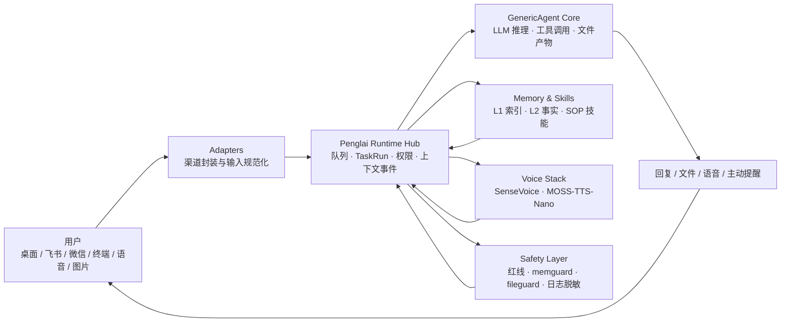

<div align="center">


# 蓬莱 Penglai 0.3.0

### 面向普通人的自托管 AI Runtime Hub

把能干活的 Agent 带到你的桌面、飞书、微信、终端和声音里。

[](LICENSE)
[](https://www.python.org/)
[](https://github.com/kevinchennewbee/PenglaiAgent/releases/tag/v0.3.0)
[](#penglai-runtime-hub)
[](https://github.com/lsdefine/GenericAgent)
[](https://kevinchennewbee.github.io/PenglaiAgent/)

**中文** · [English](README_EN.md) · [官网](https://kevinchennewbee.github.io/PenglaiAgent/) · [Release](https://github.com/kevinchennewbee/PenglaiAgent/releases/tag/v0.3.0)

</div>

> **官方渠道**：本 GitHub 仓库 · [kevinchennewbee.github.io/PenglaiAgent](https://kevinchennewbee.github.io/PenglaiAgent/) · [penglai.pages.dev](https://penglai.pages.dev/) · PyPI [`penglai`](https://pypi.org/project/penglai)。不要在非官方渠道输入 API Key、机器人 token 或任何账号凭证。

---

**蓬莱**不是另一个聊天机器人壳子。它是一个跑在你自己机器上的个人 AI Runtime Hub：用 [GenericAgent](https://github.com/lsdefine/GenericAgent) 做执行核心，用蓬莱运行层统一桌面、飞书、微信、终端、语音、图片、文件、主动消息和长期记忆。

0.3.0 是蓬莱从“能接进聊天软件”到“可安装、可运行、可升级、可审计的个人 AI 管家发行版”的一次重构。你可以下载 Mac / Windows 桌面客户端，也可以用一行命令部署到自己的主机。你的记忆、日志、配置和渠道凭证默认都留在你自己的机器上。

语音能力也从“能听”补齐到“能说”：原来依靠 FunASR / SenseVoice 路线在本地把语音转成文字、识别情绪和声学事件；0.3.0 新增 MOSS-TTS-Nano，把文字回复本地合成为语音。两边都可以 CPU 本地运行，语音数据默认不出本机。

<p align="center">
  
</p>

## 30 秒开始

桌面客户端：

- [macOS Apple Silicon DMG](https://github.com/kevinchennewbee/PenglaiAgent/releases/download/v0.3.0/Penglai_0.3.0_macos_aarch64.dmg)
- [Windows x64 installer](https://github.com/kevinchennewbee/PenglaiAgent/releases/download/v0.3.0/Penglai_0.3.0_windows_x64_setup.exe)

命令行安装：

```bash
curl -fsSL https://raw.githubusercontent.com/kevinchennewbee/PenglaiAgent/main/install.sh | sh
```

国内网络：

```bash
curl -fsSL https://gh-proxy.com/https://raw.githubusercontent.com/kevinchennewbee/PenglaiAgent/main/install.sh | sh
```

常用命令：

```bash
penglai                         # 终端里直接聊天
penglai setup                   # 配置向导
penglai doctor                  # 环境/依赖/配置/LLM/服务体检
penglai channels                # 渠道矩阵
penglai abilities               # 语音/TTS/陪伴/搜索/批判脑能力总览
penglai enable voice|tts|companion|intel|critic
penglai update                  # 检查并安全升级
penglai privacy-audit --strict  # 发布前隐私检查
```

**Docker 已撤出支持矩阵**：0.3.0 起不再提供 Dockerfile、docker-compose、docker-install、GHCR 镜像或容器部署支持。请使用桌面安装包、`install.sh`、PyPI 引导器或源码安装。

## 为什么做蓬莱

我做了十年网络技术、网络安全和运维，但不会写代码。蓬莱里的代码，是我用 AI 编程工具一句一句说出来的。

我做它，是因为我相信 AI Agent 不应该只属于会写代码、会用终端、愿意折腾配置文件的人。CLI 很强，桌面应用也很好，但普通人每天真正打开最多的入口，是聊天软件。**会发微信，就应该会用 Agent。**

蓬莱这个名字来自中国神话里的海上仙山。对古人来说，蓬莱可望而不可即；对今天很多普通人来说，AI 也常常被 API、终端、英文文档和复杂配置挡在雾里。蓬莱想做那艘船，把能干活的 Agent 带到你已经生活和工作的地方。

## Penglai Runtime Hub

0.3.0 的核心是 Runtime Hub。它把桌面、飞书、微信、终端、语音、文件和主动消息统一成同一套事件、队列、权限和运行记录，再交给 GenericAgent 执行。



用户能直接感受到的变化：

- **消息不容易丢**：任务运行中，后续消息进入队列。
- **上下文更连贯**：桌面、IM、终端、主动陪伴进入同一套上下文事件。
- **文件外发更可靠**：图片、视频、PDF、Markdown、Office 文档按真实产物类型发送；敏感后缀确定性拦截。
- **日志更安全**：API Key、token、secret、authorization 等统一脱敏后再进入日志和历史。
- **状态更可诊断**：Runtime Hub、飞书、微信、调度器、主动陪伴分开报告，不再只有“好像在跑”。
- **发布更可审计**：`privacy-audit`、`runtime-audit`、`install-check`、`doctor` 都能独立验证。

## 0.3.0 主要优势

| 能力 | 0.3.0 带来的变化 |
|---|---|
| 原生桌面客户端 | Mac / Windows 桌面安装包，图形化设置向导，多会话工作台，系统托盘，渠道和能力管理 |
| Runtime Hub | 多入口统一为 `InboundEvent`、FIFO 队列、`TaskRun` 审计和运行历史 |
| MOSS-TTS-Nano | 新增本地 TTS，把文字回复合成为语音，适合桌面朗读和 IM 语音条；CPU 本地推理，音频不必出本机 |
| SenseVoice / FunASR 路线 | 本地语音转写、情绪标签和声学事件，作为可选本地能力启用 |
| IM 渠道 | 飞书重点验证；微信、钉钉、QQ、企业微信、Telegram、Discord 逐步真机验证 |
| 主动陪伴 | 天气、情绪、早晚锚点、久未联系提醒，带勿扰和频率门禁 |
| 安全审计 | 命令红线、路径红线、记忆写入、文件外发、日志脱敏和发布前隐私审计 |
| 更新机制 | `penglai update` 支持检查、备份、应用和失败回滚 |

## 技术栈与站在谁的肩膀上

蓬莱不是从零发明所有东西，它把优秀的开源项目和生态能力组装成一个普通人可用的发行版。

| 层 | 项目 / 技术 | 作用 |
|---|---|---|
| Agent Core | [GenericAgent](https://github.com/lsdefine/GenericAgent) | 执行核心：上下文、LLM 推理、工具调用、文件产物 |
| Runtime | Penglai Runtime Hub | 队列、TaskRun、权限、运行历史、上下文事件 |
| Desktop | Tauri + Web UI | Mac / Windows 原生桌面客户端和设置向导 |
| Speech-to-text | SenseVoice / FunASR 路线 | 本地语音转写、情绪与声学事件 |
| Text-to-speech | MOSS-TTS-Nano | 本地语音合成，CPU 可跑 |
| IM | Feishu / WeChat / more adapters | 把 Agent 接进真实聊天入口 |
| Safety | redline / memguard / fileguard / log redaction | 确定性安全边界 |
| Memory | 文件式 L1 / L2 / SOP / raw sessions | 可审计、可迁移、可清理的长期记忆 |

## 渠道与能力状态

| 入口 | 接入方式 | 当前状态 |
|---|---|---|
| 桌面 | macOS / Windows 原生客户端 | 0.3.0 正式发布 |
| 飞书 | 向导扫码建应用，长连接接入 | 重点验证 |
| 微信个人号 | 向导扫码登录 | wrapper 接入中枢，需本机绑定后启用 |
| 终端 TUI | 运行 `penglai` | 可用 |
| 钉钉 / QQ / 企业微信 | `penglai enable <channel>` | 封装就绪，逐步真机验证 |
| Telegram / Discord | 贴 token 接入 | 封装就绪，逐步真机验证 |

| 能力 | 说明 | 状态 |
|---|---|---|
| 语音转写 | SenseVoice / FunASR 路线，本地转写和情绪标签 | 可选启用 |
| 语音合成 | MOSS-TTS-Nano 本地 TTS，CPU 推理 | 0.3.0 新增 |
| 图片理解 | IM 图片进入视觉任务 | 取决于配置的视觉模型 |
| 长期记忆 | 文件式记忆，写入前安全扫描 | 默认能力 |
| 搜索 | 免费搜索兜底，多源搜索可选 | 默认可用 |
| 主动陪伴 | 天气、情绪、提醒和 check-in | opt-in |
| 批判脑 | 本地绊线 + 可选异厂商复核 | 可选增强 |
| 技能集市 | 本地 SOP 技能，安装时安全扫描 | 按需安装 |

## 安全和隐私边界

- 公开仓库不包含个人记忆、日志、运行历史、token 或私有配置。
- API Key、聊天记录、长期记忆、渠道凭证和本地语音处理数据默认留在你自己的机器上。
- 日志、上下文事件和运行历史在写入前会做脱敏。
- `memory/global_mem.txt`、`memory/global_mem_insight.txt`、`temp/`、`_internal/` 等本地运行态默认不入库。
- 安全护栏是降低风险，不是绝对安全保证；建议部署在你自己控制的机器上。
- 漏洞反馈请先脱敏，详见 [SECURITY.md](SECURITY.md)。

## Penglai 和 GenericAgent 的关系

[GenericAgent](https://github.com/lsdefine/GenericAgent) 是蓬莱的执行核心。蓬莱不替代 GenericAgent，也不把上游内核改成自己的私货。蓬莱做的是普通用户真正用起来还缺的那一层：安装、桌面、渠道、语音、记忆卫生、安全审计、长期运行和升级。

| 维度 | GenericAgent | Penglai |
|---|---|---|
| 定位 | Agent 执行核心 | 个人 AI 管家发行版 |
| 安装 | 需要理解依赖和配置 | 一键安装 + 桌面向导 |
| 入口 | 终端 / 上游前端 | 桌面、飞书、微信、终端、更多 IM |
| 运行层 | 核心循环 | Runtime Hub：队列、审计、上下文、权限 |
| 语音 / 图片 | 自行接入 | SenseVoice、MOSS-TTS-Nano、图片入口规则 |
| 安全 | 基础能力 | 命令、路径、日志、文件外发、记忆写入的确定性护栏 |
| 运维 | 手动为主 | doctor / status / logs / update / audit |

## 版本

**v0.3.0 · 2026-06-25**

Runtime Hub 正式版。Mac / Windows 原生桌面客户端、飞书 QR 扫码自动创建、MOSS-TTS-Nano 本地语音合成、`penglai update` 自动备份回滚升级、Docker 全面撤出支持矩阵。

完整时间线见 [官网更新日志](https://kevinchennewbee.github.io/PenglaiAgent/#changelog)。

## 许可、品牌与致谢

- 代码使用 [MIT](LICENSE) 许可。
- 上游 GenericAgent 的版权声明完整保留。
- “蓬莱 / Penglai”名称、logo、横幅等品牌视觉资产保留所有权利，不在代码许可范围内。
- 第三方素材和高权限工具边界见 [THIRD_PARTY_NOTICES.md](THIRD_PARTY_NOTICES.md)。

感谢 [GenericAgent](https://github.com/lsdefine/GenericAgent)、MOSS-TTS-Nano、SenseVoice、Tauri、Feishu / Lark SDK 生态，以及所有让 AI 工具变得更普通、更可用、更安全的开源项目。
