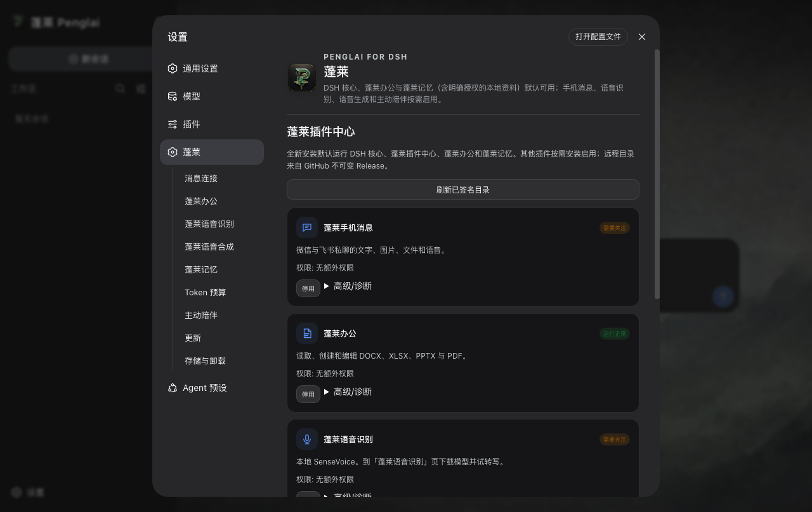
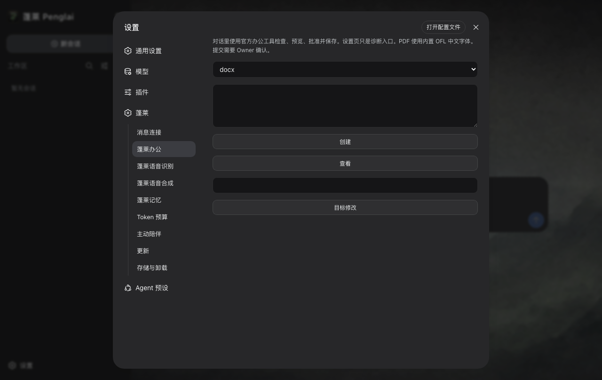

<p align="center">
  
</p>

# Penglai · 蓬莱

Official DeepSeek Harness, installed on a personal computer.

[English](#english) · [中文](#中文) · [Website](https://penglai.pages.dev) · [中文网站](https://penglai.pages.dev/zh/) · [Security](SECURITY.md)

**Penglai 0.6.0** puts official DeepSeek Harness `0.1.5-alpha.1` (tag `dsh-v0.1.5-alpha.1`, commit `5dda764ed3aa172535a7967b06ff95d9cbfe536a`, 272 npm packages) on Apple Silicon, Intel Mac, Windows x64, and UnionTech UOS 20 LoongArch. DSH remains the only agent core. Office and Memory start on.

The last immutable public installers are [v0.5.12](https://github.com/kevinchennewbee/PenglaiAgent/releases/tag/v0.5.12). The [v0.6.0](https://github.com/kevinchennewbee/PenglaiAgent/releases/tag/v0.6.0) GitHub Release is the download source for this version once those bytes exist and are read back. Published v0.5.10, v0.5.11, and v0.5.12 tags stay immutable.
[Release notes](docs/RELEASE_NOTES_0.6.0.md)

<p align="center">
  
</p>
<p align="center"><sub>Installed 0.5.5 first-run welcome, kept as a UI reference. Not a 0.6.0 screenshot.</sub></p>

<a id="english"></a>

# English

## What it is

Penglai is a desktop distribution of [DeepSeek Harness](https://github.com/deepseek-ai/deepseek-harness). It puts a fixed DSH build, Node, Electron, the official conversation interface, a first-run guide, updates, local data controls, and a reviewed set of DSH plugins into one installable application.

DSH owns the agent loop, models, tools, approvals, Workspace, Session, Turn, and the conversation. Penglai owns packaging, process supervision, onboarding, local paths, upgrades, uninstall, product identity, and plugin distribution. There is no second Penglai agent, and no replacement chat page.

```
You
  → Penglai (installers, wizard, plugins, updates, uninstall)
       → DeepSeek Harness (models, tools, Workspace, Session, conversation)
```

## A day with it

1. Install the matching Apple Silicon, Intel Mac, Windows x64, or UnionTech UOS 20 LoongArch package.
2. Finish seven first-run steps until a real model reply arrives. Back, retry, and restart-resume are supported. A failed API key is never recorded as success.
3. Work in an official Workspace. Office can inspect and edit documents after an action-specific confirmation. Memory may keep safe facts for *this* Workspace only.
4. Optionally bind Weixin, Feishu, or another supported channel; optionally install local speech models. Ordinary conversation must still work if those plugins are off, offline, or missing weights.
5. When a signed desktop update appears, you choose to install it. Updates are never silent.

## What starts on

| Product surface | Fresh install | What it does |
| --- | --- | --- |
| Penglai Office | On | Inspect, create, edit, preview, and save DOCX, XLSX, PPTX, and PDF |
| Penglai Memory | On | Automatic current-Workspace memory, explicit personal memory, authorised sources, provenance, and a knowledge graph |
| Mobile Messaging | Off | Eight platform connectors under one IM control plane; WhatsApp is not a product surface |
| Speech Recognition | Off | Local SenseVoice transcription; enabling it adds the conversation microphone entry |
| Voice Generation | Off | Local MOSS-TTS-Nano preview, desktop playback, and supported channel audio |
| Companion | Off | Opt-in scheduled contact with quiet hours, daily limits, and a bound IM route |

Settings stay simple: install and enable, or disable. Hashes, loader phases, permissions, rollback, and diagnostics remain available without dominating the normal path.

<p align="center">
  
  
</p>
<p align="center"><sub>Installed 0.5.5 Plugin Center and Office, kept as UI references. UI state is never proof of installation or health.</sub></p>

Office writes use host-issued `artifact:<uuid>` handles and wait for a confirmation bound to that action. Memory recall never searches another Workspace. Candidate curation is a model call to the provider you selected; storage and recall stay local. Mnemon `0.2.8` is bundled. Large SenseVoice and MOSS-TTS weights download only after an explicit action.

## Download

Use the matching file. Do not mix platforms.

| Computer | Installer |
| --- | --- |
| Apple Silicon, macOS 13+ | [Penglai_0.6.0_macos_aarch64.dmg](https://github.com/kevinchennewbee/PenglaiAgent/releases/download/v0.6.0/Penglai_0.6.0_macos_aarch64.dmg) |
| Intel Mac, macOS 13+ | [Penglai_0.6.0_macos_x64.dmg](https://github.com/kevinchennewbee/PenglaiAgent/releases/download/v0.6.0/Penglai_0.6.0_macos_x64.dmg) |
| Windows 10+ x64 | [Penglai_0.6.0_windows_x64_setup.exe](https://github.com/kevinchennewbee/PenglaiAgent/releases/download/v0.6.0/Penglai_0.6.0_windows_x64_setup.exe) |
| UnionTech UOS 20 LoongArch | [Penglai_0.6.0_uos_loong64.deb](https://github.com/kevinchennewbee/PenglaiAgent/releases/download/v0.6.0/Penglai_0.6.0_uos_loong64.deb) |

After the [v0.6.0](https://github.com/kevinchennewbee/PenglaiAgent/releases/tag/v0.6.0) Release is public, check the downloaded file against `SHA256SUMS` on that page. GitHub Releases is the authoritative source. Linux amd64 and Windows ARM are not targets. Native UOS install, startup, and function are Owner-tested after publication. That UOS runtime is Loongson Electron 31.7.7 (Chromium 126), not the Mac/Windows Electron 43 train.

## Quick start

```
Install the matching package
  → finish the seven-step wizard (a real model reply)
      → work in an official Workspace
          → enable messaging, voice, or Companion only if you need them
```

Upgrade with the same-platform installer as a manual overlay. Default uninstall removes the application and cache while preserving user data. External Workspaces and the `Penglai/0.5` data generation remain.

<p align="center">
  
  
</p>
<p align="center"><sub>0.5.5 Memory settings and first-run privacy step. Model calls still send task context to the provider you selected.</sub></p>

## Boundaries

- There is no Penglai account, Penglai-operated telemetry backend, or cloud memory sync. Official DSH bundles a dormant DeepSeek OTLP endpoint; Penglai hard-disables it. Model calls still send the context required for a task to the provider you selected.
- Credentials are stored in app-private YAML through official DSH. That is not Keychain or hardware isolation.
- macOS is ad-hoc signed and **not notarized**. Windows has **no Authenticode**. Do not disable system security to install.
- Plugins share the local DSH process. Install only reviewed catalog entries and read their permissions.
- UOS 20 LoongArch is the fourth packaged target. Native function on that host is not claimed as already tested.
- Source tests, packaged tests, native installed tests, and live external-account tests are reported separately.

## Further reading

[Product](docs/PRODUCT.md) · [Architecture](docs/ARCHITECTURE.md) · [Plugin Center](docs/PLUGIN_CENTER.md) · [Security](SECURITY.md) · [0.6.0 notes](docs/RELEASE_NOTES_0.6.0.md) · [Acceptance delta](docs/0.6.0/ACCEPTANCE_DELTA.md)

## Why it is called Penglai

The name comes from the Eight Immortals crossing the sea, each relying on a different skill. Models, messaging, local voice, office work, and memory have different jobs too, but they meet around one DSH core.

I spent more than ten years around networking, security, and operations. I was not a software developer when this project began. What bothered me was not a lack of powerful agents. It was the amount of software knowledge an ordinary person had to learn before one of those agents became useful.

Penglai has been rebuilt more than once. Version 0.5 was the clear decision: stop building another agent and make the good open-source core easier to install, understand, extend, and trust. 0.6.0 keeps that decision and puts the same product on four computers.

## Build, contribute, and AI-assisted work

This tree uses Node `22.23.2` and pnpm `11.7.0`.

```bash
corepack enable
pnpm install --frozen-lockfile
pnpm typecheck
pnpm test:unit
pnpm test:contract
pnpm test:integration
pnpm test:e2e
pnpm test:security
pnpm verify:contracts
pnpm verify:dependencies
pnpm audit:secrets
```

Native package commands must run on their matching host. Start with [CONTRIBUTING.md](CONTRIBUTING.md). If an AI coding tool is working in the repository, give it [AGENTS.md](AGENTS.md) first.

Penglai is created and maintained by [Kevin Chen / 陈克文](https://github.com/kevinchennewbee). Kimi Work, Grok Build, Cursor Agent, Claude Code, and OpenAI Codex have all contributed implementation, research, review, or release work. Those credits record real collaboration; product direction, authorship, acceptance, and release responsibility remain human.

The project stands on [DeepSeek Harness](https://github.com/deepseek-ai/deepseek-harness), [Electron](https://github.com/electron/electron), [Node.js](https://github.com/nodejs/node), [TypeScript](https://github.com/microsoft/TypeScript), [pnpm](https://github.com/pnpm/pnpm), [SenseVoice](https://github.com/FunAudioLLM/SenseVoice), [sherpa-onnx](https://github.com/k2-fsa/sherpa-onnx), [MOSS-TTS-Nano](https://github.com/OpenMOSS/MOSS-TTS-Nano), [Mnemon](https://github.com/mnemon-dev/mnemon), [Lark Node SDK](https://github.com/larksuite/node-sdk), and [Tencent openclaw-weixin](https://github.com/Tencent/openclaw-weixin). Thanks also to [DSH-IM](https://github.com/xmanrui/dsh-im) and [qqbot-agent-sdk](https://github.com/tencent-connect/qqbot-agent-sdk) for references that Penglai rewrites inside its own IM control plane; neither upstream runtime is bundled. Office generation builds on [PPTFast](https://github.com/liustack/pptfast), [ExcelJS](https://github.com/exceljs/exceljs), [pdf-lib](https://github.com/Hopding/pdf-lib), and [Noto CJK](https://github.com/notofonts/noto-cjk). Every dependency keeps its own license.

<a id="中文"></a>

# 中文

## 它是什么

蓬莱是 [DeepSeek Harness](https://github.com/deepseek-ai/deepseek-harness) 的桌面发行版。它把固定版本的 DSH、Node、Electron、官方会话界面、首次引导、升级、本地数据管理和一组经过审核的 DSH 插件，装进一个可以安装的客户端。

DSH 始终是唯一的 Agent 核心。Agent loop、模型、工具、审批、Workspace、Session、Turn 和会话界面都归 DSH。蓬莱负责打包、进程监管、安装引导、本地目录、升级、卸载、产品身份和插件分发。这里没有第二套蓬莱 Agent，也没有另做一张聊天页。

```
你
  → 蓬莱（安装包、引导、插件、升级、卸载）
       → DeepSeek Harness（模型、工具、Workspace、Session、会话）
```

**Penglai 0.6.0** 使用官方 DeepSeek Harness `0.1.5-alpha.1`（tag `dsh-v0.1.5-alpha.1`，commit `5dda764ed3aa172535a7967b06ff95d9cbfe536a`，272 包）。办公和记忆默认开启。四个安装包面向 Apple 芯片、Intel Mac、Windows x64 和统信 UOS 20 龙芯。最近的不可变公开安装包仍是 [v0.5.12](https://github.com/kevinchennewbee/PenglaiAgent/releases/tag/v0.5.12)。[v0.6.0](https://github.com/kevinchennewbee/PenglaiAgent/releases/tag/v0.6.0) 才是本版本的权威下载源，前提是那些字节已经存在并完成回读。

## 一次完整使用

1. 下载对应芯片的安装包：Apple 芯片、Intel Mac、Windows x64 或统信 UOS 20 龙芯，不要混用。
2. 走完七步引导，直到模型真正回复。可以返回、重试、关掉窗口后续接。密钥失败不会被记成成功。
3. 在 official Workspace 里工作。办公写入需要与动作绑定的确认；记忆只整理 *当前* Workspace 的安全事实。
4. 需要时再绑定微信、飞书或其他渠道，或下载本地语音模型。这些插件关闭、离线或缺少模型时，普通会话仍应可用。
5. 出现签名更新时由你确认安装，不会静默升级。

## 默认开着什么

| 产品功能 | 全新安装 | 能做什么 |
| --- | --- | --- |
| 蓬莱办公 | 默认启用 | 检查、创建、编辑、预览和保存 DOCX、XLSX、PPTX、PDF |
| 蓬莱记忆 | 默认启用 | 当前 Workspace 自动记忆、明确个人记忆、授权资料、来源追溯和知识图谱 |
| 消息连接 | 默认关闭 | 八个平台共用一个 IM 控制平面；WhatsApp 不是产品能力 |
| 蓬莱语音识别 | 默认关闭 | 本地 SenseVoice 转写；启用后为电脑会话提供麦克风入口 |
| 蓬莱语音生成 | 默认关闭 | 本地 MOSS-TTS-Nano 试听、电脑播放和支持渠道的语音输出 |
| 蓬莱主动陪伴 | 默认关闭 | 安静时段、每日上限、指定 IM 路由下的主动联系 |

普通用户在插件中心看到的是安装并启用，或者停用。摘要、Loader 阶段、权限、回滚和诊断仍然保留，但不再淹没正常操作。

<p align="center">
  
  
</p>
<p align="center"><sub>0.5.5 安装版插件中心与办公界面，作为参考。界面状态不等于已安装或健康。</sub></p>

办公写入使用 Host 发出的 `artifact:<uuid>` 句柄，并等待与动作绑定的确认。记忆召回不会搜索另一个 Workspace。整理候选会调用你选择的模型供应商；记录与召回留在本机。Mnemon `0.2.8` 已随包。SenseVoice 和 MOSS-TTS 的大模型要你主动下载。

## 下载

请使用对应安装包，不要混用。

| 电脑 | 安装包 |
| --- | --- |
| Apple 芯片，macOS 13+ | [Penglai_0.6.0_macos_aarch64.dmg](https://github.com/kevinchennewbee/PenglaiAgent/releases/download/v0.6.0/Penglai_0.6.0_macos_aarch64.dmg) |
| Intel Mac，macOS 13+ | [Penglai_0.6.0_macos_x64.dmg](https://github.com/kevinchennewbee/PenglaiAgent/releases/download/v0.6.0/Penglai_0.6.0_macos_x64.dmg) |
| Windows 10+ x64 | [Penglai_0.6.0_windows_x64_setup.exe](https://github.com/kevinchennewbee/PenglaiAgent/releases/download/v0.6.0/Penglai_0.6.0_windows_x64_setup.exe) |
| 统信 UOS 20 龙芯 | [Penglai_0.6.0_uos_loong64.deb](https://github.com/kevinchennewbee/PenglaiAgent/releases/download/v0.6.0/Penglai_0.6.0_uos_loong64.deb) |

[v0.6.0](https://github.com/kevinchennewbee/PenglaiAgent/releases/tag/v0.6.0) 公开发布后，请用该页的 `SHA256SUMS` 核对下载文件。权威公开源是 GitHub Release。Linux amd64 与 Windows ARM 不是目标。UOS 上的安装、启动和功能由 Owner 在发布后测试。该端运行时是龙芯 Electron 31.7.7（Chromium 126），不是 Mac/Windows 的 Electron 43。

## 快速开始

```
安装对应安装包
  → 走完七步引导（等到真实模型回复）
      → 在 official Workspace 里工作
          → 需要时再启用消息、语音或主动陪伴
```

升级使用同平台安装包手动覆盖。默认卸载去掉应用和缓存，保留用户数据。外部 Workspace 与 `Penglai/0.5` 数据代际会留下。

## 边界

- 没有蓬莱账号、蓬莱运营的遥测后端或云端记忆同步。官方 DSH 自带一个休眠的 DeepSeek OTLP 地址，蓬莱会硬性禁用。模型调用仍会把当前任务需要的内容发给你选择的供应商。
- 密钥写在 official DSH 的 app-private YAML 里。这不是钥匙串或硬件隔离。
- macOS 是 ad-hoc 签名、**未公证**；Windows **没有 Authenticode**。请不要为了安装而关闭系统安全功能。
- 插件和 DSH 在同一本地进程中运行，只应安装经过审核的目录条目并阅读权限。
- 统信 UOS 20 龙芯是第四个打包目标。该机上的功能验收尚未作为已完成事实声明。
- 源码测试、打包测试、原生安装测试、真实外部账号测试分别记录。

## 继续阅读

[产品契约](docs/PRODUCT.md) · [架构](docs/ARCHITECTURE.md) · [插件中心](docs/PLUGIN_CENTER.md) · [安全说明](SECURITY.md) · [0.6.0 说明](docs/RELEASE_NOTES_0.6.0.md) · [验收增量](docs/0.6.0/ACCEPTANCE_DELTA.md)

## 为什么叫蓬莱

蓬莱这个名字借的是八仙过海的故事。模型、手机消息、本地语音、办公和记忆各有本领，但最后都围绕同一个 DSH 核心协作。

我做了十多年网络、安全和运维，开始做这个项目时并不会写软件。真正让我难受的，不是没有强大的 Agent，而是普通人要先学会太多软件知识，才能让这些 Agent 有用。

蓬莱重做过不止一次。0.5 是到目前为止最明确的一次选择：不再造另一个 Agent，而是把优秀的开源核心变得更容易安装、理解、扩展和信任。0.6.0 把这件事做到四台电脑上。

## 构建、贡献与 AI 协作

这份树使用 Node `22.23.2` 和 pnpm `11.7.0`。

```bash
corepack enable
pnpm install --frozen-lockfile
pnpm typecheck
pnpm test:unit
pnpm test:contract
pnpm test:integration
pnpm test:e2e
pnpm test:security
pnpm verify:contracts
pnpm verify:dependencies
pnpm audit:secrets
```

原生打包命令必须在对应平台运行。普通贡献者从 [CONTRIBUTING.md](CONTRIBUTING.md) 开始；如果让 AI 编程工具进入仓库，请先把 [AGENTS.md](AGENTS.md) 交给它。

蓬莱由 [Kevin Chen / 陈克文](https://github.com/kevinchennewbee) 创建并维护。Kimi Work、Grok Build、Cursor Agent、Claude Code 和 OpenAI Codex 都参与过实现、调研、审查或发布工作。这些署名记录真实协作，但产品方向、作者身份、验收和发布责任仍然属于人。

蓬莱站在这些开源项目的肩膀上：
[DeepSeek Harness](https://github.com/deepseek-ai/deepseek-harness)、
[Electron](https://github.com/electron/electron)、
[Node.js](https://github.com/nodejs/node)、
[TypeScript](https://github.com/microsoft/TypeScript)、
[pnpm](https://github.com/pnpm/pnpm)、
[SenseVoice](https://github.com/FunAudioLLM/SenseVoice)、
[sherpa-onnx](https://github.com/k2-fsa/sherpa-onnx)、
[MOSS-TTS-Nano](https://github.com/OpenMOSS/MOSS-TTS-Nano)、
[Mnemon](https://github.com/mnemon-dev/mnemon)、
[Lark Node SDK](https://github.com/larksuite/node-sdk) 和
[Tencent openclaw-weixin](https://github.com/Tencent/openclaw-weixin)。
也特别感谢 [DSH-IM](https://github.com/xmanrui/dsh-im) 与 [qqbot-agent-sdk](https://github.com/tencent-connect/qqbot-agent-sdk) 提供参考。蓬莱只在自己的 IM 控制平面内重写这些思路，不会打包这两个上游运行时。蓬莱办公还建立在
[PPTFast](https://github.com/liustack/pptfast)、
[ExcelJS](https://github.com/exceljs/exceljs)、
[pdf-lib](https://github.com/Hopding/pdf-lib) 和
[Noto CJK](https://github.com/notofonts/noto-cjk) 之上。
每个依赖保留自己的许可证。
