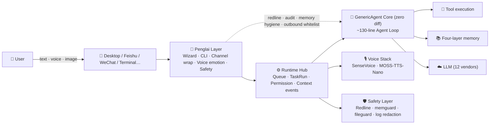
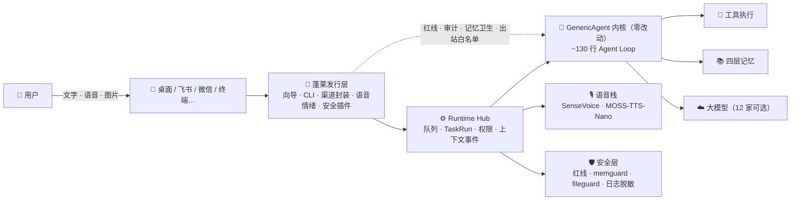

<div align="center">


# 蓬莱 · Penglai 0.3.1

### 住在你飞书、微信和终端里的自托管 AI Runtime Hub

**八仙过海，各显神通**

[](LICENSE)
[](https://www.python.org/)
[](https://github.com/kevinchennewbee/PenglaiAgent/releases)
[](#-penglai-runtime-hub)
[](https://github.com/lsdefine/GenericAgent)
[](https://kevinchennewbee.github.io/PenglaiAgent/)

**[English](#-english) · [中文](#-中文)** · [Website](https://kevinchennewbee.github.io/PenglaiAgent/) · [Release](https://github.com/kevinchennewbee/PenglaiAgent/releases)

</div>

> 📌 **Official channels:** this GitHub repository · [kevinchennewbee.github.io/PenglaiAgent](https://kevinchennewbee.github.io/PenglaiAgent/) · [penglai.pages.dev](https://penglai.pages.dev/) · PyPI [`penglai`](https://pypi.org/project/penglai). Do not enter API keys, bot tokens, or account credentials on unofficial sites or bots.

---

<a id="-english"></a>

## 🌟 Overview

**Penglai** is not another chatbot shell. It is a self-hosted personal AI Runtime Hub running on your own machine: [GenericAgent](https://github.com/lsdefine/GenericAgent) is the execution core, the `penglai` CLI is the product core, Runtime Hub is the runtime layer, and the native desktop app is the control surface. Penglai unifies desktop, Feishu (Lark), WeChat, terminal, voice, images, files, proactive messages, and long-term memory into one coherent runtime.

**v0.3.1 is a milestone release** — not just bug fixes, but the infrastructure that makes Penglai **upgradeable, migratable, and maintainable** for the long term:

- 🔄 **Migration mechanism**: backup / restore / legacy cleanup — never lose data when upgrading or switching machines
- 🚀 **Auto-update pipeline**: desktop app self-updates via `tauri-plugin-updater`; future releases just need a `git push v0.3.x` tag
- 🧩 **Dynamic versioning**: the whole repo no longer hardcodes version numbers — future releases only change one place

You can use the native Mac / Windows desktop clients, or deploy to your own host with one command. Your memory, logs, config, and channel credentials stay on your machine by default.

Voice is a full listen-and-speak loop: FunASR / SenseVoice handles local speech-to-text (transcription + emotion + acoustic events), MOSS-TTS-Nano synthesizes text replies as speech. Both run on local CPU — voice data never leaves your machine.

---

## 🌊 Origin: A non-coder and his AI butler

I worked a decade in network engineering, security, and ops — but I couldn't write code. Not a single line. Every line in this repository was "spoken" sentence by sentence using AI coding tools. Penglai itself is the proof of what it wants to demonstrate: **in the AI era, ordinary people can build tools for themselves.**

The motivation comes from real pain. As a regular user trying to embrace this transformation, I tried nearly every tool on the market and hit their walls. I saw the sharpness of the CLI era — Claude Code, OpenCode, Kimi CLI, all excellent. I saw the polish of the desktop era — Codex Desktop, Qoder, WorkBuddy, Claude Cowork, bringing Agents into windows. They're all good, but they all assume the same thing: **you're sitting at a computer.**

I kept thinking about how computing evolved: DOS gave it to people who could type commands, Windows gave it to people who could use a mouse, mobile put it in everyone's pocket. Agents are on the same path — **CLI is its DOS, desktop apps are its Windows, and the next stop is mobile, in fragmented time.** Every vendor's mobile app will have its own brilliance, but for most people, the most convenient, simplest thing they actually open every day is a chat app. **If you can send a WeChat message, you should be able to use an Agent** — no new skills required.

[GenericAgent](https://github.com/lsdefine/GenericAgent) is the cleanest Agent core I've seen, so Penglai doesn't reinvent the wheel. Penglai completes the "last mile": run it on any machine you own — a headless cloud server, a Mac mini in the corner — then move it into your Feishu and WeChat, so it's always there on your commute, in your lunch break, one message away.

---

## 🏝️ Why "Penglai"

Penglai (蓬莱) is the mythical island mountain in Chinese mythology. According to the *Records of the Grand Historian*, east of the Bohai Sea stand three divine mountains — Penglai, Fangzhang, and Yingzhou — where immortals dwell, holding the elixir of immortality. Qin Shi Huang once sent Xu Fu with three thousand boys and girls to seek it, but they never arrived. For two thousand years, "Penglai" has been the Chinese imagination of **a beautiful place visible but unreachable.**

I chose this name because today's AI is to ordinary people what Penglai was to the ancients: everyone hears it's miraculous, but few actually set foot on it — APIs, terminals, config files are the fog on the sea. **Penglai wants to bring the immortal mountain into your chat window: you don't need to learn navigation; if you can send a WeChat message, you can reach the island.** The immortal mountain of the AI era shouldn't belong only to those who can code.

As for "eight immortals crossing the sea, each showing their divine power" — the legend of eight immortals each using their own magical treasure to cross the sea to Penglai — this is the project's technical philosophy: multi-model, multi-channel, specialists each doing their part, every model crossing the sea in its own way, all serving the same you.

---

## ✨ What it can do

- 🏮 **Ten-minute setup** — `penglai setup` paged wizard (bilingual CN/EN): auto-installs dependencies (mainland China auto-switches to Tsinghua mirror) → pick model & test connectivity → **channels on one page** (Feishu QR scan auto-creates app, no webpage needed) → name your butler → ability panel with real enablement (voice pre-installed, companion/intel on demand)
- 💬 **Feishu + WeChat, both QR-scan** — Feishu scan builds bot with long-poll connection (no public IP needed); personal WeChat scan login for text/voice/image send-receive
- 🖥️ **Native desktop clients** — Mac (Apple Silicon) and Windows (x64) installers with full graphical setup wizard, multi-session chat, system tray, channel/ability management, in-app auto-update
- 🎙️ **Ears that hear emotion** — local CPU SenseVoice (~230MB): speech-to-text + 7 emotion labels (happy/sad/angry/fearful…) + acoustic events (laughter/crying/applause…), enters conversation as `[voice(emotion:down): so tired today]`
- 🔊 **Voice that speaks back** — MOSS-TTS-Nano local TTS synthesizes text replies into speech, CPU-only, for desktop readout and IM voice bars
- 🧠 **Four-layer memory** — GA-core index/facts/skills/raw-sessions file-based memory, pure markdown and auditable; pre-write threat scan (prompt injection / role hijack / key leakage), overwrite forbidden; long-term facts carry **time/source/importance signatures, new values auto-invalidate old ones**
- 🛡️ **Deterministic safety rails** — dangerous command & path redline interception + full tool-call audit JSONL — **relies on deterministic checks, not LLM self-awareness**. Covers dangerous commands, sensitive paths, memory writes, file exfiltration (whitelist currently covers Feishu channel)
- 🔎 **Web search out of the box** — built-in free Bing fallback, **works on headless servers** (no browser needed); `penglai enable intel` adds TinyFish/Tavily for multi-source cross-validation
- 🧐 **Anti-hallucination dual insurance** — local tripwire **on by default** (free): catches "overconfidence" phrasing and triggers self-check; `penglai enable critic` picks a **different vendor** model for cross-check (free options like GLM-4.7-Flash, or stronger paid models)
- 🧰 **Built-in skills + local skill market** — butler ships with reminder/schedule, weather, web article summary (no key, headless-ok); `penglai skill` is a local apt-style market (curated, security-scanned on install, no network fetching). Skills are GA-native SOPs — external skills must be rewritten as SOPs first
- 📦 **Ten-minute migration (from Hermes/OpenClaw)** — `penglai migrate` brings old butler's memory/models/channels/identity over (preview + backup + honest labeling of what can't move)
- 🌙 **Truly proactive, never noisy** <sub>opt-in</sub> — heartbeat + hard-coded gates: **severe weather alerts**, **proactive care from detected voice emotion**, morning/evening greetings, idle check-ins; do-not-disturb hours, never interrupts active conversation, frequency caps
- 🎛️ **Abilities anytime** — didn't enable something in the wizard? One command: `penglai enable voice|companion|intel`; `penglai abilities` shows the full picture — no need to re-run wizard
- ⚙️ **One-command ops** — `penglai doctor` full checkup (directly tells you which command to run for any issue) / `status` / `logs` / `update` one-click upgrade with auto-rollback

> Every item above runs on real servers every day — not a roadmap.

---

## 🚀 Quick Start

New machine, just one command — no Python, no git needed, the script handles everything:

```bash
curl -fsSL https://raw.githubusercontent.com/kevinchennewbee/PenglaiAgent/main/install.sh | sh
```

Mainland China (via mirror, same one command):

```bash
curl -fsSL https://gh-proxy.com/https://raw.githubusercontent.com/kevinchennewbee/PenglaiAgent/main/install.sh | sh
```

**Desktop clients** (recommended for new users): download from [GitHub Releases](https://github.com/kevinchennewbee/PenglaiAgent/releases)
- macOS Apple Silicon DMG
- Windows x64 installer

Daily commands:

```bash
penglai                         # chat in terminal
penglai setup                   # full setup wizard
penglai setup --only feishu     # partial reconfig: Feishu only, LLM config untouched
penglai setup --only llm|identity|feishu|wechat|channels|abilities|companion
penglai config status --json    # config overview
penglai config backup           # atomic config backup
penglai config restore <name>   # rollback to backup
penglai channels [--json]       # channel matrix + next-step commands
penglai companion status        # companion status / mode / last trigger
penglai companion mode quiet|present|active
penglai doctor                  # checkup: env/deps/config/services + next-step commands
penglai abilities               # voice/TTS/companion/search/critic overview
penglai enable voice|tts|companion|intel|critic
penglai update                  # safe upgrade with auto-rollback
penglai privacy-audit --strict  # pre-release privacy check
```

> 💡 **Upgrading is worry-free**: `penglai update` is fully automatic after confirmation — compile + security plugin pre-check catches bad updates, then a detached background supervisor restarts and runs connection health checks, **auto-rolls-back if the new version fails to start**, and reports results to your IM. You can also just tell the butler in chat: "check for updates / upgrade".

---

## 💬 Channel Matrix: one butler, many doors

All channels share the same memory — **one butler, multiple doors**:

| Channel | Setup | Voice | Status |
|---|---|---|---|
| Desktop (Mac/Windows) | Download installer | ✅ TTS playback | ✅ Released |
| Feishu (Lark) | `penglai setup`, **QR auto-create app** | ✅ STT+emotion | ✅ Validated |
| WeChat (personal) | `penglai setup`, QR login | ✅ STT+emotion (silk) | ✅ Validated |
| Terminal TUI | run `penglai` | — | ✅ Built-in |
| DingTalk | `penglai enable dingtalk`, **QR auto-create** | 🔧 Wrapped (built-in ASR) | ⚠️ Pending real-device |
| QQ | `penglai enable qq`, **QR auto-create bot** | 🔧 Wrapped (wav+emotion) | ⚠️ Pending real-device |
| WeCom | `penglai enable wecom`, backend bot | 🔧 Wrapped (built-in ASR) | ⚠️ Pending real-device |
| Telegram | `penglai enable telegram`, @BotFather token | — | ⚠️ Pending real-device |
| Discord | `penglai enable discord`, dev portal token | — | ⚠️ Pending real-device |

> "Pending" = integration code is ready (IM framework from GA upstream, voice wrapping by Penglai layer), but we haven't completed real-device testing. Honesty over appearances.
> Voice column: ✅ = validated on real device; 🔧 = Penglai layer has wrapped voice reception (upstream frontends originally discarded it); — = no voice for this channel.

---

## 🆚 Penglai vs bare GenericAgent

Penglai doesn't modify the core — it completes the "last mile from runnable to usable" on top of GA:

| Dimension | Bare GenericAgent | Penglai Distribution |
|---|---|---|
| Setup | Manual mykey edit, manual deps | 10-min paged wizard (bilingual, auto mirror) |
| IM access | Read frontend code yourself | Feishu/WeChat QR + DingTalk/QQ/WeCom one command |
| Voice | None | Local SenseVoice STT+emotion, all-channel wrapping |
| Safety | Basic | Redline/memory hygiene/outbound file whitelist, deterministic |
| Ability mgmt | Edit config files | `penglai enable / abilities` post-install toggles |
| Distribution | git clone | curl / installer / pip one-liner + mainland auto-mirror |
| Ops | Manual | `penglai doctor` checkup with fix commands |
| Desktop | None | Native Mac/Windows with 9-module control surface |
| Auto-update | None | Desktop updater + `penglai update` dual path |
| Core | — | **Zero modification**, upstream upgrades merge cleanly |

---

## 🧬 Architecture: standing on the core's shoulders



- **Zero core modification**: `ga.py`, `frontends/`, `llmcore.py`, memory tools stay zero-diff; GA core upgrades merge cleanly. Penglai only trims and augments above the core.
- **Form gradient**: new capabilities prefer SOP (0 code) → hook plugin → heartbeat module → tool — restraint by design, not laziness.
- **Identity & memory separation**: factory state has zero user memory, only one identity line. Your memory is your privacy asset, never enters the distribution.

---

## 🏗️ Penglai Runtime Hub

The Runtime Hub is 0.3.0's core: it unifies desktop, Feishu, WeChat, terminal, voice, files, and proactive messages into one set of events, queues, permissions, and run records, then hands off to GenericAgent for execution.

What users actually feel:

- **Messages don't get lost**: while a task runs, subsequent messages queue up.
- **Context is more coherent**: desktop, IM, terminal, companion share the same context events.
- **File delivery is more reliable**: images, videos, PDFs, Markdown, Office docs sent by real artifact type; sensitive extensions deterministically blocked.
- **Logs are safer**: API keys, tokens, secrets, authorization headers uniformly redacted before entering logs and history.
- **Status is more diagnosable**: Runtime Hub, Feishu, WeChat, scheduler, companion report separately — no more "seems to be running".
- **Releases are more auditable**: `privacy-audit`, `runtime-audit`, `install-check`, `doctor` all independently verifiable.

---

## 🔄 Auto-update: two independent paths

0.3.1 closes the auto-update loop into a complete pipeline, with desktop and runtime upgrading independently:

- **Desktop app**: via `tauri-plugin-updater`, six gates all passed — signing key generated and verified in CI, `latest.json` auto-published to Release, frontend `app.js` calls updater API for check/download/verify/install; `fallback.html` setup UI also has update entry, so you can update even if the main window is stuck.
- **Runtime (CLI / Runtime Hub)**: `penglai update` backs up current version, pulls new version, verifies, switches, auto-rolls-back on failure.

Desktop updater and `penglai update` don't depend on each other.

---

## 📦 Migration: upgradeable, switchable, restorable

Three layers of protection ensure data is never lost:

1. **User-active layer**: `penglai backup` / `penglai restore` — full data backup/restore (mykey + memory + sqlite + wxbot token + desktop settings)
2. **Installer-defense layer**: `install.sh` / `install.ps1` auto-backs up user data before `rm -rf`, restores after unpack; refuses to continue if version is unrecognizable
3. **Legacy-cleanup layer**: `penglai uninstall-legacy` cleans launchd/systemd services and prompts for old directory removal; desktop `detect_legacy_penglai` detects and prompts migration before wizard start

**Migration flow**: old version `penglai backup` → install 0.3.1 → new version `penglai restore` → (optional) `penglai uninstall-legacy`

---

## 📋 0.3.1 Key Changes

0.3.0 established the right architecture direction; 0.3.1 closes the loop on "right direction but half-finished implementation".

| Area | What 0.3.1 brings |
|---|---|
| CLI core | `setup --only` partial reconfig (reconfigure Feishu without re-running full API Key flow); `config backup/restore` atomic config mgmt; `channels` / `companion` subcommands; CLI QR output; setup end-to-end smoke test |
| Desktop control surface | Fixed `_require_token` so 9 handlers work; eliminated 9 inline Python ops (bridge `--bootstrap` mode, Rust shell back to thin); `tauri-plugin-updater` auto-update; 9-module frontend rebuild (Chat / Runs / Channels / Abilities / Companion / Diagnostics / Logs / Update / Security); Mac frosted glass + Windows Mica |
| Runtime Hub | TaskRun state machine closure (`WAITING_PERMISSION → RUNNING → SUCCEEDED`); crash recovery (zombie TaskRun marked failed on restart); SQLite TOCTOU fix (`BEGIN IMMEDIATE`); owner messages via control API, multi-entry shared GA session |
| Outbound delivery | Feishu / DingTalk / QQ / WeCom unified via DeliveryService safety policy, file-exfil blocked notice consistent across channels |
| Companion | off / quiet / present / active four-mode differentiation; active no longer "must speak", consecutive SILENT auto-escalates cooldown; companion events visible in next prompt (context closure) |
| Diagnostics | `doctor` outputs "problem + next-step command" format; detects legacy process residuals; auto smoke test after setup |
| Desktop safe init | Fixed `install_runtime` not launching bridge causing "click no response"; fixed Windows IME Chinese input crash; `setup_op` retry; `finalizeSetup` validation |
| Auto-update | `tauri-plugin-updater` six gates all passed (signing key + CI generates `latest.json` + frontend call); `fallback.html` can also check updates; `app.js` dual-layer update UI |
| Version dynamicization | Entire repo changed from hardcoded 0.3.0 to dynamic `VERSION` constant reference |
| Mac packaging | `icon.icns` added; adhoc re-sign then regenerate `.tar.gz` + `.sig` |

> GitHub issue #2 (reconfiguring Feishu dragged back through full API Key flow) is fixed in 0.3.1 via `penglai setup --only feishu` and desktop dual-path.

---

## 🛡️ Safety & Privacy Boundaries

- Public repo contains no personal memory, logs, run history, tokens, or private config.
- API keys, chat history, long-term memory, channel credentials, and local voice processing data stay on your machine by default.
- Logs, context events, and run history are redacted before writing.
- `memory/global_mem.txt`, `memory/global_mem_insight.txt`, `temp/`, `_internal/` are local runtime state, not committed.
- Safety rails reduce risk, not guarantee absolute security; deploy on a machine you control.
- For vulnerability reports, redact first — see [SECURITY.md](SECURITY.md).

---

## 📜 License & Brand

- **Code**: [MIT](LICENSE) license. Upstream GenericAgent copyright notice fully preserved; Penglai-layer code © 2026 Kevin Chen, also MIT-licensed — use, modify, commercialize freely.
- **Brand**: "Penglai" / "蓬莱" name, logo, and banner visual assets are **all rights reserved**, not covered by the code license. Don't use them for your distribution, derivative, or commercial naming/branding without written permission.
- **Upstream core**: `ga.py`, `frontends/`, `llmcore.py`, memory tools are [GenericAgent](https://github.com/lsdefine/GenericAgent) core files (zero-diff preserved); Penglai trims and augments above them.

---

## 🙏 Acknowledgments

Penglai stands on these projects:

- [GenericAgent](https://github.com/lsdefine/GenericAgent) (MIT) — the core itself: minimal Agent loop, L1-L4 memory, self-evolving skill tree
- [SenseVoice / FunASR](https://github.com/FunAudioLLM/SenseVoice) (MIT) · [sherpa-onnx](https://github.com/k2-fsa/sherpa-onnx) (Apache-2.0) — CPU-friendly voice & emotion recognition
- [MOSS-TTS-Nano](https://github.com/OpenMOSS/MOSS-TTS-Nano) (Apache-2.0) — local speech synthesis
- [Tauri](https://github.com/tauri-apps/tauri) (MIT/Apache-2.0) — native Mac/Windows desktop shell
- [Feishu / Lark SDK](https://github.com/larksuite/oapi-sdk-python) (MIT) — IM integration

Thanks to all issue reporters and testers. Special thanks to:
- [@larrylinli](https://github.com/larrylinli) — issues #2/#3/#4, drove `setup --only`, Feishu diagnostics, desktop architecture improvements
- [@ljfhdwxsk](https://github.com/ljfhdwxsk) — issue #1, Docker/WSL install feedback that hardened the installer

---

## 📄 Version Timeline

- **v0.3.1 · 2026-06-27** — Milestone: migration mechanism + auto-update pipeline + dynamic versioning. `penglai backup/restore/uninstall-legacy`; `setup --only` partial reconfig; `tauri-plugin-updater` six gates; version dynamicization; Mac adhoc re-sign + updater regen; Runtime Hub stabilization; companion 4-mode + context closure.
- **v0.3.0 · 2026-06-25** — Runtime Hub GA. Native Mac/Windows desktop clients, Feishu QR auto-create, MOSS-TTS-Nano local TTS, `penglai update` auto-rollback, Docker fully withdrawn.

Full timeline: [Website changelog](https://kevinchennewbee.github.io/PenglaiAgent/#changelog)

---

<a id="-中文"></a>

## 🌟 项目简介

**蓬莱**不是另一个聊天机器人壳子。它是一个跑在你自己机器上的个人 AI Runtime Hub：[GenericAgent](https://github.com/lsdefine/GenericAgent) 是执行核心，`penglai` CLI 是产品核心，Runtime Hub 是运行中枢，桌面是原生控制面。蓬莱运行层统一桌面、飞书、微信、终端、语音、图片、文件、主动消息和长期记忆。

**v0.3.1 是里程碑级别的发布**——不只是修 bug，更是让蓬莱**可持续升级、可安全迁移、可长期维护**的底层基建闭环：

- 🔄 **迁移机制**：备份 / 恢复 / 旧版清理——升级或换机不丢数据
- 🚀 **自动升级链路**：桌面应用通过 `tauri-plugin-updater` 自升级；未来发版只需 `git push v0.3.x` tag
- 🧩 **版本号动态化**：全仓库不再硬编码版本号，未来发版只改一处

你可以用 Mac / Windows 原生桌面客户端，也可以一行命令部署到自己的主机。你的记忆、日志、配置和渠道凭证默认都留在你自己的机器上。

语音能力是完整的听说闭环：FunASR / SenseVoice 路线在本地把语音转成文字、识别情绪和声学事件；MOSS-TTS-Nano 把文字回复本地合成为语音。两边都可以 CPU 本地运行，语音数据默认不出本机。

---

## 🌊 缘起：一个不会写代码的人，和他的 AI 管家

我做了十年网络技术、网络安全与网络运维，但**不会写代码——一行都不会**。这个仓库里的每一行代码，都是我用 AI 编程工具一句话一句话"说"出来的。蓬莱本身就是它想证明的那件事：**AI 时代，普通人也能为自己造工具。**

初心来自真实的痛。作为一个想认真拥抱这场变革的普通用户，我把市面上摸得到的工具几乎用了个遍，也实打实撞过它们的墙。我见证了 CLI 时代的锋利——Claude Code、OpenCode、Kimi CLI 个个出色；也看到了桌面时代的完善与流行——Codex 桌面版、Qoder、WorkBuddy、Claude Cowork 把 Agent 做进了窗口里。它们都很好，但它们都默认同一件事：**你得坐在电脑前。**

我总想起电脑的来路：DOS 把计算交给会敲命令的人，Windows 的图形界面把它交给会用鼠标的人，而移动互联网把它装进了每个人的口袋。Agent 正在走同一条路——**CLI 是它的 DOS，桌面应用是它的 Windows，下一站一定在移动端、在碎片时间里。** 各家的移动 App 会各有精彩，但对普通大众而言，最方便、最简单、每天真实会打开的，是聊天软件。**会发微信，就该会用 Agent**——不需要再学任何新东西。

[GenericAgent](https://github.com/lsdefine/GenericAgent) 是我见过最干净的 Agent 内核，所以蓬莱不重造轮子，核心完全站在它的肩膀上。蓬莱要补的是"最后一公里"：让它跑在你拥有的任何一台机器上——无头云服务器、角落里 24 小时待机的 Mac mini，Windows 也在路上——然后住进你的飞书和微信，在通勤的地铁上、午休的间隙里，随叫随到，一直都在。

---

## 🏝️ 为什么叫「蓬莱」

蓬莱是中国神话里的海上仙山。《史记》记载，渤海之东有三神山——蓬莱、方丈、瀛洲，仙人居之，藏不死之药；秦始皇曾遣徐福率三千童男童女东渡求访，终未能至。两千年来，"蓬莱"是中国人对**可望而不可即的美好之地**最古老的想象。

我选这个名字，是因为今天的 AI 之于普通人，恰如蓬莱之于古人：人人听说它神奇，真正登上去的人却很少——API、终端、配置文件，就是横在海面上的那层迷雾。**蓬莱想做的，是把仙山搬进你的聊天窗口：你不必学会航海，会发微信，就能上岛。** AI 时代的仙山，不该只属于会写代码的人。

至于"八仙过海，各显神通"——传说八位神仙各凭自己的法器渡海赴蓬莱——这正是项目的技术哲学：多模型、多渠道、专家各司其职，每个模型用自己的方式渡海，服务同一个你。

---

## ✨ 它能做什么

- 🏮 **十分钟开箱** —— `penglai setup` 翻页式向导（中/英双语）：自装依赖（国内自动切清华镜像）→ 选模型测连通 → **渠道一页选**（飞书扫码自动建应用，免开网页）→ 给管家起名 → 能力面板真启用（语音默认装好，陪伴/情报按需开）
- 💬 **飞书 + 微信双渠道，都是扫码** —— 飞书扫码建机器人、长连接免公网 IP；个人微信扫码登录，文字/语音/图片收发
- 🖥️ **原生桌面客户端** —— Mac（Apple Silicon）和 Windows（x64）安装包，图形化设置向导、多会话工作台、系统托盘、渠道和能力管理、应用内自动升级
- 🎙️ **听得出情绪的耳朵** —— 本地 CPU 跑 SenseVoice（约 230MB）：语音转写 + 7 种情绪标签（高兴/悲伤/生气/害怕…）+ 声学事件（笑声/哭声/掌声…），`[语音(情绪:低落): 今天好累]` 这样进入对话
- 🔊 **会说话的嘴** —— MOSS-TTS-Nano 本地 TTS，把文字回复合成为语音，CPU 本地推理，适合桌面朗读和 IM 语音条
- 🧠 **四层记忆** —— 基于 GA 内核的索引/事实/技能/原始会话四层文件式记忆，纯 markdown 可审计；写入前威胁扫描（提示注入/角色劫持/密钥落库），禁止覆盖；长期事实带**时间/来源/重要度签名、新值自动作废旧值**（治过期偏好污染）
- 🛡️ **确定性安全护栏** —— 危险命令与路径红线拦截 + 全量工具调用审计 JSONL——**靠确定性检查，不靠 LLM 自觉**。已覆盖危险命令、敏感路径、记忆写入、文件外发（白名单当前仅覆盖飞书渠道）等关键风险面
- 🔎 **网页搜索开箱即用** —— 内置免费 Bing 兜底，**无头云服务器也能查**天气/新闻/事实（不依赖浏览器）；想要多源交叉验证再 `penglai enable intel` 叠加 TinyFish/Tavily 等独立搜索源
- 🧐 **防幻觉双保险** —— 本地绊线**出厂常开**（免费）：嗅到「过度自信」措辞就拦下自检；`penglai enable critic` 从**整张厂商目录任选**一个**不同厂商**的复核模型（免费如 GLM-4.7-Flash，也可投更强的付费模型换更大视差）——单模型查不出自己的幻觉
- 🧰 **出厂内置技能 + 本地技能集市** —— 管家自带提醒/日程、天气查询、网页文章总结（免 key、无头可用）；`penglai skill` 是本地 apt 式集市（出厂精选、装时过安全扫描、不联网拉）。技能一律是 GA 原生 SOP——外部技能必须先改写成 SOP 才能收编
- 📦 **十分钟搬家（从 Hermes/OpenClaw）** —— `penglai migrate` 把旧管家的记忆/模型/渠道/人设搬过来（预览 + 备份 + 诚实标注搬不了的）
- 🌙 **真主动，不扰民** <sub>opt-in</sub> —— 心跳 + 硬编码门禁的真主动：**恶劣天气预警**、**从语音里听出的情绪主动关心**、早晚问候、久未联系才招呼；勿扰时段、对话中绝不插话、频率上限——像朋友想起你，而不是闹钟响了
- 🎛️ **能力随时补开** —— 第一次向导没开的，事后一条命令补上：`penglai enable voice|companion|intel` 开能力、`penglai abilities` 看全貌——不必重跑向导
- ⚙️ **运维一个命令** —— `penglai doctor` 一键体检，**未启用的项直接告诉你用哪条命令开** / `status` / `logs` / `update` 一键升级到最新版

> 以上每一条都在真实服务器上每天跑着，不是路线图。

---

## 🚀 快速开始

新机器只要联网，**一行命令**——没有 Python、没有 git 都不要紧，脚本全自动备好：

```bash
curl -fsSL https://raw.githubusercontent.com/kevinchennewbee/PenglaiAgent/main/install.sh | sh
```

国内网络（走镜像，同样一行）：

```bash
curl -fsSL https://gh-proxy.com/https://raw.githubusercontent.com/kevinchennewbee/PenglaiAgent/main/install.sh | sh
```

**桌面客户端**（推荐新用户）：在 [GitHub Releases](https://github.com/kevinchennewbee/PenglaiAgent/releases) 下载
- macOS Apple Silicon DMG
- Windows x64 安装包

日常运维：

```bash
penglai                         # 终端里直接聊天
penglai setup                   # 配置向导（全量）
penglai setup --only feishu     # 局部补配：只重配飞书，不触碰已配置的 LLM
penglai setup --only llm|identity|feishu|wechat|channels|abilities|companion
penglai config status --json    # 配置概览（--json 供桌面调用）
penglai config backup           # 原子备份当前配置
penglai config restore <名称>   # 回滚到备份
penglai channels [--json]       # 渠道矩阵 + 下一步命令
penglai companion status        # 主动陪伴状态 / 模式 / 最近触发原因
penglai companion mode quiet|present|active   # 切换陪伴模式
penglai doctor                  # 体检：环境/依赖/配置/服务/旧版本残留进程 + 下一步命令
penglai abilities               # 语音/TTS/陪伴/搜索/批判脑能力总览
penglai enable voice|tts|companion|intel|critic
penglai update                  # 安全升级：预检 → 后台重启 → 健康检查 → 失败自动回滚
penglai privacy-audit --strict  # 发布前隐私检查
```

> 💡 **升级很省心**：`penglai update` 确认后全自动——先编译+安全插件预检拦住坏更新，再由脱离进程的后台监工重启并做连接健康检查，**新版起不来会自动回滚到上一个能跑的版本**，全程结果发到你飞书/微信，不用 SSH 上服务器。你也可以让管家在 IM 里直接说「检查更新 / 升级」。

> **Docker 已撤出支持矩阵**：0.3.0 起不再提供 Dockerfile、docker-compose、docker-install、GHCR 镜像或容器部署支持。请使用桌面安装包、`install.sh`、PyPI 引导器或源码安装。

---

## 💬 渠道矩阵：一个管家，多个门

所有渠道共享同一份记忆——**同一个管家，多个门**：

| 渠道 | 接入方式 | 语音 | 状态 |
|---|---|---|---|
| 桌面（Mac/Windows） | 下载安装包 | ✅ TTS 朗读 | ✅ 已发布 |
| 飞书 | `penglai setup` 向导，**扫码自动建应用** | ✅ 转写+情绪 | ✅ 已实测 |
| 微信（个人号） | `penglai setup` 向导，扫码登录 | ✅ 转写+情绪（silk） | ✅ 已实测 |
| 终端 TUI | 裸跑 `penglai` 即聊 | — | ✅ 内核自带 |
| 钉钉 | `penglai enable dingtalk`，**扫码自动建应用** | 🔧 封装(自带ASR) | ⚠️ 待实测 |
| QQ | `penglai enable qq`，**扫码自动建机器人** | 🔧 封装(wav+情绪) | ⚠️ 待实测 |
| 企业微信 | `penglai enable wecom`，后台建智能机器人贴凭证 | 🔧 封装(自带ASR) | ⚠️ 待实测 |
| Telegram | `penglai enable telegram`，@BotFather 贴 token | — | ⚠️ 待实测 |
| Discord | `penglai enable discord`，开发者后台贴 token | — | ⚠️ 待实测 |

> 「待实测」= 接入代码已就绪（IM 框架为 GA 上游自带，语音接收为蓬莱层封装），但我们还没在真机走完全程——实测过一个就升级成 ✅。诚实比好看重要。
> 语音列：✅=真机验证过；🔧=发行层已封装语音接收（上游前端原本丢弃语音），待真机实测；—=该渠道无语音。

---

## 🆚 蓬莱 vs 裸 GenericAgent

蓬莱不改内核，只在 GA 之上补齐"从能跑到好用"的最后一公里：

| 维度 | 裸 GenericAgent | 蓬莱发行版 |
|---|---|---|
| 上手 | 手动改 mykey、装依赖 | 十分钟翻页向导（中英双语、自动镜像） |
| IM 接入 | 自己读前端代码接 | 飞书/微信扫码 + 钉钉/QQ/企微一条命令 |
| 语音 | 无 | 本地 SenseVoice 转写+情绪，全渠道封装 |
| 安全 | 基础 | 红线/记忆卫生/出站文件白名单，确定性防线 |
| 能力管理 | 改配置文件 | `penglai enable / abilities` 事后开关 |
| 安装分发 | git clone | curl / 安装包 / pip 一行 + 国内自动镜像 |
| 运维 | 手动 | `penglai doctor` 体检并直接给修复命令 |
| 桌面 | 无 | 原生 Mac/Windows + 9 模块控制面 |
| 自动升级 | 无 | 桌面 updater + `penglai update` 双路径 |
| 内核 | — | **零改动**，上游升级照常合并 |

---

## 🧬 架构：站在内核肩膀上



- **内核零改动**：`ga.py`、`frontends/`、`llmcore.py`、记忆工具等内核文件保持零 diff，GA 的内核升级照常合并；发行层只在内核之上做裁剪与增补。
- **形态梯度**：新能力优先用 SOP（0 行代码）实现，其次 hook 插件，再次心跳模块，最后才是工具——克制是设计，不是懒。
- **身份与记忆分离**：出厂态零用户记忆，只带一行身份。你的记忆是你的隐私资产，永不进发行版。

---

## 🏗️ Penglai Runtime Hub

Runtime Hub 是 0.3.0 的核心：它把桌面、飞书、微信、终端、语音、文件和主动消息统一成同一套事件、队列、权限和运行记录，再交给 GenericAgent 执行。

用户能直接感受到的变化：

- **消息不容易丢**：任务运行中，后续消息进入队列。
- **上下文更连贯**：桌面、IM、终端、主动陪伴进入同一套上下文事件。
- **文件外发更可靠**：图片、视频、PDF、Markdown、Office 文档按真实产物类型发送；敏感后缀确定性拦截。
- **日志更安全**：API Key、token、secret、authorization 等统一脱敏后再进入日志和历史。
- **状态更可诊断**：Runtime Hub、飞书、微信、调度器、主动陪伴分开报告，不再只有"好像在跑"。
- **发布更可审计**：`privacy-audit`、`runtime-audit`、`install-check`、`doctor` 都能独立验证。

---

## 🔄 自动升级：两条独立路径

0.3.1 把自动升级跑通成一条完整链路，桌面应用和运行时两层各自独立升级：

- **桌面应用**：基于 `tauri-plugin-updater`，六道关卡全部打通——签名密钥在 CI 中生成并校验，`latest.json` 由 CI 自动发布到 Release，前端 `app.js` 调用 updater API 完成检查、下载、校验、安装；`fallback.html` 配置界面也接入了升级入口，即使主窗口卡住也能从配置界面检查更新。
- **运行时（CLI / Runtime Hub）**：执行 `penglai update` 会先备份当前版本，拉取新版本，校验后切换，失败自动回滚。

桌面应用升级走 updater，运行时升级走 `penglai update`，两条路径互不依赖。

---

## 📦 迁移机制：可升级、可换机、可回退

三层兜底，确保数据不丢：

1. **用户主动层**：`penglai backup` / `penglai restore` 完整数据备份恢复（mykey + memory + sqlite + wxbot token + 桌面配置）
2. **安装器防御层**：install.sh / install.ps1 在 `rm -rf` 前自动备份用户数据，解压后恢复；版本不可识别时拒绝继续
3. **旧版本清理层**：`penglai uninstall-legacy` 清 launchd/systemd 服务 + 桌面端 `detect_legacy_penglai` 向导启动前检测提示

**迁移流程**：旧版本 `penglai backup` → 安装 0.3.1 → 新版本 `penglai restore` →（可选）`penglai uninstall-legacy`

---

## 📋 0.3.1 主要变化

0.3.0 建立了正确的架构方向；0.3.1 把"方向正确但实现半成品"的核心架构真正落地闭环。

| 领域 | 0.3.1 带来的变化 |
|---|---|
| CLI 核心 | `setup --only` 局部补配（重配飞书不再走 API Key 全流程）；`config backup/restore` 原子配置管理；`channels` / `companion` 子命令；CLI 二维码输出；setup 端到端 smoke test |
| 桌面控制面 | 修复 `_require_token` 让 9 个 handler 正常工作；消除 9 个内联 Python op（bridge `--bootstrap` 模式，Rust 壳回归薄壳）；接 `tauri-plugin-updater` 自动更新；前端 9 模块重构（Chat / Runs / Channels / Abilities / Companion / Diagnostics / Logs / Update / Security）；Mac 毛玻璃 + Windows Mica 双平台适配 |
| Runtime Hub | TaskRun 状态机闭合（`WAITING_PERMISSION → RUNNING → SUCCEEDED`）；崩溃恢复（重启时把僵尸 TaskRun 标记 failed）；SQLite TOCTOU 修复（`BEGIN IMMEDIATE`）；owner 消息走 control API，多入口共享同一个 GA 会话 |
| 出站投递 | 飞书 / 钉钉 / QQ / 企业微信统一走 DeliveryService 安全策略，文件外发 blocked notice 全渠道一致 |
| 主动陪伴 | off / quiet / present / active 四档模式差异化；active 不再"必须说"，连续 SILENT 自动升级冷却；companion 事件在下一轮 prompt 可见（context 闭环） |
| 诊断 | `doctor` 输出"问题 + 下一步命令"格式；检测旧版本残留进程；setup 完成后自动冒烟验证 |
| 桌面安全初始化 | 修复 `install_runtime` 后 bridge 未拉起导致"点击无反应"；修复 Windows IME 中文输入崩溃；`setup_op` 重试机制；`finalizeSetup` 校验 |
| 自动升级 | `tauri-plugin-updater` 六道关卡全通（签名密钥 + CI 生成 `latest.json` + 前端调用）；`fallback.html` 配置界面也能检查更新；`app.js` 两层升级 UI |
| 版本号动态化 | 全仓库从硬编码 0.3.0 改为动态引用 `VERSION` 常量 |
| Mac 打包修复 | `icon.icns` 加入配置；adhoc 重签名后重新生成 `.tar.gz` + `.sig` |

> GitHub issue #2（重配飞书被拉回 API Key 全流程）在 0.3.1 用 `penglai setup --only feishu` 和桌面双路径修复。

---

## 🛡️ 安全和隐私边界

- 公开仓库不包含个人记忆、日志、运行历史、token 或私有配置。
- API Key、聊天记录、长期记忆、渠道凭证和本地语音处理数据默认留在你自己的机器上。
- 日志、上下文事件和运行历史在写入前会做脱敏。
- `memory/global_mem.txt`、`memory/global_mem_insight.txt`、`temp/`、`_internal/` 等本地运行态默认不入库。
- 安全护栏是降低风险，不是绝对安全保证；建议部署在你自己控制的机器上。
- 漏洞反馈请先脱敏，详见 [SECURITY.md](SECURITY.md)。

---

## 📜 许可与品牌

- **代码**：[MIT](LICENSE) 许可。上游 GenericAgent 的版权声明完整保留；蓬莱层代码 © 2026 Kevin Chen，同样以 MIT 发布——随便用、随便改、随便商用。
- **品牌**：「蓬莱」「Penglai」名称、logo 与横幅视觉资产**保留所有权利**，不在代码许可范围内。未经书面许可，请勿将其用于你的分发版本、衍生产品或商业宣传的命名与标识。
- **内核来自上游**：`ga.py`、`frontends/`、`llmcore.py`、记忆工具等是 [GenericAgent](https://github.com/lsdefine/GenericAgent) 的内核原文件（零改动保留）；蓬莱在其上做发行层的裁剪与增补。

---

## 🙏 致谢

蓬莱站在这些项目的肩膀上：

- [GenericAgent](https://github.com/lsdefine/GenericAgent)（MIT）——内核本身：极简 Agent 循环、L1-L4 记忆、自进化技能树
- [SenseVoice / FunASR](https://github.com/FunAudioLLM/SenseVoice)（MIT）· [sherpa-onnx](https://github.com/k2-fsa/sherpa-onnx)（Apache-2.0）——CPU 友好的语音与情绪识别
- [MOSS-TTS-Nano](https://github.com/OpenMOSS/MOSS-TTS-Nano)（Apache-2.0）——本地语音合成
- [Tauri](https://github.com/tauri-apps/tauri)（MIT/Apache-2.0）——Mac/Windows 原生桌面壳
- [Feishu / Lark SDK](https://github.com/larksuite/oapi-sdk-python)（MIT）——IM 集成

感谢所有提 issue、反馈问题、参与测试的用户。特别感谢：
- [@larrylinli](https://github.com/larrylinli)——issue #2/#3/#4，推动 `setup --only` 局部补配、飞书接入诊断、桌面端架构说明改进
- [@ljfhdwxsk](https://github.com/ljfhdwxsk)——issue #1，Docker/WSL 安装反馈，帮助加固安装器

---

## 📄 版本时间线

- **v0.3.1 · 2026-06-27** — 里程碑：迁移机制 + 自动升级链路 + 版本号动态化。`penglai backup/restore/uninstall-legacy`；`setup --only` 局部补配；`tauri-plugin-updater` 六道关卡；版本号动态化；Mac adhoc 重签名 + updater 产物重生成；Runtime Hub 稳态化；陪伴四档模式 + context 闭环。
- **v0.3.0 · 2026-06-25** — Runtime Hub 正式版。Mac/Windows 原生桌面客户端、飞书 QR 扫码自动创建、MOSS-TTS-Nano 本地语音合成、`penglai update` 自动备份回滚升级、Docker 全面撤出支持矩阵。

完整时间线见 [官网更新日志](https://kevinchennewbee.github.io/PenglaiAgent/#changelog)。
