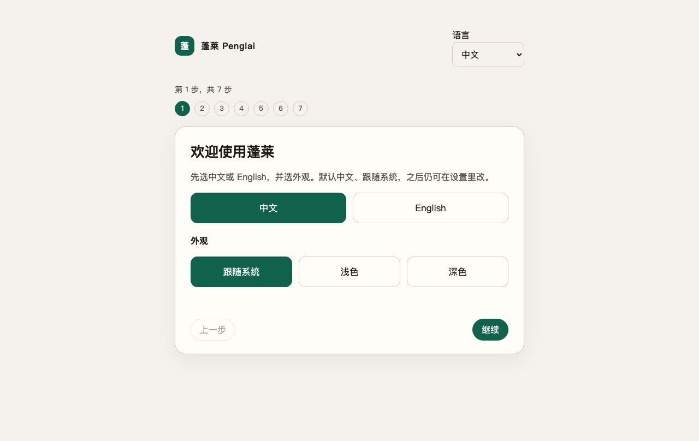
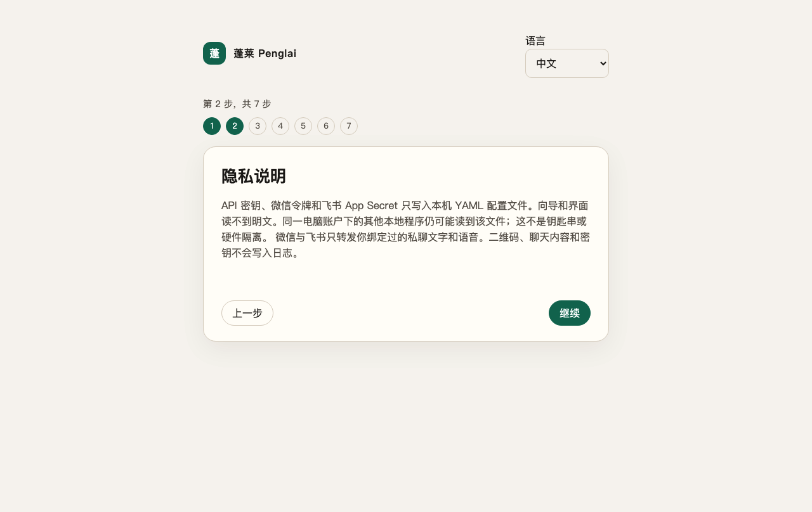
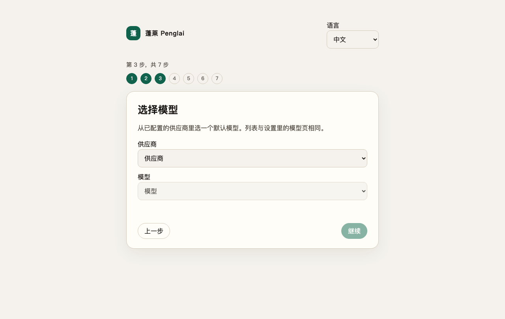
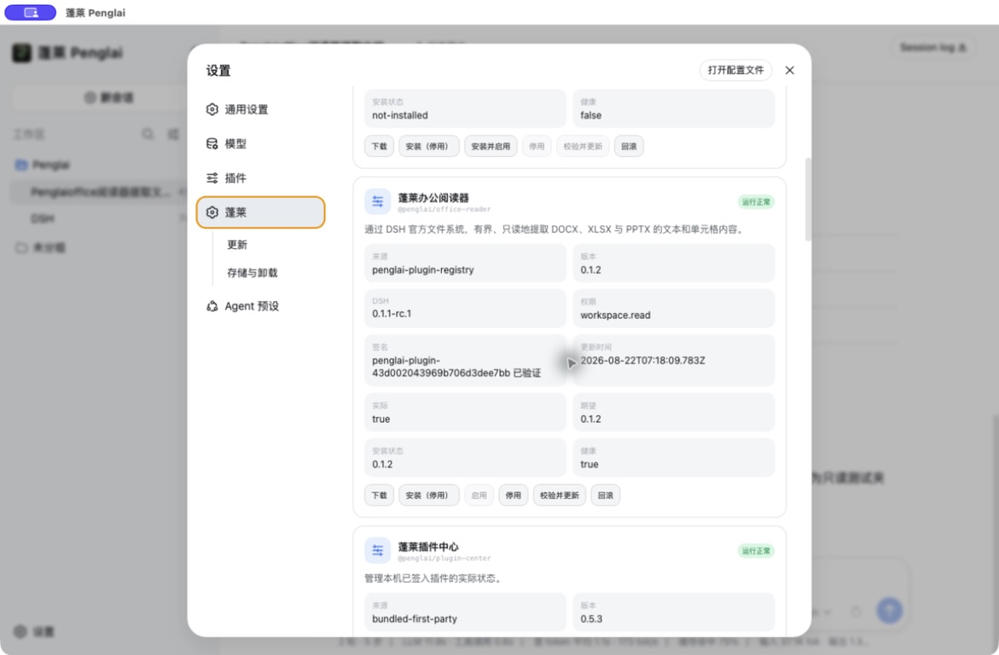
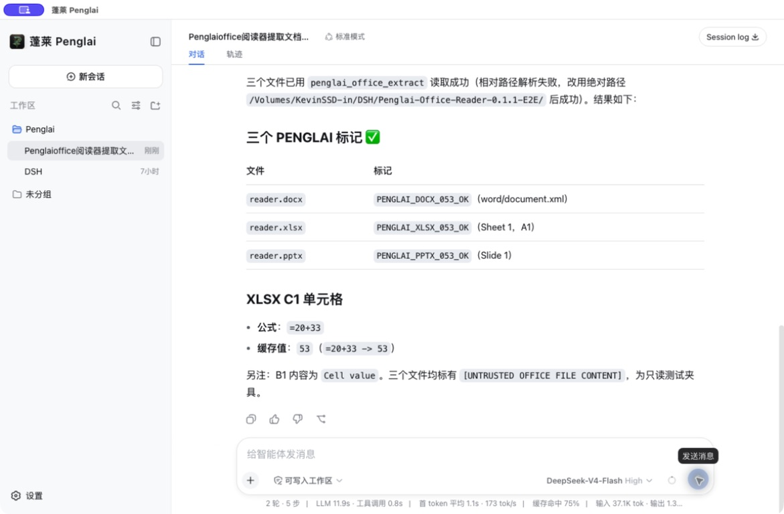
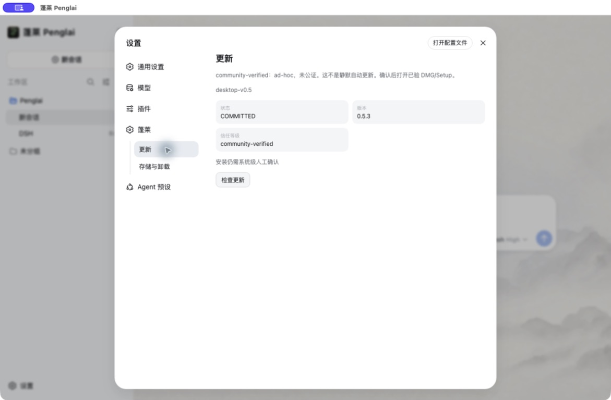

<p align="center">
  
</p>

<p align="center"><sub>The original Penglai project banner, preserved as part of the project's visual history.</sub></p>

<h1 align="center">Penglai · 蓬莱</h1>

<p align="center"><strong>Bring the agent out of the terminal and into the computer you already use.</strong></p>

<p align="center">
  <a href="https://github.com/kevinchennewbee/PenglaiAgent/releases/tag/v0.5.3"></a>
  <a href="https://github.com/kevinchennewbee/PenglaiAgent/actions/runs/32560185691"></a>
  <a href="https://github.com/deepseek-ai/deepseek-harness"></a>
  <a href="docs/PUBLICATION_0.5.3.md"></a>
  <a href="LICENSE"></a>
</p>

<p align="center">
  <a href="#english">English</a> ·
  <a href="#中文">中文</a> ·
  <a href="https://penglai.pages.dev">Website</a> ·
  <a href="https://github.com/kevinchennewbee/PenglaiAgent/releases/tag/v0.5.3">Current download</a> ·
  <a href="docs/RELEASE_NOTES_0.5.3.md">0.5.3 notes</a> ·
  <a href="SECURITY.md">Security</a>
</p>

> **0.5.5 candidate under verification.** Local development targets official DSH `0.1.1-rc.2`. A fresh profile loads official DSH plus required-builtin Penglai Office and Penglai Memory. IM, ASR, MOSS-TTS, and Companion stay installable and default-off. There is no `v0.5.5` GitHub tag or Release yet. macOS remains ad-hoc/not notarized; Windows has no Authenticode. Intel Mac and Windows native installers are `AWAITING_NATIVE_MAC_X64` / `AWAITING_NATIVE_WIN_X64` until matching runners produce them. Live WeChat/Feishu and paid provider evidence stay `AWAITING_LIVE_CREDENTIAL`.
>
> Penglai 0.5.3 remains the current public release for Apple Silicon, Intel Mac, and Windows x64. All three native jobs built, installed, launched, and exercised packages from source `afc75b2...`. The immutable 0.5.2 files remain available with their correction notice.

<p align="center">
  
  
  
</p>

<a id="english"></a>

# English

## What Penglai is

Penglai is a desktop distribution of [DeepSeek Harness](https://github.com/deepseek-ai/deepseek-harness). It packages a fixed DSH build, Node, Electron, the official DSH Web interface, a first-run setup flow, and a set of reviewed DSH plugins into an application that can be installed without preparing a development environment.

DSH owns the agent loop, models, tools, approvals, Workspace, Session, Turn, and the main Web interface. Penglai owns the desktop package, process supervision, local data layout, onboarding, update and uninstall behavior, product identity, and the plugin catalog. Penglai does not run a second agent or replace DSH chat with its own chat page.

The name comes from the story of the Eight Immortals crossing the sea, each using a different skill. In Penglai, models, channels, local voice, memory, and other plugins bring different abilities to one DSH core.

## A note from the author

I spent more than ten years around networking, security, and operations, but I was not a software developer when Penglai began. What bothered me was not a lack of powerful agents. It was that most of them still expected an ordinary person to sit in front of a terminal, understand APIs and configuration files, and learn the language of software before receiving any benefit.

Computers moved from command lines to windows and then into everyone's pocket. Agents should make the same journey. If I can send a message, I should be able to reach my own assistant. If it takes an action, I should be able to see what it was allowed to do, what actually happened, and what it cost.

Penglai has been rebuilt more than once. Each rebuild left useful ideas behind, but it also made the core simpler. Version 0.5 is the clearest decision so far: DSH is the only agent core. Penglai should make that core easier to install, understand, extend, and trust. It should not build a second agent beside it.

This repository is also a record of human and AI collaboration. AI coding tools can write and review a remarkable amount of code, but none of them is trusted by default and none of them is the author of Penglai. Product direction, taste, risk decisions, acceptance, and release responsibility remain human work.

## Where the project is now

Penglai 0.5.0 was a clean architectural reset around official DSH `0.1.0-rc.8`. It shipped one Apple Silicon DMG on 20 August 2026.

Penglai 0.5.3 was released on 22 August 2026. It keeps official DSH `0.1.1-rc.1`, closes the assisted-update failure found after 0.5.2, and ships three installers from one source commit:

| Platform | 0.5.3 installer | Native result |
| --- | --- | --- |
| Apple Silicon, macOS 13+ | [`Penglai_0.5.3_macos_aarch64.dmg`](https://github.com/kevinchennewbee/PenglaiAgent/releases/download/v0.5.3/Penglai_0.5.3_macos_aarch64.dmg) | PASS |
| Intel Mac | [`Penglai_0.5.3_macos_x64.dmg`](https://github.com/kevinchennewbee/PenglaiAgent/releases/download/v0.5.3/Penglai_0.5.3_macos_x64.dmg) | PASS |
| Windows x64 | [`Penglai_0.5.3_windows_x64_setup.exe`](https://github.com/kevinchennewbee/PenglaiAgent/releases/download/v0.5.3/Penglai_0.5.3_windows_x64_setup.exe) | PASS |

The source tree passes its format, type, build, unit, contract, integration, desktop E2E, dependency, license, and secret gates. [Native run 32560185691](https://github.com/kevinchennewbee/PenglaiAgent/actions/runs/32560185691) separately built, installed, launched, and checked all three packages on matching native hosts. Source checks and installed evidence remain separate claims. GitHub CodeQL still lists an open baseline of local file-race, regular-expression, build-script, and vendored-code findings; the release does not claim a zero-alert scan.

<p align="center">
  
  
  
</p>

## One DSH core, optional Penglai plugins

A fresh profile starts with DSH and Penglai Center. The other Penglai plugins are optional and must not prevent ordinary DSH conversation when they are absent, disabled, or broken.

| Package | What it adds |
| --- | --- |
| `@penglai/im` | authorised private conversations through Weixin and Feishu, with durable binding, routing, and recovery |
| `@penglai/asr` | local SenseVoice speech recognition, including language and emotion metadata |
| `@penglai/moss-tts` | local MOSS-TTS-Nano synthesis, preview, and supported channel audio output |
| `@penglai/context` | a local index for explicitly granted folders and host-verified source cards |
| `@penglai/memory` | global, Workspace, and session-candidate memory with confirmation boundaries |
| `@penglai/budget` | local usage limits based on the official DSH TokenMeter and model route |
| `@penglai/companion` | opt-in scheduled messages with quiet hours, daily limits, and channel binding |

All seven optional packages passed the 0.5.3 source suite against DSH rc.1. The exact packaged app on all three native targets then observed Penglai Center and the seven optional plugins through four runtime phases: fresh default-disabled, all enabled, all enabled after DSH restart, and all disabled after a second restart. Each phase used the official DSH HTTP/WebSocket surface and loader inventory and left no owned process behind. This proves the shipped set across those phases; it does not turn every future plugin or every external service into a tested claim.

## Plugin Center

Penglai Center is a real DSH host/client plugin inside the official DSH settings interface. Installed and active states come from the DSH loader inventory, not from a UI preference or a downloaded filename.

Penglai includes PPDP/1, the Penglai Plugin Distribution Protocol. The client can discover versioned GitHub Releases from the public [Penglai Plugin Registry](https://github.com/kevinchennewbee/PenglaiPluginRegistry), verify a Penglai Ed25519 signature and each archive hash, install a package in the disabled state, ask for permission confirmation, and roll back a failed activation.

The current signed catalog is the immutable [`plugin-catalog-v1.000004`](https://github.com/kevinchennewbee/PenglaiPluginRegistry/releases/tag/plugin-catalog-v1.000004) Release. It keeps the Pilot and carries `@penglai/office-reader` 0.1.2 for bounded, read-only DOCX/XLSX/PPTX extraction under the exact DSH 0.1.1-rc.1 tool contracts. The production client has refreshed it from GitHub, verified both signatures, staged the archive under app-private data, installed it disabled, and recovered the signed last-good catalog offline. Future reviewed DSH plugins can be published in a new catalog sequence without rebuilding the Penglai desktop application.

Penglai Center does not accept arbitrary npm packages, Git repositories, or download URLs. A DSH plugin runs with the local DSH process permissions. Catalog permission fields explain what was reviewed and what the user is confirming; they are not an operating-system sandbox.

## Models and first run

Penglai uses the official DSH model directory, adapters, and local YAML credentials service. It does not keep a separate provider registry or API key store.

The setup flow covers privacy, language and appearance, provider credentials, the official model list, a real API test, Workspace selection, and the first official Turn. DeepSeek's rc.1 adapter includes `deepseek-v4-flash-vision-exp` with text and image input. An installed 0.5.3 Apple Silicon package refreshed catalog 4, updated Office Reader from 0.1.1 to 0.1.2, restarted embedded DSH, and used a real DeepSeek session to extract bounded content from DOCX, XLSX, and PPTX fixtures. The temporary credential used for acceptance is not part of the repository or Release.

## Install and upgrade

Download the appropriate package from the immutable [Penglai 0.5.3 Release](https://github.com/kevinchennewbee/PenglaiAgent/releases/tag/v0.5.3) and compare it with the published `SHA256SUMS` before installing.

Penglai 0.5.0 cannot update itself in-app and needs a manual same-platform overlay. A completed Penglai 0.5.1 profile can discover, download, hash-check, signature-check, and hand off later releases from **Settings → Penglai → Update**. A public 0.5.1 binary has downloaded and opened the exact signed 0.5.3 Apple Silicon DMG; after the system-level copy, 0.5.3 launched the official DSH UI and recorded `COMMITTED / 0.5.3`. The immutable 0.5.2 package installs and runs, but that path can leave its update ledger in recovery when optional IM remains disabled. Users should install the corrective 0.5.3 package instead. If the 0.5.1 Workspace bug prevents reaching Settings, manually overlay the same-platform package. These paths preserve data under the isolated `Penglai/0.5` generation and external Workspaces.

Penglai 0.5.1 and later contain PUDP/1, a signed and versioned application-update protocol for later same-platform releases. It uses immutable tagged assets and `update-manifest-v1.json`, never a mutable `latest.json`. Updates require verification and user confirmation. They are not silent. Discovery currently uses GitHub's unauthenticated Releases API, so a shared network that exhausts GitHub's anonymous rate limit must wait for the reset or use the immutable Release page for a manual same-platform overlay.

## Local data and trust

- There is no Penglai account, cloud sync, or telemetry service.
- Provider calls send the prompt and required context to the provider selected by the user.
- Credentials are written by the official DSH credentials service to an app-private YAML file. The renderer cannot read them back.
- ASR and TTS model files are downloaded only after user action from pinned sources with revision, size, and SHA-256 checks.
- Context reads only folders explicitly granted by the user and does not modify source files.
- Long-term global memory and reusable SOP writes require confirmation. Companion is off by default and cannot run tools unattended.
- macOS packages use ad-hoc signing and are not notarized. There is no Apple Developer ID.
- Windows packages have no Authenticode signature and may trigger SmartScreen warnings.
- Penglai's Ed25519 signatures protect update and plugin bytes. They do not replace Apple or Microsoft publisher identity.

See [Security](SECURITY.md), the [product and data contract](docs/PRODUCT.md), [Plugin Center](docs/PLUGIN_CENTER.md), and the release SBOM and third-party notices for the full boundary.

## Architecture

```text
Penglai Desktop (Electron)
  -> embedded Node and official DSH 0.1.1-rc.1
  -> authenticated loopback proxy
  -> setup wizard before DSH is ready
  -> official DSH Web for normal use
  -> Penglai Center and optional DSH plugins
```

The package contains its own runtime and does not fall back to a system Node, pnpm, Python, ffmpeg, global DSH install, or source checkout. Large speech model weights are optional downloads and never block DSH startup.

## Project history

Penglai has changed architecture more than once. The old versions remain in Git history and Releases because they explain how the product arrived here, but their runtimes are not mixed into 0.5.

| Generation | What it explored |
| --- | --- |
| 0.3 | the Python and GenericAgent product line |
| 0.4 | a TypeScript Host, Pi runtime, Tauri desktop, durable tasks, evidence, and personal context |
| 0.5.0 | a clean Electron distribution with official DSH as the only agent and Web UI core |
| 0.5.1 | DSH rc.1, three release targets, signed plugin distribution, and a signed future update path |
| 0.5.2 | installed first-run repairs and real provider/Turn acceptance; a later upgrade drill exposed the optional-IM post-verification defect |
| 0.5.3 | update closeout: optional plugins no longer block commit, and a newer manual overlay can clear the superseded 0.5.2 recovery state without inventing a signed ledger |

The useful product ideas can return as DSH plugins. Old databases, credentials, sessions, and execution engines do not automatically cross an architectural generation.

## Build and test

Development uses Node `22.22.2` and pnpm `10.14.0`.

```bash
corepack enable
pnpm install --frozen-lockfile
pnpm typecheck
pnpm test:unit
pnpm test:contract
pnpm test:integration
pnpm test:e2e
pnpm test:security
pnpm verify:contracts
pnpm verify:dependencies
pnpm audit:secrets
```

Native packaging commands are target-specific:

```bash
pnpm package:dmg:arm       # native Apple Silicon Mac
pnpm package:dmg:intel     # native Intel Mac
pnpm package:windows       # native Windows x64 with MSVC and NSIS
```

A successful source build is not release evidence. See the [0.5.3 publication contract](docs/PUBLICATION_0.5.3.md), [acceptance registry](docs/ACCEPTANCE.md), and [contributing guide](CONTRIBUTING.md).

## People, tools, and acknowledgements

Penglai source is released under the [MIT License](LICENSE). The Penglai name, logo, and visual identity are not granted by the software license.

The project is created and maintained by [Kevin Chen / 陈克文](https://github.com/kevinchennewbee). Across the 0.3, 0.4, and 0.5 generations, implementation and review have also been assisted by the following AI tools:

| Collaborator | Contribution |
| --- | --- |
| [Kimi Work](https://www.kimi.com/en/products/download) | research, implementation, and long-running repository work |
| [Grok Build](https://grok.com/) | implementation, review, and native release preparation |
| [Cursor Agent](https://cursor.com/) | implementation and repository edits |
| [Claude Code](https://www.anthropic.com/claude-code) | implementation and review |
| [OpenAI Codex](https://openai.com/codex/) | release audit, fixes, verification, documentation, and publication |

These credits record real collaboration. They do not transfer authorship, judgment, or release accountability to a model or tool.

Penglai 0.5 stands on [DeepSeek Harness](https://github.com/deepseek-ai/deepseek-harness), [Electron](https://github.com/electron/electron), [Node.js](https://github.com/nodejs/node), [TypeScript](https://github.com/microsoft/TypeScript), and [pnpm](https://github.com/pnpm/pnpm). Local speech and channel support builds on [SenseVoice](https://github.com/FunAudioLLM/SenseVoice), [sherpa-onnx](https://github.com/k2-fsa/sherpa-onnx), [MOSS-TTS-Nano](https://github.com/OpenMOSS/MOSS-TTS-Nano), [Lark Node SDK](https://github.com/larksuite/node-sdk), [Tencent openclaw-weixin](https://github.com/Tencent/openclaw-weixin), [silk-wasm](https://github.com/idranme/silk-wasm), and [libopus-wasm](https://github.com/openclaw/libopus-wasm). Earlier generations also learned from [GenericAgent](https://github.com/lsdefine/GenericAgent) and [Pi Agent](https://github.com/earendil-works/pi).

Thank you to every upstream maintainer and contributor. Each dependency keeps its own license and attribution. Release packages include `THIRD_PARTY_NOTICES.txt` and `SBOM.cdx.json` with the exact shipped versions and files.

<a id="中文"></a>

# 中文

## 蓬莱是什么

蓬莱是 [DeepSeek Harness](https://github.com/deepseek-ai/deepseek-harness) 的桌面发行版。它把固定版本的 DSH、Node、Electron、官方 DSH Web、首次引导和经过审核的 DSH 插件装进一个普通应用，不要求用户先准备开发环境。

Agent loop、模型、工具、审批、Workspace、Session、Turn 和主界面都由 DSH 提供。蓬莱负责安装包、进程监管、本地数据目录、首次引导、升级与卸载、产品名称和插件目录。蓬莱不再运行第二套 Agent，也不做一张自己的聊天页来替代 DSH Web。

“蓬莱”这个名字借的是八仙过海的故事。模型、渠道、本地语音、记忆和其他插件各有本领，但共用一个 DSH 核心。

## 作者的话

我做了十多年网络、安全和运维，但开始做蓬莱时，我并不会写软件。真正让我难受的，不是市面上没有强大的 Agent，而是它们大多仍然要求普通人坐在终端前，先学会 API、配置文件和软件工程的语言，才有资格得到帮助。

计算机从命令行走进窗口，又走进每个人的口袋。Agent 也应该走完这段路。只要我能发一条消息，就应该能找到自己的助理；它替我做事时，我也应该看得见它得到了什么权限、究竟做了什么、花了多少成本。

蓬莱重做过不止一次。每次重做都留下了一些值得保留的东西，也让核心变得更简单。0.5 是目前最明确的一次选择：DSH 是唯一的 Agent 核心。蓬莱要做的是让它更容易安装、理解、扩展和信任，而不是在旁边再造一个 Agent。

这个仓库也是一份人与 AI 一起工作的记录。AI 编程工具可以写出、检查惊人数量的代码，但我不默认相信任何一个模型，它们也不是蓬莱的作者。产品方向、审美、风险取舍、验收和发布责任，最终仍然是人的工作。

## 项目现在做到哪了

Penglai 0.5.0 围绕官方 DSH `0.1.0-rc.8` 重做了整个架构。2026 年 8 月 20 日发布的安装包只有一份 Apple Silicon DMG。

Penglai 0.5.3 已于 2026 年 8 月 22 日发布。它继续使用官方 DSH `0.1.1-rc.1`，修复 0.5.2 发布后真实升级演练发现的问题，并由同一份源码发布三个安装包：

| 平台 | 0.5.3 安装包 | 原生验收 |
| --- | --- | --- |
| Apple Silicon，macOS 13+ | [`Penglai_0.5.3_macos_aarch64.dmg`](https://github.com/kevinchennewbee/PenglaiAgent/releases/download/v0.5.3/Penglai_0.5.3_macos_aarch64.dmg) | PASS |
| Intel Mac | [`Penglai_0.5.3_macos_x64.dmg`](https://github.com/kevinchennewbee/PenglaiAgent/releases/download/v0.5.3/Penglai_0.5.3_macos_x64.dmg) | PASS |
| Windows x64 | [`Penglai_0.5.3_windows_x64_setup.exe`](https://github.com/kevinchennewbee/PenglaiAgent/releases/download/v0.5.3/Penglai_0.5.3_windows_x64_setup.exe) | PASS |

源码已经通过格式、类型、构建、单元、契约、集成、桌面 E2E、依赖、许可证和秘密扫描。[原生运行 32560185691](https://github.com/kevinchennewbee/PenglaiAgent/actions/runs/32560185691) 又在对应原生机器上分别构建、安装、启动并检查了三份最终安装包。源码门禁与真实安装证据仍然是两种不同的事实。GitHub CodeQL 目前仍保留一批本机文件竞争、正则性能、构建脚本和上游代码告警；0.5.3 不声称已经做到零告警。

## 一个 DSH 核心，七个可选插件

全新 profile 只启动 DSH 和 Penglai Center。其他蓬莱插件都是可选项。插件缺失、关闭或出错时，普通 DSH 对话和无关插件必须照常工作。

| 插件 | 能力 |
| --- | --- |
| `@penglai/im` | 微信、飞书授权私聊，持久绑定、路由和恢复 |
| `@penglai/asr` | 本机 SenseVoice 语音识别，以及语言、情绪元数据 |
| `@penglai/moss-tts` | 本机 MOSS-TTS-Nano 合成、试听和渠道语音输出 |
| `@penglai/context` | 为用户明确授权的目录建立本地索引，显示由 host 核对的来源卡 |
| `@penglai/memory` | global、Workspace 和 session candidate 分层记忆，受确认边界约束 |
| `@penglai/budget` | 根据 official DSH TokenMeter 与模型 route 统计和限制本地用量 |
| `@penglai/companion` | 默认关闭的定时陪伴，带安静时段、每日上限和渠道绑定 |

七个可选插件都通过了 DSH rc.1 下的 0.5.3 源码套件。随后，三端最终安装包又分别观察了 Penglai Center 和七个可选插件的四个运行阶段：首次启动默认停用、全部启用、重启 DSH 后仍全部启用、全部停用并再次重启。每一阶段都读取 official DSH HTTP/WebSocket 和 loader inventory，并确认没有残留的受管进程。这证明本次随包发布的插件在这些阶段兼容，不等于替未来插件或所有外部服务做保证。

## 插件中心怎么更新

Penglai Center 是 official DSH settings 里的真实 host/client 插件。installed 和 active 状态只认 DSH loader inventory，不认 UI 里的开关文字，也不认下载目录里有没有一个文件。

蓬莱包含 PPDP/1，也就是蓬莱插件发行协议。客户端从公开的 [Penglai Plugin Registry](https://github.com/kevinchennewbee/PenglaiPluginRegistry) 查找按版本发布的 GitHub Release，验证蓬莱 Ed25519 签名和每个 tar 包的 SHA。插件先以 disabled 状态安装，用户确认权限后再启用；启用失败会回滚。

当前签名 catalog 是不可变的 [`plugin-catalog-v1.000004`](https://github.com/kevinchennewbee/PenglaiPluginRegistry/releases/tag/plugin-catalog-v1.000004) Release。它保留试航插件，并提供 `@penglai/office-reader` 0.1.2，在 DSH 0.1.1-rc.1 的精确工具 contract 下有界、只读地提取 DOCX、XLSX、PPTX。生产客户端已经真实完成 GitHub 刷新、两层验签、用户私有目录 staging、默认关闭安装，以及断网后的 signed last-good 恢复。以后加入经过审核的 DSH 插件，只需要发布新的 catalog sequence，不需要为了改列表重做桌面客户端。

插件中心不接受任意 npm、Git 仓库或下载 URL。DSH 插件与本机 DSH 进程共享权限。catalog 里的 permission 用来说明审核内容和用户正在确认什么，不是操作系统沙箱。

## 模型与首次引导

蓬莱使用 official DSH 的模型目录、adapter 和本地 YAML credentials service，不维护第二份 provider 列表或 API Key 仓库。

首次引导包括隐私、语言和外观、provider 凭据、official model list、真实 API test、Workspace 和第一条 official Turn。DSH rc.1 的 DeepSeek adapter 已包含 `deepseek-v4-flash-vision-exp`，支持文本与图片输入。真实安装的 0.5.3 Apple Silicon 客户端已经刷新 catalog 4，把 Office Reader 从 0.1.1 更新到 0.1.2，自动重启内置 DSH，并在真实 DeepSeek 会话中读取 DOCX、XLSX 和 PPTX 测试文件。验收使用的临时凭据不在仓库或 Release 中。

## 安装与升级

请从不可变的 [Penglai 0.5.3 Release](https://github.com/kevinchennewbee/PenglaiAgent/releases/tag/v0.5.3) 下载对应平台安装包，并用其中的 `SHA256SUMS` 核对文件。

0.5.0 不能在应用内直接升级，需要手动覆盖同平台的新版本。已经完成引导的 0.5.1 可以在 **设置 → 蓬莱 → 更新** 中发现、下载、校验 SHA、验签并交给系统安装器。公开 0.5.1 客户端已经真实下载并打开精确的 0.5.3 Apple Silicon 签名 DMG；完成系统级复制后，0.5.3 启动 official DSH 主界面，并写入 `COMMITTED / 0.5.3`。不可变的 0.5.2 安装包能安装和运行，但当可选 IM 保持关闭时，这条升级路径可能把更新账本留在 recovery 状态；请改用修复该问题的 0.5.3。如果 0.5.1 的 Workspace 误判让用户进不了设置页，请手动覆盖同平台安装包。数据仍保留在 `Penglai/0.5` 隔离目录及外置 Workspace。

0.5.1 及之后版本包含 PUDP/1，为后续同平台版本提供签名、按版本发布的辅助更新。它读取 immutable tag 下的 `update-manifest-v1.json`，不用可变的 `latest.json`。更新必须先校验，再由用户确认，不会静默替换应用。发现阶段目前使用 GitHub 匿名 Releases API；如果共享网络耗尽匿名额度，需要等 GitHub 重置，或从不可变 Release 页面下载同平台安装包手动覆盖。

## 本地数据与信任边界

- 没有蓬莱账号、云同步或遥测服务。
- 调用云模型时，prompt 和本次任务需要的上下文会发送给用户选择的 provider。
- 凭据由 official DSH credentials service 写入应用私有的 YAML 文件，renderer 不能读回明文。
- ASR/TTS 模型只在用户操作后下载，固定来源、revision、size 和 SHA-256。
- Context 只读取用户明确授权的目录，不修改源文件。
- 写入长期 global memory 或可复用 SOP 需要确认。Companion 默认关闭，不能无人值守使用工具。
- macOS 安装包采用 ad-hoc 签名，没有 Apple Developer ID，也没有公证。
- Windows 安装包没有 Authenticode，可能出现 SmartScreen 提示。
- 蓬莱 Ed25519 签名保护更新和插件字节，不能代替 Apple 或 Microsoft 的发行者身份。

完整说明见[安全文档](SECURITY.md)、[产品与数据合同](docs/PRODUCT.md)、[插件中心合同](docs/PLUGIN_CENTER.md)，以及 Release 中的 SBOM 和第三方声明。

## 架构

```text
Penglai Desktop (Electron)
  -> 内置 Node 与 official DSH 0.1.1-rc.1
  -> authenticated loopback proxy
  -> DSH 就绪前显示首次引导
  -> 日常使用进入 official DSH Web
  -> Penglai Center 与可选 DSH 插件
```

安装包自带运行时，不会回退到系统 Node、pnpm、Python、ffmpeg、全局 dsh 或源码目录。大型语音模型按需下载，不影响 DSH 首次启动。

## 版本历史

蓬莱换过几次架构。旧版本保留在 Git 历史和 Release 里，因为这些经历解释了今天的产品，但旧 runtime 不会混进 0.5。

| 版本 | 当时在解决什么 |
| --- | --- |
| 0.3 | Python 与 GenericAgent 产品线 |
| 0.4 | TypeScript Host、Pi runtime、Tauri 桌面、持久任务、证据和个人上下文 |
| 0.5.0 | 以 official DSH 为唯一 Agent 与 Web UI 核心的 Electron 发行版 |
| 0.5.1 | DSH rc.1、三个发行目标、签名插件目录和后续签名更新路径 |
| 0.5.2 | 真实安装首次引导修复和真实 provider/Turn 验收；后续升级演练发现可选 IM 错误参与 post-verify |
| 0.5.3 | 修复升级收尾：可选插件不再阻断 commit；真实安装更高版本后，可以纠正旧的 0.5.2 recovery 状态，但不会伪造签名升级账本 |

有价值的产品想法可以重新做成 DSH 插件。旧数据库、凭据、会话和执行引擎不会自动跨架构继承。

## 从源码构建与测试

开发环境使用 Node `22.22.2` 和 pnpm `10.14.0`。

```bash
corepack enable
pnpm install --frozen-lockfile
pnpm typecheck
pnpm test:unit
pnpm test:contract
pnpm test:integration
pnpm test:e2e
pnpm test:security
pnpm verify:contracts
pnpm verify:dependencies
pnpm audit:secrets
```

安装包必须在对应原生平台构建：

```bash
pnpm package:dmg:arm       # Apple Silicon Mac
pnpm package:dmg:intel     # Intel Mac
pnpm package:windows       # Windows x64，需要 MSVC 与 NSIS
```

源码构建成功不算发布证据。发布流程见 [0.5.3 公开发布合同](docs/PUBLICATION_0.5.3.md)、[验收清单](docs/ACCEPTANCE.md)与[贡献指南](CONTRIBUTING.md)。

## 人、工具与致谢

Penglai 源码使用 [MIT License](LICENSE)。软件许可证不包含 Penglai 名称、logo 和视觉识别的授权。

项目由 [陈克文 / Kevin Chen](https://github.com/kevinchennewbee) 发起并维护。0.3、0.4、0.5 几代开发与审查过程中，也得到以下 AI 工具的实际协助：

| 协作者 | 参与内容 |
| --- | --- |
| [Kimi Work](https://www.kimi.com/en/products/download) | 调研、实现和长时间仓库任务 |
| [Grok Build](https://grok.com/) | 实现、审查与原生发布准备 |
| [Cursor Agent](https://cursor.com/) | 实现与仓库编辑 |
| [Claude Code](https://www.anthropic.com/claude-code) | 实现与审查 |
| [OpenAI Codex](https://openai.com/codex/) | 发布审计、修复、验证、文档与公开发布 |

这些署名记录真实协作，不把作者身份、判断和发布责任交给模型或工具。

Penglai 0.5 建立在 [DeepSeek Harness](https://github.com/deepseek-ai/deepseek-harness)、[Electron](https://github.com/electron/electron)、[Node.js](https://github.com/nodejs/node)、[TypeScript](https://github.com/microsoft/TypeScript) 和 [pnpm](https://github.com/pnpm/pnpm) 之上。本地语音和渠道能力感谢 [SenseVoice](https://github.com/FunAudioLLM/SenseVoice)、[sherpa-onnx](https://github.com/k2-fsa/sherpa-onnx)、[MOSS-TTS-Nano](https://github.com/OpenMOSS/MOSS-TTS-Nano)、[Lark Node SDK](https://github.com/larksuite/node-sdk)、[Tencent openclaw-weixin](https://github.com/Tencent/openclaw-weixin)、[silk-wasm](https://github.com/idranme/silk-wasm) 和 [libopus-wasm](https://github.com/openclaw/libopus-wasm)。更早的版本也从 [GenericAgent](https://github.com/lsdefine/GenericAgent) 与 [Pi Agent](https://github.com/earendil-works/pi) 得到过启发。

感谢所有上游维护者和贡献者。各依赖保留自己的许可证与归属，正式安装包会用 `THIRD_PARTY_NOTICES.txt` 和 `SBOM.cdx.json` 列出实际随包发布的精确版本与文件。
