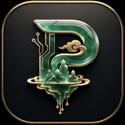

<p align="center">
  
</p>

<h1 align="center">蓬莱 Penglai</h1>

<p align="center">让每个人都能更简单地安装、配置并组合使用 DeepSeek Harness。</p>

<p align="center">
  <a href="https://github.com/kevinchennewbee/PenglaiAgent/releases/tag/v0.5.0">下载 0.5.0</a> ·
  <a href="https://penglai.pages.dev">官网</a> ·
  <a href="docs/RELEASE_NOTES_0.5.0.md">版本说明</a> ·
  <a href="SECURITY.md">安全与隐私</a>
</p>

## 蓬莱是什么

Penglai 0.5.0 是以 official [DeepSeek Harness（DSH）](https://github.com/deepseek-ai/deepseek-harness)为唯一核心的本地桌面发行版。

如果把 DSH 看作 Linux，蓬莱更接近一个为普通用户准备的发行层：负责安装引导、桌面封装、中文体验、可靠运行和插件组合；Agent、Workspace、Session、Turn、模型、工具、审批与基础 Web UI 仍由 DSH 提供。

蓬莱自己的差异化能力也遵守 DSH 的插件逻辑。IM、SenseVoice ASR、MOSS-TTS、个人上下文、分层记忆、预算与主动陪伴都作为可选 DSH 插件工作，而不是另一套 Agent runtime、模型网关或聊天界面。这样 DSH 继续升级时，蓬莱可以更快跟进，插件生态也可以持续扩展。

## 下载与安装

0.5.0 当前只发布：

```text
Penglai_0.5.0_macos_aarch64.dmg
```

适用于 Apple Silicon（M 系列）Mac，最低 macOS 13。请从 [GitHub Release v0.5.0](https://github.com/kevinchennewbee/PenglaiAgent/releases/tag/v0.5.0) 下载，并用 Release 中的 `SHA256SUMS` 核对文件。

1. 打开 DMG，将「蓬莱 Penglai」拖入 Applications。
2. 首次启动完成隐私、语言与外观、BYOK 模型、API 测试、Workspace 和第一段真实对话。
3. 进入 Penglai Center，按需安装插件。

这是 `community-verified` 版本：应用已 ad-hoc seal，但没有 Apple Developer ID，也未 notarize。首次打开可能出现系统信誉提示；项目不会要求你关闭 Gatekeeper。

0.4.1 → 0.5.0 是 fresh install。0.5.0 不迁移、读取或删除旧版会话、凭据和设置。

## 一个干净的核心，按需组合能力

fresh 安装默认只启用 DSH core 与 Penglai Center。其他插件默认不安装、不加载；用户可以分别安装、启用、配置、停用或卸载：

| 插件 | 能力 |
| --- | --- |
| `@penglai/im` | 微信与飞书授权私聊，持久绑定、路由与恢复 |
| `@penglai/asr` | 本机 SenseVoice 语音识别、语言与情绪元数据 |
| `@penglai/moss-tts` | 本机 MOSS-TTS-Nano 合成、试听和渠道语音输出 |
| `@penglai/context` | 授权目录的本地索引与可核对来源卡 |
| `@penglai/memory` | global / Workspace / session candidate 分层记忆 |
| `@penglai/budget` | 基于 official TokenMeter 的本地用量与硬限制 |
| `@penglai/companion` | 默认关闭的定时陪伴、安静时段和渠道绑定 |

它们可以独立使用，也可以组合：安装 IM 就能进行文字私聊；再安装 ASR，微信语音可在本机转写后进入 DSH；再配置 MOSS-TTS，支持的渠道可以返回语音。任何可选插件缺失或关闭，都不会阻断 DSH 基础对话和其他插件。

0.5.0 已真实验证微信私聊文字收发，以及 encrypted SILK → 本地 SenseVoice → official DSH Turn → 微信文字回复。当前不承诺微信原生绿色语音气泡；群聊、图片、普通文件、视频和富卡片不在本版范围。

## BYOK、本地优先与隐私

- 模型和 provider 复用 official DSH/Pi adapter；你使用自己的 API key。
- API key、微信 token、飞书 App Secret 通过 official credentials seam 写入本机 app-private YAML，网页 renderer 不能读取明文。
- 同一 OS 用户的高权限本地进程仍可能读取这些文件；本项目不把普通文件存储描述成硬件隔离。
- 无 Penglai 云账户、云同步或遥测。
- ASR/TTS 模型按固定来源、revision、大小和 SHA-256 下载；大型模型不塞入 DMG。
- Context 只访问用户明确授权的 realpath 目录，不修改源文件；撤销后可删除派生索引。
- 长期 global memory 与 SOP 写入需要用户确认；Companion 默认关闭且不能无人值守使用工具。

更多边界见 [SECURITY.md](SECURITY.md)、[插件中心合同](docs/PLUGIN_CENTER.md)与[版本说明](docs/RELEASE_NOTES_0.5.0.md)。

## 架构

```text
Penglai Desktop
├── Electron 发行层：首启引导、embedded runtime、进程监管与数据生命周期
├── official DSH rc8：Agent / Workspace / Session / Turn / Models / Tools / Web UI
├── official Pi adapters + credentials-local：多供应商 BYOK
├── Penglai Center：真实 DSH loader/profile inventory 与事务
└── 可选 Penglai DSH plugins
    ├── IM：Weixin / Feishu
    ├── Voice：SenseVoice ASR / MOSS-TTS-Nano
    └── Context / Memory / Budget / Companion
```

Penglai 不复制 DSH 的 Models、Workspace、Session、Skills、Schedule、TokenMeter 或主聊天 UI。所有设置 UI 进入 official DSH settings slot；插件实际状态来自真实 loader/profile inventory。

## 从源码开发

需要 Node.js 22.22.2 与 pnpm 10.14.0：

```bash
corepack enable
pnpm install --frozen-lockfile
pnpm typecheck
pnpm test:unit
pnpm test:contract
pnpm test:integration
pnpm test:security
pnpm audit:secrets
```

Apple Silicon 本地打包：

```bash
pnpm build:local-dmg
```

DSH overlay 固定 exact npm version、upstream checksum 与 parity tests；hash 不一致会阻止构建。详细设计见 [docs/ARCHITECTURE.md](docs/ARCHITECTURE.md)，贡献前请读 [CONTRIBUTING.md](CONTRIBUTING.md)。

## 当前边界与路线

- 0.5.0：Apple Silicon / macOS 13+。
- Intel Mac 与 Windows 安装包：后续版本。
- Developer ID、notarization 与稳定 updater signing channel：后续在具备正式发布身份和独立密钥后提供。
- 在线社区市场：本版不开放任意 npm/Git/URL；未来只接入经过来源、许可、权限、兼容性和安全审核的 DSH 插件。

## License 与致谢

Penglai 源码采用 [MIT License](LICENSE)。DSH、Electron、Node、SenseVoice、MOSS-TTS、腾讯 iLink 参考实现、飞书 SDK 与其他依赖各自遵循其许可证；完整归属与固定来源见 Release 的 `THIRD_PARTY_NOTICES.txt`、`SBOM.cdx.json` 和仓库 provenance 文件。

---

**English summary:** Penglai is an Apple-Silicon desktop distribution built around official DeepSeek Harness. DSH remains the sole agent and UI core; Penglai adds onboarding, packaging and optional standards-compliant plugins for IM, local voice, context, memory, budgets and companionship. Version 0.5.0 is a fresh install, BYOK, local-first, community-verified, ad-hoc sealed and not notarized.
