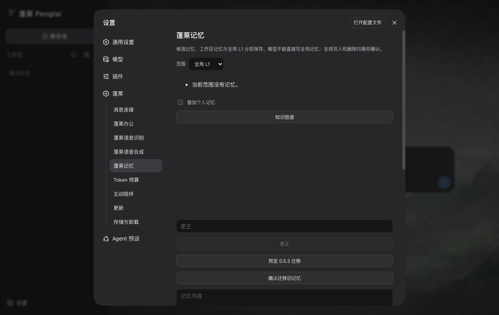
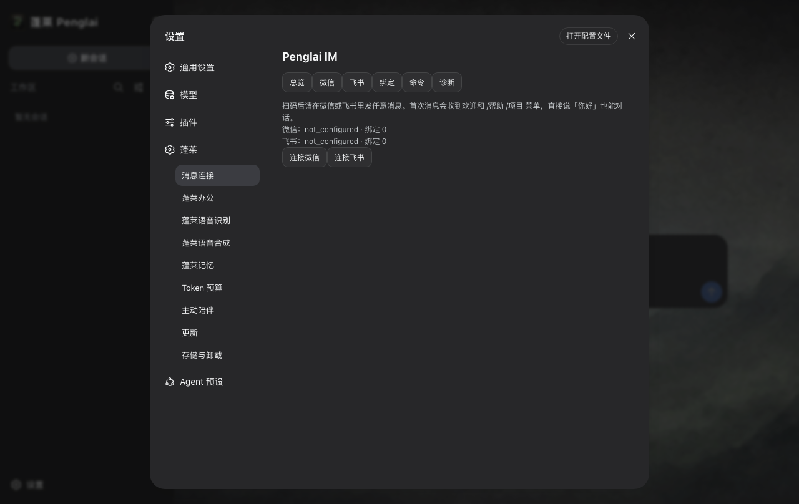
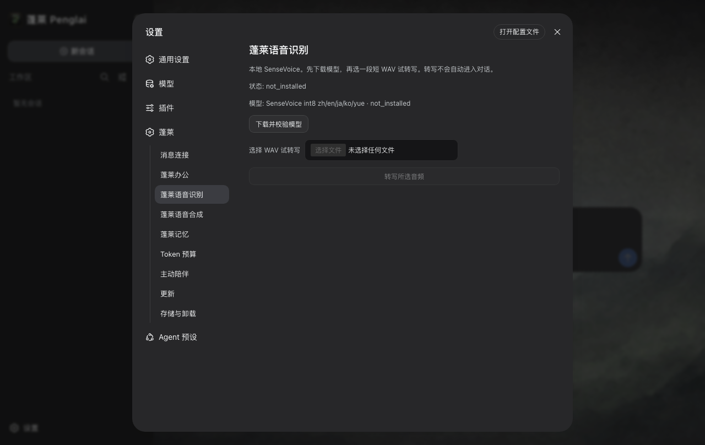
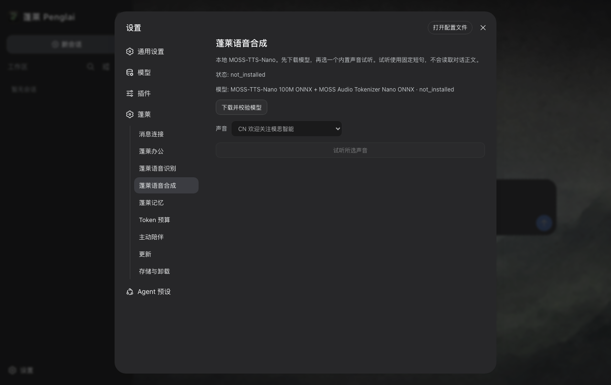
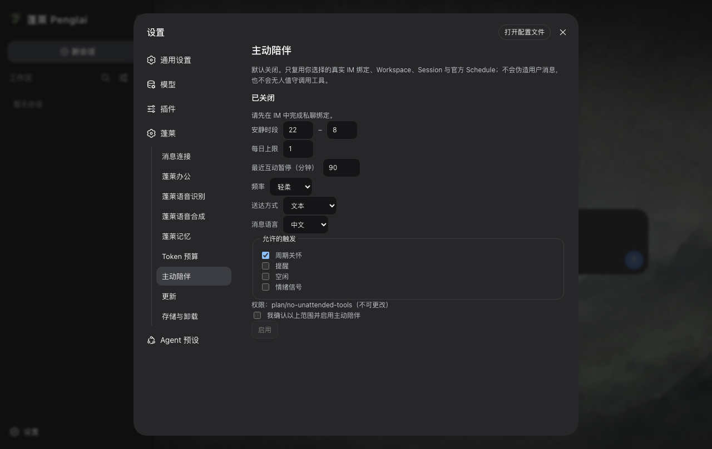

<p align="center">
  
</p>

<p align="center"><sub>The original Penglai banner. The architecture has changed; the island is still the same one.</sub></p>

<h1 align="center">Penglai · 蓬莱</h1>

<p align="center"><strong>DeepSeek Harness, ready to live on a personal computer.</strong></p>

<p align="center">
  <a href="docs/RELEASE_NOTES_0.5.7.md"></a>
  <a href="https://github.com/deepseek-ai/deepseek-harness"></a>
  
  <a href="LICENSE"></a>
</p>

<p align="center">
  <a href="#english">English</a> ·
  <a href="#中文">中文</a> ·
  <a href="https://penglai.pages.dev">Website</a> ·
  <a href="https://github.com/kevinchennewbee/PenglaiAgent/releases/tag/v0.5.6">Last public download (0.5.6)</a> ·
  <a href="docs/RELEASE_NOTES_0.5.7.md">0.5.7 notes</a> ·
  <a href="AGENTS.md">For AI contributors</a> ·
  <a href="SECURITY.md">Security</a>
</p>

> Penglai 0.5.7 is a development candidate on branch `0.5.7`. Official DSH
> remains `0.1.1-rc.2`. Installer sizes and SHA-256 are filled only after the
> public `v0.5.7` readback. The last immutable public Release is
> [`v0.5.6`](https://github.com/kevinchennewbee/PenglaiAgent/releases/tag/v0.5.6).
> macOS remains ad-hoc signed and not notarized; Windows has no Authenticode.

<p align="center">
  
  
</p>
<p align="center"><sub>Installed 0.5.5 screenshots retained as product references; 0.5.7 screenshots come only from the final installed product and must not include QR, accounts, or chat privacy.</sub></p>

<a id="english"></a>

# English

## Penglai in one minute

Penglai is a desktop distribution of
[DeepSeek Harness](https://github.com/deepseek-ai/deepseek-harness). It puts a
fixed DSH build, Node, Electron, the official DSH Web interface, a first-run
guide, updates, local data controls, and a reviewed set of DSH plugins into one
installable application.

DSH remains the only agent core. It owns the agent loop, models, tools,
approvals, Workspace, Session, Turn, and the conversation interface. Penglai
does the less glamorous work that determines whether a desktop product is
actually usable: packaging, process supervision, onboarding, local paths,
upgrades, uninstall, product identity, and plugin distribution. There is no
second Penglai agent hiding beside DSH and no replacement chat page.

Version 0.5.7 keeps those completed actions and adds eight platform connectors
under one Messaging plugin. Workspace memory can be curated and recalled
automatically, high-impact writes use one action-bound Owner broker, Office and
IM files use scoped opaque artifact references, and TTS buttons follow real
playback state. Live support claims follow
[`docs/0.5.7/LIVE_IM_MATRIX.md`](docs/0.5.7/LIVE_IM_MATRIX.md).

## What ships in 0.5.7

| Product surface | Fresh install | What it does |
| --- | --- | --- |
| Penglai Office | On | Inspect, create, edit, preview, and save DOCX, XLSX, PPTX, and PDF |
| Penglai Memory | On | Automatic current-Workspace memory, explicit personal memory, authorised sources, provenance, and a knowledge graph |
| Mobile Messaging | Off | Eight platform connectors under one IM control plane; WhatsApp runtime is not bundled |
| Speech Recognition | Off | Local SenseVoice transcription; enabling it adds the conversation microphone entry |
| Voice Generation | Off | Local MOSS-TTS-Nano preview, desktop playback, and supported channel audio |
| Companion | Off | Opt-in scheduled contact with quiet hours, daily limits, and a bound IM route |

The settings page is deliberately simple. Ordinary users see install/enable or
disable. Detailed hashes, loader phases, permissions, rollback, and diagnostics
are still available, but they no longer dominate the normal path.

<p align="center">
  
  
  
</p>

### Why the installer contains nine plugin packages

The package builder emits nine first-party code archives. That does not mean a
new user must make nine downloads.

| Package | Role in the product |
| --- | --- |
| `@penglai/plugin-center` | Required system surface for actual DSH loader state and signed catalog updates |
| `@penglai/im` | User-facing Mobile Messaging |
| `@penglai/plugin-reference` | Hidden conformance fixture used to test the plugin lifecycle; never shown as a product |
| `@penglai/asr` | User-facing local speech recognition |
| `@penglai/moss-tts` | User-facing local voice generation |
| `@penglai/memory` | Required Penglai Memory, including authorised local sources |
| `@penglai/office` | Required Penglai Office |
| `@penglai/budget` | Hidden advanced token-budget control |
| `@penglai/companion` | User-facing proactive companion |

All nine code packages are already inside each desktop installer. Office,
Memory, and Plugin Center are activated for a fresh profile. Optional packages
are copied from those verified bundled bytes when the user enables them. The
large SenseVoice and MOSS-TTS model weights are the exception: they download
only after an explicit action, from pinned revisions with size and SHA-256
checks. Mnemon and the Office Chinese font are already bundled. LibreOffice is
used by maintainers as an independent Office verifier; it is not required on a
user's machine.

## Office that can do work, not just read files

The old remote Office Reader has been retired. Penglai Office is a required DSH
plugin with a closed set of typed operations. It can inspect and create office
files, build a visible edit plan, preview the result, commit after the required
confirmation, and undo the last committed change. It covers DOCX, XLSX, PPTX,
and PDF, includes templates, and bundles an OFL Chinese font for PDF output.

Models do not get to invent arbitrary paths or run macros. Source and output
handles are issued by the host, Workspace boundaries are checked again at the
operation, and a write or export is not accepted merely because a model asked
for it. The exact capability matrix and remaining format limits live in
[the Office capability matrix](docs/0.5.5/OFFICE_CAPABILITY_MATRIX.md).

## Memory that knows which project it belongs to

Penglai Memory stores and recalls records locally and is enabled by default.
Mnemon 0.2.4 is its only recall engine. The fresh mode intelligently organizes
safe project facts inside the current official Workspace. A separate no-tools
official Agent uses the current provider/model after a Turn, so that curation
request is a model call to the provider rather than an offline-only step. The
host validates a closed output schema and skips secrets, sensitive content,
injection-like text, and malformed output. Before a later model step, confirmed
current-Workspace records and explicitly accepted personal facts can be
recalled. Workspace A cannot recall Workspace B.

Users can turn memory off or review candidates first. Personal/global memory,
forgetting, correction, source revocation, import, and reusable SOP changes keep
a visible action-specific Owner confirmation. The model cannot promote itself
to personal memory merely by assigning a high confidence score.

Explicitly authorised folders are indexed as sources without changing the
original files. Search results retain provenance. Revoking a source removes the
derived index and leaves the source untouched. The graph is a view of these
records and links, not a second database and not a cloud account.

<p align="center">
  
  
</p>

## Messaging and local voice

One Messaging plugin exposes eight connection entries: Weixin, Feishu, DingTalk,
WeCom, QQ, Slack, Telegram, and Discord. Text and supported images, files, and voice for a live
adapter arrive in the bound official DSH Session. Images use the official DSH
image store. Office files and audio use scoped opaque `artifact:<uuid>`
references. A mocked webhook is never live evidence.

Slack, Telegram, and Discord use official token or manifest flows and do not
fake QR. QQ is official Bot QR, not personal QQ login. The WhatsApp community
runtime is not bundled in 0.5.7.

SenseVoice and MOSS-TTS stay off until requested because their model files are
large. Once Speech Recognition is enabled and its model is installed, Penglai
can expose microphone input in the desktop conversation. Voice Generation can
preview locally and can send audio only through adapters that genuinely support
it. Neither plugin is allowed to stop ordinary DSH chat when it is disabled,
offline, or missing weights.

## A Plugin Center that can outlive a desktop release

Penglai Plugin Center reads versioned, immutable GitHub Releases from the public
[Penglai Plugin Registry](https://github.com/kevinchennewbee/PenglaiPluginRegistry).
It verifies the catalog signature, archive identity, SHA-256, DSH compatibility,
platform, and declared permissions before staging a package. Activation is a
separate step and failed activation rolls back.

This is the reason a good DSH rc.2 plugin can be reviewed and added later
without publishing Penglai 0.5.7 merely to change a list. The catalog is still
fail-closed: arbitrary npm names, Git repositories, and download URLs are not
accepted. A DSH plugin shares the local DSH process permissions; the permission
list explains review and consent, but it is not an operating-system sandbox.

Reviewed plugin cards may expose signed HTTPS repository, documentation, and
issue links. Electron Main validates the destination, shows it to the user, and
opens it externally only after confirmation.

## First run, installation, and updates

The seven-step guide covers language, privacy, the official model catalog,
credential testing, an official Workspace, and the first real DSH Turn. It can
go Back, retry a failed credential, resume after restart, and reject the app's
own data or installation directory as a Workspace. Finishing the wizard means a
real model reply was received, not merely that a health endpoint answered.

The 0.5.7 release contract contains exactly three native installers. Bytes and
SHA-256 are filled only after public readback of immutable `v0.5.7`:

| Platform | Release asset | Native installed evidence |
| --- | --- | --- |
| Apple Silicon, macOS 13+ | `Penglai_0.5.7_macos_aarch64.dmg` | pending public readback |
| Intel Mac | `Penglai_0.5.7_macos_x64.dmg` | pending public readback |
| Windows x64 | `Penglai_0.5.7_windows_x64_setup.exe` | pending public readback |

The last immutable public set remains [`v0.5.6`](https://github.com/kevinchennewbee/PenglaiAgent/releases/tag/v0.5.6).

Penglai 0.5.1 through 0.5.6 can check the signed 0.5 line from **Settings →
Penglai → Updates** after `v0.5.7` is public, or use a same-platform manual
overlay. There is no silent update. Version 0.5.0 needs a manual overlay because
it predates the production update trust path. External Workspaces and the
`Penglai/0.5` data generation are preserved.

## Trust boundaries worth reading

- There is no Penglai account, Penglai-operated telemetry backend, or cloud
  memory sync. Official DSH bundles a session-telemetry adapter and a dormant
  DeepSeek OTLP endpoint, but Penglai's owned DSH process hard-disables the row
  after profile patches. In that state DSH constructs no SDK provider or upload
  pipeline.
- Users bring their own model provider credentials. Official DSH writes them to
  app-private YAML; this is not Keychain or hardware isolation.
- macOS packages are ad-hoc signed and not notarized. Windows packages do not
  have Authenticode. Gatekeeper or SmartScreen may warn.
- Penglai Ed25519 signatures protect updater and plugin bytes. They do not
  provide Apple or Microsoft publisher identity.
- Plugins run beside DSH and share that local process. Install only reviewed
  catalog entries and read their permissions.
- Source tests, packaged tests, native installed tests, and live external-account
  tests are reported separately. One never substitutes for another.

See [Security](SECURITY.md), [Product and data contract](docs/PRODUCT.md),
[Architecture](docs/ARCHITECTURE.md), and [Plugin Center](docs/PLUGIN_CENTER.md)
for the full boundary.

## Why it is called Penglai

The name comes from the Eight Immortals crossing the sea, each relying on a
different skill. Models, messaging, local voice, office work, and memory have
different jobs too, but they meet around one DSH core.

I spent more than ten years around networking, security, and operations. I was
not a software developer when this project began. What bothered me was not a
lack of powerful agents. It was the amount of software knowledge an ordinary
person had to learn before one of those agents became useful.

Computers travelled from command lines to windows and then into everyone's
pocket. Agents should make the same trip. If I can send a message, I should be
able to reach my own assistant. If it acts for me, I should be able to see what
it was allowed to do, what actually happened, and what it cost.

Penglai has been rebuilt more than once. Version 0.5 is the clearest decision so
far: stop building another agent and make the good open-source core easier to
install, understand, extend, and trust. The older generations remain in Git
history because they explain the road here; their runtimes are not mixed into
0.5.

## Build, contribute, and AI-assisted work

Development uses Node `22.22.2` and pnpm `10.14.0`.

```bash
corepack enable
pnpm install --frozen-lockfile
pnpm typecheck
pnpm test:unit
pnpm test:contract
pnpm test:integration
pnpm test:e2e
pnpm test:security
pnpm verify:contracts
pnpm verify:dependencies
pnpm audit:secrets
```

Native package commands must run on their matching host. A successful
cross-build is not native installed evidence. Start with
[CONTRIBUTING.md](CONTRIBUTING.md), and if an AI coding tool is working in the
repository, give it [AGENTS.md](AGENTS.md) first.

Penglai is created and maintained by
[Kevin Chen / 陈克文](https://github.com/kevinchennewbee). Kimi Work, Grok Build,
Cursor Agent, Claude Code, and OpenAI Codex have all contributed implementation,
research, review, or release work. Those credits record real collaboration;
product direction, authorship, acceptance, and release responsibility remain
human.

The project stands on the work of
[DeepSeek Harness](https://github.com/deepseek-ai/deepseek-harness),
[Electron](https://github.com/electron/electron),
[Node.js](https://github.com/nodejs/node),
[TypeScript](https://github.com/microsoft/TypeScript),
[pnpm](https://github.com/pnpm/pnpm),
[SenseVoice](https://github.com/FunAudioLLM/SenseVoice),
[sherpa-onnx](https://github.com/k2-fsa/sherpa-onnx),
[MOSS-TTS-Nano](https://github.com/OpenMOSS/MOSS-TTS-Nano),
[Mnemon](https://github.com/mnemon-dev/mnemon),
[Lark Node SDK](https://github.com/larksuite/node-sdk), and
[Tencent openclaw-weixin](https://github.com/Tencent/openclaw-weixin).
Special thanks also go to [DSH-IM](https://github.com/xmanrui/dsh-im) for
channel transport and messaging-UX references, and to
[qqbot-agent-sdk](https://github.com/tencent-connect/qqbot-agent-sdk) for the
official QQ Bot onboarding reference. Penglai selectively rewrites those ideas
inside its own IM control plane; neither upstream runtime is bundled. Office
generation builds on [PPTFast](https://github.com/liustack/pptfast),
[ExcelJS](https://github.com/exceljs/exceljs),
[pdf-lib](https://github.com/Hopding/pdf-lib), and
[Noto CJK](https://github.com/notofonts/noto-cjk).
Every dependency keeps its own license. Release packages include the exact SBOM
and third-party notices.

<a id="中文"></a>

# 中文

## 一分钟认识蓬莱

蓬莱是 [DeepSeek Harness](https://github.com/deepseek-ai/deepseek-harness)
的桌面发行版。它把固定版本的 DSH、Node、Electron、官方 DSH Web、首次引导、
升级、本地数据管理和一组经过审核的 DSH 插件，装进一个普通人可以安装的客户端。

DSH 始终是唯一的 Agent 核心。Agent loop、模型、工具、审批、Workspace、Session、
Turn 和会话界面都归 DSH。蓬莱负责那些不太耀眼、却决定桌面产品能不能交给用户的
事情：打包、进程监管、安装引导、本地目录、升级、卸载、产品身份和插件分发。这里
没有藏着第二套蓬莱 Agent，也没有另做一张聊天页替代 DSH。

0.5.7 继续让这些动作真正完成，并在唯一的「消息连接」插件下提供八个平台的
连接入口。Workspace 记忆可以自动整理和召回，高影响动作统一经过 Owner
Broker，办公与 IM 文件使用不透明 artifact。公开“支持”声明只以
[`LIVE_IM_MATRIX.md`](docs/0.5.7/LIVE_IM_MATRIX.md) 为准。

## 0.5.7 带来了什么

| 产品功能 | 全新安装 | 能做什么 |
| --- | --- | --- |
| 蓬莱办公 | 默认启用 | 检查、创建、编辑、预览和保存 DOCX、XLSX、PPTX、PDF |
| 蓬莱记忆 | 默认启用 | 当前 Workspace 自动记忆、明确个人记忆、授权资料、来源追溯和知识图谱 |
| 消息连接 | 默认关闭 | 八个平台共用一个 IM 控制平面；0.5.7 不捆绑 WhatsApp runtime |
| 蓬莱语音识别 | 默认关闭 | 本地 SenseVoice 转写；启用后为电脑会话提供麦克风入口 |
| 蓬莱语音生成 | 默认关闭 | 本地 MOSS-TTS-Nano 试听、电脑播放和支持渠道的语音输出 |
| 蓬莱主动陪伴 | 默认关闭 | 安静时段、每日上限、指定 IM 路由下的主动联系 |

普通用户在插件中心看到的是安装并启用，或者停用。摘要、Loader 阶段、权限、回滚
和诊断仍然保留，但不再把正常操作淹没在一排技术按钮里。

<p align="center">
  
  
  
</p>

### 为什么安装包里有 9 个插件包

构建程序会生成 9 个第一方代码包，但这不等于用户要下载 9 次。

| 包 | 在产品里的作用 |
| --- | --- |
| `@penglai/plugin-center` | 必需的系统插件，读取真实 DSH Loader 状态并更新签名目录 |
| `@penglai/im` | 面向用户的消息连接 |
| `@penglai/plugin-reference` | 隐藏的插件生命周期合规测试件，不会作为产品展示 |
| `@penglai/asr` | 面向用户的本地语音识别 |
| `@penglai/moss-tts` | 面向用户的本地语音生成 |
| `@penglai/memory` | 必需的蓬莱记忆，已融合用户明确授权的本地资料 |
| `@penglai/office` | 必需的蓬莱办公 |
| `@penglai/budget` | 隐藏的高级 Token 预算控制 |
| `@penglai/companion` | 面向用户的蓬莱主动陪伴 |

这 9 个代码包都已经放在三个桌面安装包里。全新 profile 会启用插件中心、办公和记忆；
用户启用可选插件时，客户端从安装包内经过验证的字节安装到 app-private DSH profile。
唯一需要另行下载的是体积较大的 SenseVoice 和 MOSS-TTS 模型，而且必须由用户主动
点击，下载时校验固定 revision、大小和 SHA-256。Mnemon 与办公中文字体已经随包。
LibreOffice 只是维护者用来交叉验证办公文件的工具，不是用户依赖。

## 蓬莱办公不是只读阅读器

旧的远程办公阅读器已经退役。新的蓬莱办公是默认启用的 DSH 插件，提供一组封闭的
typed operation：检查和创建文件、生成可见修改计划、预览、确认后提交，以及撤销
上一笔提交。它覆盖 DOCX、XLSX、PPTX 和 PDF，包含模板，并为 PDF 输出内置 OFL
中文字体。

模型不能自己编造任意路径，也不能运行宏。输入和输出都使用 Host 发出的句柄，
每次操作重新检查 Workspace 边界，写入和导出不会因为模型说了一句请保存就自动
发生。精确能力和格式限制见
[蓬莱办公能力矩阵](docs/0.5.5/OFFICE_CAPABILITY_MATRIX.md)。

## 蓬莱记忆知道自己属于哪个项目

蓬莱记忆在本机保存和召回记录，并且默认启用。Mnemon 0.2.4 是唯一召回引擎。全新
profile 会智能整理当前 official Workspace 的安全项目事实：Turn 结束后，一个禁用全部
工具的 official Agent 沿用当前供应商和模型，因此“整理候选”本身会调用模型供应商，
不是完全离线步骤。Host 再用封闭格式与本地策略过滤密钥、敏感内容、类似提示词注入和
错误输出。后续步骤只召回当前 Workspace 已确认记录和用户明确保存的个人记忆；
Workspace A 不能召回 Workspace B。

用户可以关闭记忆，或者改成先看候选。个人/全局记忆、遗忘、更正、资料源撤销、导入
和 SOP 仍需与动作绑定的可见 Owner 确认；模型不能靠自己给一个高置信度就升级为个人
长期记忆。

用户明确授权的文件夹会被索引为资料来源，原文件不会被修改。搜索结果保留来源，
撤销授权只删除派生索引，不碰源文件。知识图谱只是这些记忆和关系的直观视图，不是
第二个数据库，也不需要蓬莱云账号。

<p align="center">
  
  
</p>

## 手机消息和本地语音

唯一的「消息连接」插件提供八个平台的连接入口：微信、飞书、钉钉、企业微信、
QQ、Slack、Telegram、Discord。文字和受支持的图片、文件、语音进入绑定的 official DSH Session。
图片走 official 图片存储；文件和音频走 `artifact:<uuid>`。

Slack、Telegram、Discord 走官方 Token/Manifest，禁止伪装扫码。QQ 只做官方
Bot 扫码，不模拟个人号。0.5.7 不捆绑 WhatsApp 社区协议 runtime。

SenseVoice 和 MOSS-TTS 默认关闭，是因为模型文件较大。语音识别启用并下载模型后，
电脑会话可以出现麦克风输入；语音生成可以在本机试听，也只会向真正支持音频的渠道
发送。插件被停用、离线或没有模型时，普通 DSH 会话仍然必须可用。

## 插件中心可以比桌面版本更新得更快

蓬莱插件中心从公开的
[Penglai Plugin Registry](https://github.com/kevinchennewbee/PenglaiPluginRegistry)
读取带版本、不可变的 GitHub Release。安装前会校验目录签名、包身份、SHA-256、DSH
兼容版本、平台和声明权限。下载与启用是两个阶段，启用失败会回滚。

因此以后审核出一个优秀的 rc.2 插件，可以只发布新一代签名目录，不必为了列表变化
再打一个 0.5.7 客户端。它仍然是 fail-closed：任意 npm 包名、Git 仓库或下载地址都
不会被接受。DSH 插件与本地 DSH 进程共享权限，权限列表用于审核和确认，不是操作
系统沙箱。

经过审核的插件卡可以显示签名 HTTPS 仓库、文档和 Issues 链接。Electron Main 校验
目标、向用户展示地址，并且只有确认后才在外部打开。

## 安装引导与升级

七步引导覆盖语言、隐私、official 模型目录、密钥实测、official Workspace 和第一条
真实 DSH Turn。它支持返回、密钥失败后重试、重启后续接，也会拒绝把应用数据目录
或安装目录选作 Workspace。只有模型真的回复了，才算完成，不会拿健康接口冒充。

0.5.7 发布契约固定三个原生安装包。大小和 SHA-256 只在公网回读 `v0.5.7` 之后
填写：

| 平台 | 正式文件 | 原生安装证据 |
| --- | --- | --- |
| Apple Silicon，macOS 13+ | `Penglai_0.5.7_macos_aarch64.dmg` | 待公网回读 |
| Intel Mac | `Penglai_0.5.7_macos_x64.dmg` | 待公网回读 |
| Windows x64 | `Penglai_0.5.7_windows_x64_setup.exe` | 待公网回读 |

上一份不可变公网资产仍是 [`v0.5.6`](https://github.com/kevinchennewbee/PenglaiAgent/releases/tag/v0.5.6)。

0.5.1 到 0.5.6 可以在 `v0.5.7` 公开发布后从 **设置 → 蓬莱 → 更新** 检查 0.5
系列签名版本，也可以用同平台安装包手动覆盖。它不会静默升级。0.5.0 没有生产
升级信任链，只能手动覆盖。外部 Workspace 与 `Penglai/0.5` 数据代际会保留。

## 需要读清楚的信任边界

- 没有蓬莱账号、蓬莱运营的遥测后端或云端记忆同步。official DSH 自带的
  session-telemetry adapter 也包含一个休眠的 DeepSeek OTLP 地址，但蓬莱启动的
  DSH 会在所有 profile patch 之后硬性禁用该行；此状态下不会创建 SDK provider
  或上传管线。
- 用户自备模型供应商密钥。official DSH 把密钥写入 app-private YAML；这不是
  Keychain 或硬件隔离。
- macOS 是 ad-hoc 签名、未公证；Windows 没有 Authenticode，Gatekeeper 或
  SmartScreen 可能提示。
- 蓬莱 Ed25519 签名保护升级和插件字节，但不能代替 Apple 或 Microsoft 发布者身份。
- 插件和 DSH 在同一本地进程中运行，只应安装经过审核的目录条目并阅读权限。
- 源码测试、打包测试、原生安装测试、真实外部账号测试分别记录，不能互相冒充。

完整边界见 [安全说明](SECURITY.md)、[产品与数据契约](docs/PRODUCT.md)、
[架构](docs/ARCHITECTURE.md) 和 [插件中心](docs/PLUGIN_CENTER.md)。

## 为什么叫蓬莱

蓬莱这个名字借的是八仙过海的故事。模型、手机消息、本地语音、办公和记忆各有本领，
但最后都围绕同一个 DSH 核心协作。

我做了十多年网络、安全和运维，开始做这个项目时并不会写软件。真正让我难受的，
不是没有强大的 Agent，而是普通人要先学会太多软件知识，才能让这些 Agent 有用。

计算机从命令行走进窗口，又走进每个人的口袋。Agent 也应该走完这段路。只要我能
发一条消息，就应该能找到自己的助理；它替我做事时，我也应该看得见它得到了什么
权限、究竟做了什么、花了多少成本。

蓬莱重做过不止一次。0.5 是到目前为止最明确的一次选择：不再造另一个 Agent，而是
把优秀的开源核心变得更容易安装、理解、扩展和信任。旧版本留在 Git 历史里，因为
它们解释了这条路是怎么走来的；旧运行时不会混进 0.5。

## 构建、贡献与 AI 协作

开发环境使用 Node `22.22.2` 和 pnpm `10.14.0`。

```bash
corepack enable
pnpm install --frozen-lockfile
pnpm typecheck
pnpm test:unit
pnpm test:contract
pnpm test:integration
pnpm test:e2e
pnpm test:security
pnpm verify:contracts
pnpm verify:dependencies
pnpm audit:secrets
```

三个原生打包命令必须在对应平台运行，macOS 上交叉生成 Windows payload 不能算
Windows 真机安装证据。普通贡献者从 [CONTRIBUTING.md](CONTRIBUTING.md) 开始；
如果让 AI 编程工具进入仓库，请先把 [AGENTS.md](AGENTS.md) 交给它。

蓬莱由 [Kevin Chen / 陈克文](https://github.com/kevinchennewbee) 创建并维护。
Kimi Work、Grok Build、Cursor Agent、Claude Code 和 OpenAI Codex 都参与过实现、
调研、审查或发布工作。这些署名记录真实协作，但产品方向、作者身份、验收和发布
责任仍然属于人。

蓬莱站在这些开源项目的肩膀上：
[DeepSeek Harness](https://github.com/deepseek-ai/deepseek-harness)、
[Electron](https://github.com/electron/electron)、
[Node.js](https://github.com/nodejs/node)、
[TypeScript](https://github.com/microsoft/TypeScript)、
[pnpm](https://github.com/pnpm/pnpm)、
[SenseVoice](https://github.com/FunAudioLLM/SenseVoice)、
[sherpa-onnx](https://github.com/k2-fsa/sherpa-onnx)、
[MOSS-TTS-Nano](https://github.com/OpenMOSS/MOSS-TTS-Nano)、
[Mnemon](https://github.com/mnemon-dev/mnemon)、
[Lark Node SDK](https://github.com/larksuite/node-sdk) 和
[Tencent openclaw-weixin](https://github.com/Tencent/openclaw-weixin)。
也特别感谢 [DSH-IM](https://github.com/xmanrui/dsh-im) 提供多渠道传输和消息
交互参考，以及 [qqbot-agent-sdk](https://github.com/tencent-connect/qqbot-agent-sdk)
提供官方 QQ Bot 扫码接入参考。蓬莱只在自己的 IM 控制平面内选择性重写这些思路，
不会打包这两个上游运行时。蓬莱办公的生成能力也建立在
[PPTFast](https://github.com/liustack/pptfast)、
[ExcelJS](https://github.com/exceljs/exceljs)、
[pdf-lib](https://github.com/Hopding/pdf-lib) 和
[Noto CJK](https://github.com/notofonts/noto-cjk) 之上。
每个依赖保留自己的许可证；Release 会附上精确 SBOM 和第三方声明。
