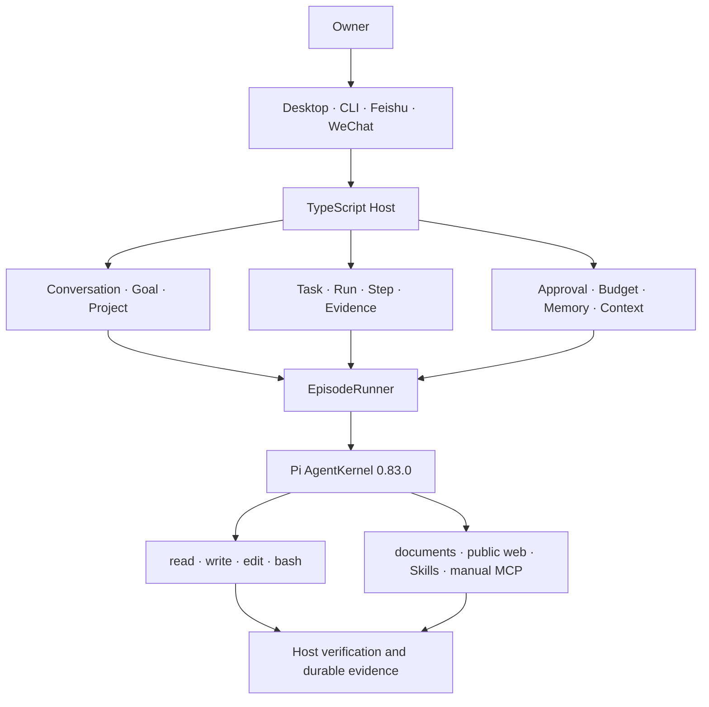
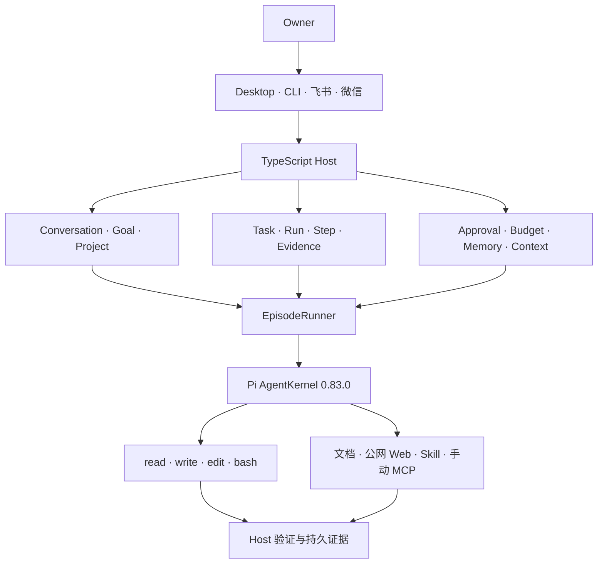

<div align="center">


# Penglai · 蓬莱 0.4.1

### A local AI workbench that can act, remember, and understand the documents you choose

**One assistant. Many doors. Evidence before claims.**

[](https://github.com/kevinchennewbee/PenglaiAgent/releases/tag/v0.4.1)
[](https://www.typescriptlang.org/)
[](https://github.com/earendil-works/pi-agent-core)
[](https://github.com/kevinchennewbee/PenglaiAgent/releases/latest)
[](LICENSE)

**[English](#english) · [中文](#中文)** · [Website](https://kevinchennewbee.github.io/PenglaiAgent/) · [Download](https://github.com/kevinchennewbee/PenglaiAgent/releases/latest) · [Changelog](CHANGELOG.md) · [0.4.1 release notes](RELEASE_NOTES_0.4.1.md) · [Security](SECURITY.md) · [Privacy](docs/PRIVACY_AND_DATA.md)

</div>

> **Official channels:** this GitHub repository, [kevinchennewbee.github.io/PenglaiAgent](https://kevinchennewbee.github.io/PenglaiAgent/), and [penglai.pages.dev](https://penglai.pages.dev/). Never enter API keys, bot tokens, or account credentials on unofficial sites or bots.

---

<a id="english"></a>

## Overview

**Penglai is not another chatbot shell.** It is a self-hosted personal AI workbench that runs on your own machine. It combines a TypeScript Host, the open-source Pi agent kernel, a native Tauri desktop app, a complete CLI, durable work records, explicit approvals, budgets, recovery, IM channels, local voice, and owner-authorized personal context in one coherent runtime.

The product has one assistant and one conversation surface. A conversation either works in the assistant's own directory or, after explicit owner confirmation, is anchored to a realpath-checked project. Desktop, CLI, Goals, Feishu, WeChat, and durable Tasks all enter the same execution path:

```text
EpisodeRunner → Pi AgentKernel → policy/approval gate → tools → durable evidence
```

That single path matters. A model saying “done” is not completion evidence. Penglai records file diffs, disk re-reads, command exit states, approval decisions, token usage, checkpoints, and source status so the owner can inspect what actually happened.

### What changed in 0.4.1

0.4.1 is a real published release, not a placeholder. It adds **Personal Context V1**, improves the first-run experience, and fixes state-fidelity problems discovered after 0.4.0:

- **Owner-authorized local documents.** Grant a global or project directory from the native folder picker or with `penglai context source add`. Penglai builds a deletable SQLite + FTS5 derived index locally and never rewrites the originals.
- **Host-verified source cards.** Answers identify the file and section and show a live `current`, `stale`, `revoked`, or `unavailable` state. References survive restarts and reindexing instead of existing only in model prose.
- **Useful immediately after setup.** Empty chats can offer example questions generated offline from real document titles in the authorized source.
- **More truthful lifecycle states.** Queued IM replies are no longer presented as failures, owner cancellations are no longer persisted as `failed`, and large-directory indexing no longer blocks the native shell.
- **Recovered updater channel.** The published update manifest and assets were repaired without changing the 0.4.1 version number.

See the [0.4.1 release notes](RELEASE_NOTES_0.4.1.md) for the exact fixes, acceptance evidence, and known limits.

## Origin: a non-coder and his AI butler

Penglai began with a simple frustration. Its owner spent a decade in networking, security, and operations, but did not write software. Powerful coding agents existed, yet most assumed that the user was sitting at a terminal or desktop and already knew the language of APIs, repositories, permissions, and configuration files.

Computing moved from command lines to windows and then into everyone's pocket. Agents should make the same journey. A useful personal agent should still be available during a commute, between meetings, or from a chat app—not only while an IDE is open. If you can send a message, you should be able to reach your own assistant; if it takes an action, you should be able to see the authority, evidence, and cost behind it.

Penglai itself is also a record of human–AI collaborative development. The owner provides the product direction, architecture decisions, risk judgment, acceptance, and release responsibility. Different stages have used AI coding tools including **Kimi Work, Grok Build, Cursor, and OpenAI Codex** for implementation, review, and iteration. No single model or platform independently designed or delivered the release.

## Why “Penglai”

Penglai (蓬莱) is the mythical island mountain described in Chinese tradition: famous, wondrous, and always obscured by the sea. Modern AI can feel the same to ordinary people. Everyone hears what it can do, while APIs, terminals, model catalogs, and configuration files remain the fog between the user and the island.

The name expresses the project's goal: bring that distant capability into the places people already live and work. The legend of “the Eight Immortals crossing the sea, each showing their own power” also captures the technical philosophy—many models, channels, and specialist tools can each contribute, while serving one owner and one source of truth.

## What Penglai can do

### One continuous assistant

- Stream safe Markdown/GFM, tables, code, images, and ordinary file inputs.
- Steer, follow up, or interrupt a running answer; use Pi-native compaction and thinking levels.
- Search, rename, archive, restore, and continue conversation history.
- Receive background-completion notifications without inventing a second “work mode.”
- Anchor a conversation to a trusted project only after owner confirmation.

### Durable goals, projects, and tasks

- Persist Goal, Project, Task, Run, Step, Evidence, Approval, and checkpoint records.
- Start and continue plan-mode goals, distinguish `blocked` from `complete`, and require the owner to lift genuine blocks.
- Recover interrupted work from durable checkpoints instead of relying on a chat transcript alone.
- Keep TaskRunner responsible for lifecycle persistence while all model execution stays in EpisodeRunner.

### Tools for real work

- Pi atomic `read`, `write`, `edit`, and `bash` tools cover code, Git, archives, logs, builds, tests, and process inspection.
- Host brokers read and create real PDF, DOCX, XLSX, and PPTX artifacts inside the workspace.
- Public web search and fetch use network and SSRF boundaries and require owner L3 approval.
- Imported artifacts can be opened, revealed in the file manager, or previewed as jailed read-only text.
- Declarative Agent Skills can be installed from a local directory or GitHub, hashed on every use, inspected, enabled, disabled, and removed. Penglai does not run package installers, lifecycle hooks, or arbitrary TypeScript extensions.
- stdio, HTTP, and SSE MCP servers are connected manually. The Host never auto-starts third-party services, and every MCP tool call goes through fresh L3 approval.

### Personal Context V1

Personal Context turns documents you deliberately authorize into a local, inspectable knowledge source:

1. The owner grants a directory with global or project scope.
2. The Host reads supported files and builds a derived SQLite + FTS5 index locally.
3. Chat and Tasks retrieve relevant passages by scope and can deep-read the source when needed.
4. A cloud model receives only the snippets selected for that request, through the provider the owner configured.
5. The Host—not the model—resolves the final source cards and their current status.
6. Revoking a source removes its derived index without modifying the original files.

Supported in V1: PDF, DOCX, XLSX, PPTX, Markdown, TXT, CSV, TSV, JSON, YAML, XML, HTML, and RTF. Complex layout reconstruction, scanned-document OCR, and formula restoration are not V1 guarantees.

### Permissions and evidence

| Level | Meaning | Typical result |
|---|---|---|
| L1 | Autonomous inside the current authority | Read project files, inspect state |
| L2 | Owner-confirmable and optionally remembered per project | Bounded edits and commands |
| L3 | Human approval every time | External transmission, deletion, web, MCP |
| L4 | Denied | Credential access, jailbreak paths, forbidden actions |

The user-facing permission dial exposes `plan`, `confirm`, `auto_edit`, and `full`, but none of those modes bypasses hard L3/L4 boundaries. Every tool call is revalidated by the Host immediately before execution.

### Models, channels, voice, and companionship

- Eleven built-in model-provider profiles plus custom OpenAI-compatible endpoints, live `/models` probing, deprecated-model warnings, and catalog refresh.
- Feishu long connection and WeChat iLink route through the same local transcript, allowlist, approval, and execution truth as Desktop and CLI.
- Local SenseVoice ASR includes language, emotion, and acoustic-event labels.
- MOSS-TTS-Nano provides an ONNX CPU text-to-speech pipeline; models are downloaded on demand and are not a startup dependency.
- Active companionship is off by default and requires explicit owner opt-in. Quiet hours, frequency, morning/evening opportunities, idle opportunities, and short proactive IM messages remain auditable. It cannot execute unattended tools.

### Budgets, memory, and diagnostics

- Global and per-project daily budgets, 80% warnings, 100% breakers, owner lifts, and a complete usage ledger.
- Global L1 memory, project memory, owner-approved SOP skills, and post-run distillation/audit.
- Desktop Doctor and `penglai doctor --export` produce a bounded, redacted support package. It includes runtime metadata, Doctor results, and recent text logs—never credentials, conversations, databases, model profiles, memory, Skills, or MCP configuration.

## Product boundaries

Penglai 0.4.1 deliberately does **not** expose arbitrary Pi TypeScript extensions/hooks, built-in browser/CUA automation, a general scheduler, or autonomous unattended tool execution. MCP is mounted only after manual owner connection and still requires per-call L3 approval. Active companionship can create a short message through the same core under `plan` authority; it cannot quietly operate the machine.

The project jail, approval checks, and credential-path denials are important process-level defenses, not an operating-system sandbox. Penglai does not claim it can safely execute arbitrary untrusted plugins or external code.

## Architecture



The native Tauri 2 app launches the bundled target Node runtime and TypeScript Host. It is a control surface over the same facts as the CLI, not a separate backend. Desktop users do not need a system Node installation, Python, or a source checkout.

Repository layout:

```text
packages/protocol   Cross-process contracts, versions, and error codes
packages/host       TypeScript Host, CLI, policy, execution, storage, channels
packages/desktop    React + Tauri 2 native desktop workbench
scripts             Contract, security, runtime, lifecycle, and release gates
docs                Privacy, uninstall, release notes, and release process
```

## Quick start

### Desktop

Download the latest release for:

- macOS Apple Silicon (`aarch64` DMG)
- macOS Intel (`x64` DMG)
- Windows x64 installer

The desktop bundles its Host runtime. macOS Developer ID/notarization and Windows Authenticode are not currently configured or verified, so the operating system may show an unknown-publisher warning. Updater assets are protected by minisign, SHA-256 manifests, release contracts, and SBOMs; minisign is not a substitute for operating-system publisher trust.

### From source

Requirements: Node.js `>=22.19`. Local desktop builds also require Rust and the platform build tools.

```bash
git clone https://github.com/kevinchennewbee/PenglaiAgent.git
cd PenglaiAgent
npm ci

# First-time setup, then open a terminal conversation
npm run cli -w @penglai/host -- setup
npm run cli -w @penglai/host -- chat

# Inspect local runtime health
npm run cli -w @penglai/host -- doctor
```

Useful CLI entry points from the source tree:

```bash
npm run cli -w @penglai/host -- doctor --export
npm run cli -w @penglai/host -- status
npm run cli -w @penglai/host -- project list
npm run cli -w @penglai/host -- task list
npm run cli -w @penglai/host -- approval list
npm run cli -w @penglai/host -- budget
npm run cli -w @penglai/host -- channel list
npm run cli -w @penglai/host -- context source list
npm run cli -w @penglai/host -- migrate --dry-run
```

If the Host is installed through `packages/host/scripts/install.sh` or `install.ps1`, use the shorter `penglai ...` form. The installer accepts only a production-built runtime and does not silently fall back to source-development mode.

## Build, test, and release

```bash
npm test
npm run typecheck -w @penglai/protocol
npm run typecheck -w @penglai/host
npm run typecheck -w @penglai/desktop
npm run build
npm run protocol:check
npm run desktop:allowlist
npm run renderer:token-boundary
npm run renderer:network-boundary
npm audit --audit-level=moderate --registry=https://registry.npmjs.org
node scripts/release-check.mjs
```

Desktop development and local macOS acceptance build:

```bash
npm run tauri:dev -w @penglai/desktop
npm run tauri:build:local -w @penglai/desktop
node scripts/lifecycle-check.mjs
```

A local ad-hoc-signed build is for acceptance only. Formal releases additionally require an owner-signed annotated tag, protected GitHub environment, exact-version runtime build, updater signing, asset read-back, SHA-256 manifests, SBOM, notices, and release-contract gates. See [the release process](docs/RELEASE_PROCESS.md).

## Migrating from 0.3.x

0.3.x is the released Python product line and is frozen at [`v0.3.6`](https://github.com/kevinchennewbee/PenglaiAgent/releases/tag/v0.3.6). Version 0.4 is a separate TypeScript generation and does not overwrite the 0.3 updater channel. Preserve the old data and run:

```bash
penglai migrate --dry-run
penglai migrate
```

Migration creates a backup before writing; an additional backup of `~/.penglai/` is still recommended. The `main` branch does not carry the old Python runtime or track `.py/.pyw` files. Non-executable `.fixture` material is used only to test the TypeScript migrator.

## Project status and trust statement

- Public source and releases live on `main`; the bilingual static website lives on `gh-pages`.
- 0.4.1 is available as macOS arm64, macOS x64, Windows x64, and Linux x64 Host runtime assets.
- The updater is signed, but Apple Developer ID/notarization and Windows Authenticode remain unconfigured or unverified.
- Personal Context V1 is local-first but not “nothing ever leaves the computer”: when a cloud model answers, the selected relevant snippets are sent to the configured provider.
- Static policy checks reduce risk; they do not turn the Host into an OS sandbox.

## License and acknowledgements

Penglai is released under the [MIT License](LICENSE).

The project inherits early product genes from [GenericAgent](https://github.com/lsdefine/GenericAgent) and thanks its unusually clean agent loop. The 0.4 execution kernel is pinned to [`@earendil-works/pi-agent-core`](https://github.com/earendil-works/pi-agent-core) / `@earendil-works/pi-ai` 0.83.0 under MIT. Trae Agent implementations were useful research references during the 0.4 rewrite. Local voice builds on [SenseVoice](https://github.com/FunAudioLLM/SenseVoice), [sherpa-onnx](https://github.com/k2-fsa/sherpa-onnx), and MOSS-TTS-Nano; the desktop shell uses [Tauri](https://github.com/tauri-apps/tauri). Exact third-party attribution is shipped in `THIRD_PARTY_NOTICES.txt` and the release SBOM.

Penglai's development is owner-led and multi-tool. **Kimi Work, Grok Build, Cursor, and OpenAI Codex** have all contributed to implementation and review at different stages. Product authorship, decisions, acceptance, and release accountability remain with the owner; the project does not credit an entire release to one model.

For contributions, read [CONTRIBUTING.md](CONTRIBUTING.md). For security reports, follow [SECURITY.md](SECURITY.md) and redact sensitive material before sending it.

---

<a id="中文"></a>

## 项目简介

**蓬莱不是又一个聊天机器人外壳。** 它是运行在你自己机器上的自托管个人 AI 工作台：TypeScript Host、开源 Pi agent 内核、Tauri 原生桌面端、完整 CLI、持久工作记录、明确审批、预算、恢复、IM 渠道、本地语音，以及由 Owner 主动授权的个人上下文，共用同一套运行时。

产品只有一个助理和一个会话面。会话要么在助理自己的目录工作，要么在 Owner 明确确认后锚定到经过 realpath 校验的项目。Desktop、CLI、Goal、飞书、微信和持久 Task 全部进入同一条执行路径：

```text
EpisodeRunner → Pi AgentKernel → 策略/审批门 → 工具 → 持久证据
```

这条单一路径很重要。模型说“做完了”不等于完成证据。蓬莱会记录文件 diff、磁盘重读、命令退出态、审批决定、token 用量、checkpoint 和来源状态，让 Owner 能够核对真实发生了什么。

### 0.4.1 更新了什么

0.4.1 是真实发布的正式版本，不是占位符。它加入了**个人上下文 V1**，改善首次使用体验，并修复 0.4.0 上线后发现的状态失真问题：

- **Owner 授权的本地资料。** 通过原生目录选择器或 `penglai context source add` 授权 global/project 目录。蓬莱在本机建立可删除的 SQLite + FTS5 派生索引，绝不改写原文件。
- **由 Host 验证的来源卡片。** 回答显示文件、章节以及实时的 `current`、`stale`、`revoked`、`unavailable` 状态。引用能跨重启和重索引存在，而不是只停留在模型措辞里。
- **配置完成就能用。** 空会话会用已授权资料的真实标题离线生成示例问题。
- **更诚实的生命周期状态。** IM 排队应答不再显示为失败，Owner 取消不再持久化为 `failed`，大目录索引不再阻塞原生壳。
- **更新通道恢复。** 已发布的更新清单与资产完成修复，没有改动 0.4.1 版本号。

精确修复、验收证据和已知限制见 [0.4.1 发布说明](RELEASE_NOTES_0.4.1.md)。

## 缘起：一个不会写代码的人，和他的 AI 管家

蓬莱起源于一个很现实的挫折。Owner 做了十年网络、安全和运维，却不会写软件。强大的编程 Agent 已经出现，但大多数产品仍默认用户坐在终端或桌面前，而且熟悉 API、仓库、权限和配置文件的语言。

计算从命令行走向窗口，再走进每个人的口袋；Agent 也应该走完同样的路。一个真正有用的个人 Agent 应该在通勤、会议间隙或聊天软件里仍然触手可及，而不是只有 IDE 打开时才存在。会发消息，就应该能找到自己的助理；它采取行动时，也应该能看到背后的权限、证据和成本。

蓬莱本身也是人机协作开发的记录。Owner 负责产品方向、架构取舍、风险判断、验收与发布责任；不同阶段综合使用了 **Kimi Work、Grok Build、Cursor 和 OpenAI Codex** 参与实现、审查和迭代。没有任何单一模型或平台独立设计并交付整个版本。

## 为什么叫「蓬莱」

蓬莱是中国传说中的海上仙山：世人皆知其神奇，却始终隔着云海。今天的 AI 对普通人也很像蓬莱——人人都听过它能做什么，API、终端、模型目录和配置文件却仍是横在用户与仙山之间的海雾。

这个名字表达了项目的目标：把遥远的能力带进人们已经生活和工作的地方。“八仙过海，各显神通”也对应它的技术哲学——不同模型、渠道和专门工具各自发挥能力，但共同服务于同一个 Owner 和同一份事实。

## 蓬莱能做什么

### 一个持续存在的助理

- 流式输出安全 Markdown/GFM、表格和代码，接收图片与普通文件。
- 在回答运行时 steer、follow-up 或 interrupt，使用 Pi 原生 compact 与 thinking 档位。
- 搜索、重命名、归档、恢复并继续历史会话。
- 接收后台完成通知，不额外发明第二套“工作模式”。
- 只有经过 Owner 确认，才把会话锚定到可信项目。

### 持久 Goal、Project 和 Task

- 持久化 Goal、Project、Task、Run、Step、Evidence、Approval 和 checkpoint。
- 启动并继续 plan 模式目标，区分 `blocked` 和 `complete`，真实阻塞必须由 Owner 解封。
- 从持久 checkpoint 恢复中断工作，而不是只依赖聊天记录。
- TaskRunner 只负责生命周期持久化，全部模型执行仍统一留在 EpisodeRunner。

### 真正工作的工具

- Pi 原子 `read`、`write`、`edit`、`bash` 工具覆盖代码、Git、压缩、日志、构建、测试和进程检查。
- Host broker 能在工作区内读取和生成真实 PDF、DOCX、XLSX、PPTX 产物。
- 公网搜索与网页抓取经过网络/SSRF 边界，并要求 Owner L3 审批。
- 导入的产物可以打开、在文件管理器定位，或在 jail 内进行只读文本预览。
- 声明式 Agent Skill 可以从本地目录或 GitHub 安装，每次使用前验哈希，并支持查看、启停和卸载。蓬莱不运行 package installer、生命周期钩子或任意 TypeScript extension。
- stdio、HTTP、SSE MCP 必须手动连接。Host 启动时绝不自启第三方服务，每次 MCP 工具调用都重新经过 L3 审批。

### 个人上下文 V1

个人上下文把你明确授权的资料变成本地、可核对的知识来源：

1. Owner 授权一个 global 或 project 作用域的目录。
2. Host 读取支持的文件，在本机建立 SQLite + FTS5 派生索引。
3. Chat 和 Task 按作用域检索相关段落，需要时继续深读来源。
4. 使用云模型时，只有本次请求选中的相关片段会通过 Owner 配置的供应商发送出去。
5. 最终来源卡片和实时状态由 Host 解析，而不是由模型自行声称。
6. 撤销来源会删除派生索引，不会修改原文件。

V1 支持 PDF、DOCX、XLSX、PPTX、Markdown、TXT、CSV、TSV、JSON、YAML、XML、HTML、RTF。复杂版式还原、扫描件 OCR 和公式恢复不属于 V1 保证。

### 权限与证据

| 等级 | 含义 | 典型结果 |
|---|---|---|
| L1 | 在当前授权内自主执行 | 读取项目文件、检查状态 |
| L2 | 可由 Owner 确认，并可按项目记住 | 有边界的编辑与命令 |
| L3 | 每次都必须人工审批 | 外发、删除、网页、MCP |
| L4 | 直接拒绝 | 凭证访问、越狱路径、禁止动作 |

用户可见的权限旋钮提供 `plan`、`confirm`、`auto_edit`、`full`，但任何模式都不能绕过硬性的 L3/L4 边界。每次工具调用在真正执行前都由 Host 重新复核权限。

### 模型、渠道、语音和主动陪伴

- 11 个内置模型供应商档案和自定义 OpenAI-compatible 端点，实时 `/models` 探测、废弃模型提醒和目录刷新。
- 飞书长连接与微信 iLink 和 Desktop/CLI 共用本地 transcript、白名单、审批及执行事实。
- 本地 SenseVoice ASR 包含语言、情绪和声音事件标签。
- MOSS-TTS-Nano 提供 ONNX CPU 文本转语音管线；模型按需下载，不是启动硬依赖。
- 主动陪伴默认关闭，必须由 Owner 明确启用。勿扰时间、频率、早晚机会、空闲机会和 IM 主动短消息均可审计，且不能无人值守执行工具。

### 预算、记忆和诊断

- 全局/项目日预算、80% 预警、100% 熔断、Owner lift 和完整用量账本。
- 全局 L1 记忆、项目记忆、Owner 批准的 SOP Skill，以及 Run 完成后的蒸馏/审计。
- Desktop Doctor 与 `penglai doctor --export` 生成有边界的脱敏支持包，只包含运行时元数据、Doctor 结果和近期文本日志；不包含凭证、会话、数据库、模型档案、记忆、Skill 或 MCP 配置。

## 产品边界

蓬莱 0.4.1 明确**不开放**任意 Pi TypeScript extension/hooks、内置 browser/CUA 自动化、通用 scheduler 或无人值守自主工具执行。MCP 只有在 Owner 手动连接后才挂载，并继续要求逐次 L3 审批。主动陪伴只能在 `plan` 权限下通过同一核心生成短消息，不能暗中操作机器。

项目 jail、审批检查和敏感凭证路径拒绝是重要的进程级防线，但不是操作系统 sandbox。蓬莱不宣称可以安全执行任意不可信插件或外部代码。

## 架构



Tauri 2 原生应用会启动随包内置的目标 Node runtime 和 TypeScript Host。它是 CLI 同一份事实的控制面，不是另一个后端。桌面用户不需要系统 Node、Python 或源码 checkout。

仓库结构：

```text
packages/protocol   跨进程协议、版本与错误码
packages/host       TypeScript Host、CLI、策略、执行、存储、渠道
packages/desktop    React + Tauri 2 原生桌面工作台
scripts             契约、安全、runtime、生命周期与发布门禁
docs                隐私、卸载、发布说明与发布流程
```

## 快速开始

### 桌面端

从最新 Release 下载：

- macOS Apple Silicon（`aarch64` DMG）
- macOS Intel（`x64` DMG）
- Windows x64 安装包

桌面端随包内置 Host runtime。macOS Developer ID/notarization 和 Windows Authenticode 当前尚未配置或验证，所以操作系统可能显示未知发布者警告。更新资产由 minisign、SHA-256 清单、release contract 和 SBOM 保护；minisign 不能替代操作系统发行者信任。

### 从源码运行

要求：Node.js `>=22.19`。本地桌面构建还需要 Rust 和对应平台构建工具。

```bash
git clone https://github.com/kevinchennewbee/PenglaiAgent.git
cd PenglaiAgent
npm ci

# 首次配置，然后进入终端会话
npm run cli -w @penglai/host -- setup
npm run cli -w @penglai/host -- chat

# 检查本地运行时健康状态
npm run cli -w @penglai/host -- doctor
```

从源码树常用的 CLI 入口：

```bash
npm run cli -w @penglai/host -- doctor --export
npm run cli -w @penglai/host -- status
npm run cli -w @penglai/host -- project list
npm run cli -w @penglai/host -- task list
npm run cli -w @penglai/host -- approval list
npm run cli -w @penglai/host -- budget
npm run cli -w @penglai/host -- channel list
npm run cli -w @penglai/host -- context source list
npm run cli -w @penglai/host -- migrate --dry-run
```

如果通过 `packages/host/scripts/install.sh` 或 `install.ps1` 安装 Host，可使用简写的 `penglai ...`。安装器只接受生产构建 runtime，不会静默退回源码开发模式。

## 构建、测试与发布

```bash
npm test
npm run typecheck -w @penglai/protocol
npm run typecheck -w @penglai/host
npm run typecheck -w @penglai/desktop
npm run build
npm run protocol:check
npm run desktop:allowlist
npm run renderer:token-boundary
npm run renderer:network-boundary
npm audit --audit-level=moderate --registry=https://registry.npmjs.org
node scripts/release-check.mjs
```

桌面开发与本地 macOS 验收包：

```bash
npm run tauri:dev -w @penglai/desktop
npm run tauri:build:local -w @penglai/desktop
node scripts/lifecycle-check.mjs
```

本地 adhoc-signed 构建只用于验收。正式 Release 还必须经过 Owner 签名 annotated tag、受保护 GitHub environment、精确版本 runtime 构建、updater 签名、资产回读、SHA-256 清单、SBOM、第三方声明和 release contract 门禁。详见[发布流程](docs/RELEASE_PROCESS.md)。

## 从 0.3.x 迁移

0.3.x 是已经发布的 Python 产品线，冻结在 [`v0.3.6`](https://github.com/kevinchennewbee/PenglaiAgent/releases/tag/v0.3.6)。0.4 是独立的 TypeScript 跨代版本，不会覆盖 0.3 更新通道。请保留旧数据并执行：

```bash
penglai migrate --dry-run
penglai migrate
```

迁移写入前会创建备份；仍建议额外备份整个 `~/.penglai/`。`main` 不携带旧 Python runtime，也不跟踪 `.py/.pyw` 文件；不可执行的 `.fixture` 原料只用于测试 TypeScript 迁移器。

## 项目状态与信任声明

- 公开源码与 Release 位于 `main`；双语静态官网位于 `gh-pages`。
- 0.4.1 已提供 macOS arm64、macOS x64、Windows x64，以及 Linux x64 Host runtime 资产。
- updater 已签名，但 Apple Developer ID/notarization 和 Windows Authenticode 仍未配置或验证。
- 个人上下文 V1 是 local-first，不是“任何内容永不离机”：使用云模型回答时，本次选中的相关片段会发送给已配置供应商。
- 静态策略检查可以降低风险，但不会把 Host 变成 OS sandbox。

## 许可与致谢

蓬莱使用 [MIT License](LICENSE)。

项目继承并感谢 [GenericAgent](https://github.com/lsdefine/GenericAgent) 的早期产品基因和干净的 agent loop。0.4 执行内核锁定 [`@earendil-works/pi-agent-core`](https://github.com/earendil-works/pi-agent-core) / `@earendil-works/pi-ai` 0.83.0（MIT）；Trae Agent 相关实现为 0.4 重构提供了调研参照。本地语音基于 [SenseVoice](https://github.com/FunAudioLLM/SenseVoice)、[sherpa-onnx](https://github.com/k2-fsa/sherpa-onnx) 与 MOSS-TTS-Nano；桌面壳基于 [Tauri](https://github.com/tauri-apps/tauri)。精确第三方归属随 Release 的 `THIRD_PARTY_NOTICES.txt` 和 SBOM 发布。

蓬莱由 Owner 主导，并采用多工具协作开发。**Kimi Work、Grok Build、Cursor 和 OpenAI Codex** 都在不同阶段参与过实现与审查；产品作者身份、决策、验收和发布责任属于 Owner，项目不会把整个版本归功于某一个模型。

参与贡献请阅读 [CONTRIBUTING.md](CONTRIBUTING.md)。安全反馈请遵循 [SECURITY.md](SECURITY.md)，发送前先移除敏感信息。
