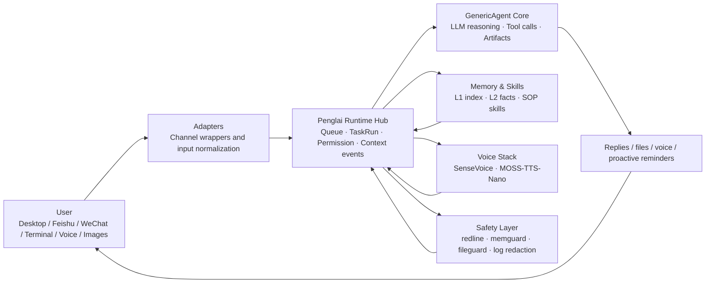

<div align="center">


# Penglai 0.3.1

### A self-hosted AI Runtime Hub for ordinary users

The `penglai` CLI is the product core, Runtime Hub is the runtime hub, and the desktop is the native control surface. Bring a working agent to your desktop, Feishu, WeChat, terminal, and voice.

[](LICENSE)
[](https://www.python.org/)
[](https://github.com/kevinchennewbee/PenglaiAgent/releases)
[](#penglai-runtime-hub)
[](https://github.com/lsdefine/GenericAgent)
[](https://kevinchennewbee.github.io/PenglaiAgent/)

[中文](README.md) · **English** · [Website](https://kevinchennewbee.github.io/PenglaiAgent/) · [Release](https://github.com/kevinchennewbee/PenglaiAgent/releases)

</div>

> **Official channels:** this GitHub repository · [kevinchennewbee.github.io/PenglaiAgent](https://kevinchennewbee.github.io/PenglaiAgent/) · [penglai.pages.dev](https://penglai.pages.dev/) · PyPI [`penglai`](https://pypi.org/project/penglai). Do not enter API keys, bot tokens, or account credentials on unofficial sites or bots.

---

**Penglai** is not another chatbot shell. It is a personal AI Runtime Hub that runs on your own machine: [GenericAgent](https://github.com/lsdefine/GenericAgent) is the execution core, the `penglai` CLI is the product core, Runtime Hub is the runtime hub, and the desktop is the native control surface. Penglai unifies desktop, Feishu, WeChat, terminal, voice, images, files, proactive events, and long-term memory.

v0.3.0 moved Penglai from "an agent connected to chat apps" to a personal AI butler distribution that can be installed, operated, upgraded, and audited. v0.3.1 closes the loop on 0.3.0's "right direction but half-finished implementation": the `penglai` CLI becomes the authoritative core of the distribution, the desktop returns to its "thin shell + CLI control surface" essence, and the owner's messages from any entry share the same GA session. You can use the native Mac / Windows desktop clients or deploy it to your own host with one command. Your memory, logs, config, and channel credentials stay on your machine by default.

Voice is also a full listen-and-speak loop. The FunASR / SenseVoice line handles local speech-to-text: transcription, emotion labels, and acoustic events. MOSS-TTS-Nano synthesizes text replies locally as speech. Both sides can run on local CPU, and voice data does not need to leave your machine.

<p align="center">
  
</p>

## Start in 30 Seconds

**Desktop clients are recommended**: download the Mac / Windows installer for your version from [GitHub Releases](https://github.com/kevinchennewbee/PenglaiAgent/releases), then double-click to install and complete all setup through the graphical wizard:

- macOS Apple Silicon DMG
- Windows x64 installer

Command-line install (for headless servers or terminal-first users):

```bash
curl -fsSL https://raw.githubusercontent.com/kevinchennewbee/PenglaiAgent/main/install.sh | sh
```

Mainland China network:

```bash
curl -fsSL https://gh-proxy.com/https://raw.githubusercontent.com/kevinchennewbee/PenglaiAgent/main/install.sh | sh
```

Daily commands:

```bash
penglai                         # chat in the terminal
penglai setup                   # setup wizard (full)
penglai setup --only feishu     # partial reconfig: reconfigure Feishu only, leave the LLM config intact
penglai setup --only llm|identity|feishu|wechat|channels|abilities|companion
penglai config status --json    # config overview (--json for desktop use)
penglai config backup           # atomically back up the current config
penglai config restore <backup> # roll back to a backup
penglai channels [--json]       # channel matrix + next-step commands
penglai companion status        # companion status / mode / last trigger reason
penglai companion mode quiet|present|active   # switch companion mode
penglai doctor                  # checks: env / deps / config / services / old-version leftover processes + next steps
penglai abilities               # voice / TTS / companion / search / critic overview
penglai enable voice|tts|companion|intel|critic
penglai update                  # check and safely upgrade
penglai privacy-audit --strict  # pre-release privacy audit
```

Headless servers can also complete Feishu / WeChat QR setup: `penglai setup --only feishu` prints an ASCII QR code directly in the terminal, no desktop required. After `setup` finishes, a minimal LLM request runs as an end-to-end smoke test (`--skip-smoke-test` to skip).

**Docker has been removed from the support matrix**: starting with 0.3.0, Penglai no longer ships Dockerfile, docker-compose, docker-install, GHCR image, or container deployment support. Use the desktop installers, `install.sh`, PyPI bootstrap, or source install instead.

## Auto-update

0.3.1 turns auto-update into a complete end-to-end pipeline. The desktop app and the runtime can each upgrade on its own:

- **Desktop app**: built on `tauri-plugin-updater`, with all six gates wired up — the signing key is generated and verified in CI, `latest.json` is published to the Release by CI, and the frontend `app.js` calls the updater API to check, download, verify, and install. `fallback.html` (the fallback config UI) also exposes the update entry, so you can still check for updates from the config UI even if the main window is stuck.
- **Runtime (CLI / Runtime Hub)**: run `penglai update` to back up the current version, fetch the new one, verify, and switch — with automatic rollback on failure.

Desktop upgrades go through the updater; runtime upgrades go through `penglai update`. The two paths are independent.

## Why Penglai Exists

I spent ten years in networking, security, and operations, but I could not write code. Penglai was spoken into existence line by line with AI coding tools.

It exists because AI agents should not belong only to people who can code, use terminals, and edit config files. CLI agents are powerful. Desktop agents are useful. But ordinary users live in chat apps. **If you can send a WeChat message, you should be able to use an agent.**

The name Penglai comes from the legendary immortal island in Chinese mythology. For ancient people, Penglai was magical but hidden behind sea mist. For many people today, AI feels just as distant, hidden behind APIs, terminals, English docs, and configuration files. Penglai tries to be the ferry.

## Penglai Runtime Hub

The core of v0.3.0 is Runtime Hub. It normalizes desktop, Feishu, WeChat, terminal, voice, files, and proactive events into one event, queue, permission, and run-history layer before handing work to GenericAgent.



What users actually feel:

- **Fewer lost messages**: follow-up messages queue while a task is running.
- **More coherent context**: desktop, IM, terminal, and proactive events share the same context path.
- **More reliable file delivery**: images, videos, PDFs, Markdown, and Office docs are sent by real artifact type; sensitive suffixes stay blocked.
- **Safer logs**: API keys, tokens, secrets, and authorization-like values are redacted before logs and history.
- **Clearer diagnostics**: Runtime Hub, Feishu, WeChat, scheduler, and companion services report separately.
- **Auditable releases**: `privacy-audit`, `runtime-audit`, `install-check`, and `doctor` validate different risk layers.

## What's new in 0.3.1

v0.3.0 established the right architectural direction; v0.3.1 closes the loop on the "right direction but half-finished implementation".

| Area | What v0.3.1 changes |
|---|---|
| CLI core | `setup --only` partial reconfig (reconfiguring Feishu no longer forces the API key flow); `config backup/restore` atomic config management; `channels` / `companion` subcommands; CLI QR output; setup end-to-end smoke test |
| Desktop control surface | Fixed `_require_token` so 9 handlers work again; removed 9 inline Python ops (bridge `--bootstrap` mode, Rust shell back to thin shell); `tauri-plugin-updater` auto-update; 9-module frontend refactor (Chat / Runs / Channels / Abilities / Companion / Diagnostics / Logs / Update / Security); Mac frosted-glass + Windows Mica dual-platform fit |
| Runtime Hub | TaskRun FSM closure (`WAITING_PERMISSION → RUNNING → SUCCEEDED`); crash recovery (zombie TaskRuns marked failed on restart); SQLite TOCTOU fix (`BEGIN IMMEDIATE`); owner messages routed via control API so multiple entries share one GA session |
| Outbound delivery | Feishu / DingTalk / QQ / WeCom unified through DeliveryService; file-delivery blocked notice consistent across all channels |
| Proactive companion | off / quiet / present / active four modes with real differences; active no longer "must speak", consecutive SILENT escalates cooldown; companion events visible in the next prompt (context closed loop) |
| Diagnostics | `doctor` prints "problem + next-step command"; detects old-version leftover processes; auto smoke test after setup |
| Upstream GA sync | extra_sys_prompts generic prompt slot; turn-25 file checkpoint; reasoning field compatibility |
| Desktop safe init | fixed bridge not coming up after `install_runtime` (the "click does nothing" bug); fixed Windows IME Chinese input crash; `setup_op` retry; `finalizeSetup` validation |
| Auto-update | `tauri-plugin-updater` passes all six gates (signing key + CI-generated `latest.json` + frontend call); `fallback.html` config UI can also check for updates; `app.js` two-layer update UI (desktop app + runtime) |
| CLI integration fixes | `_try_penglai_setup_only` TTY check fallback; cross-platform `os.chmod`; `pgrep` → `wmic` cross-platform |
| Dynamic versioning | repo-wide hardcoded 0.3.0 replaced by a dynamic `VERSION` constant |
| Mac packaging fix | `icon.icns` added to config; adhoc re-sign then regenerate `.tar.gz` + `.sig` |

> GitHub issue #2 (reconfiguring Feishu forced the API key flow) is fixed in 0.3.1 via `penglai setup --only feishu` and the desktop path.

## Why v0.3.0 Matters

| Area | What v0.3.0 adds |
|---|---|
| Native desktop | Mac / Windows installers, graphical setup wizard, multi-session workspace, tray, channel and ability management |
| Runtime Hub | `InboundEvent`, FIFO queue, `TaskRun` audit, run history |
| MOSS-TTS-Nano | Local text-to-speech for desktop playback and IM voice messages; CPU-local inference, audio can stay on-device |
| SenseVoice / FunASR line | Local speech transcription, emotion labels, acoustic events |
| IM channels | Feishu is the most validated; WeChat, DingTalk, QQ, WeCom, Telegram, and Discord are progressively field-tested |
| Proactive companion | Weather, emotion follow-up, anchors, check-ins, quiet hours, frequency gates |
| Safety audit | command red lines, path red lines, memory writes, outbound files, log redaction, pre-release privacy audit |
| Updates | `penglai update` with check, backup, apply, and rollback |

## Stack and Acknowledgements

Penglai does not invent every layer from scratch. It packages strong open-source and ecosystem components into something ordinary users can actually run.

| Layer | Project / technology | Role |
|---|---|---|
| Agent Core | [GenericAgent](https://github.com/lsdefine/GenericAgent) | execution core: context, LLM reasoning, tools, artifacts |
| Runtime | Penglai Runtime Hub | queue, TaskRun, permissions, run history, context events |
| Desktop | Tauri 2.0 + Web UI | native Mac / Windows thin shell + Python bridge; from 0.3.1 a 9-module control surface (Chat / Runs / Channels / Abilities / Companion / Diagnostics / Logs / Update / Security), no inline Python in the Rust layer, config logic delegated to the CLI |
| Speech-to-text | SenseVoice / FunASR line | local transcription, emotion labels, acoustic events |
| Text-to-speech | MOSS-TTS-Nano | local speech synthesis, CPU-capable |
| IM | Feishu / WeChat / more adapters | real chat entries for the agent |
| Safety | redline / memguard / fileguard / log redaction | deterministic safety boundaries |
| Memory | file-based L1 / L2 / SOP / raw sessions | auditable, migratable, cleanable long-term memory |

## Channels and Abilities

| Entry | How it connects | Status |
|---|---|---|
| Desktop | macOS / Windows native clients | 0.3.1 control surface (thin shell + 9 modules) |
| Feishu | setup wizard, QR-created app, long connection | most validated |
| WeChat personal account | setup wizard, QR login | routed through Runtime Hub, enable after local binding |
| Terminal TUI | run `penglai` | available |
| DingTalk / QQ / WeCom | `penglai enable <channel>` | wrapped, field validation ongoing |
| Telegram / Discord | paste bot token | wrapped, field validation ongoing |

| Ability | Description | Status |
|---|---|---|
| Speech-to-text | SenseVoice / FunASR-line local transcription and emotion labels | optional |
| Text-to-speech | MOSS-TTS-Nano local TTS, CPU inference | new in 0.3.0 |
| Vision | IM images enter vision tasks | depends on configured vision model |
| Long-term memory | file-based memory with write-time safety scan | default |
| Search | free fallback, optional enhanced providers | default |
| Proactive companion | weather, emotion, reminders, check-ins; from 0.3.1 off / quiet / present / active four modes + context closed loop | opt-in |
| Critic | local tripwire + optional cross-vendor review | optional |
| Skills | local SOP skills with install-time scan | on demand |

## Safety and Privacy

- The public repository does not include personal memory, logs, runtime history, tokens, or private config.
- API keys, chat records, long-term memory, channel credentials, and locally processed voice data stay on your machine by default.
- Logs, context events, and run history are redacted before writing.
- `memory/global_mem.txt`, `memory/global_mem_insight.txt`, `temp/`, and `_internal/` are local runtime/private paths and are ignored by default.
- Safety rails reduce risk; they are not an absolute security guarantee. Run Penglai on a machine you control.
- Please redact sensitive data before reporting vulnerabilities. See [SECURITY.md](SECURITY.md).

## Penglai and GenericAgent

[GenericAgent](https://github.com/lsdefine/GenericAgent) is Penglai's execution core. Penglai does not replace GenericAgent or turn the upstream kernel into a private fork. Penglai adds the layer ordinary users need: setup, desktop, channels, voice, memory hygiene, safety audit, long-running operation, and upgrades.

| Dimension | GenericAgent | Penglai |
|---|---|---|
| Role | agent execution core | personal AI butler distribution |
| Setup | dependency and config knowledge required | one-command install + desktop wizard |
| Entries | terminal / upstream frontends | desktop, Feishu, WeChat, terminal, more IM |
| Runtime | core loop | Runtime Hub: queue, audit, context, permissions |
| Voice / images | bring your own integration | SenseVoice, MOSS-TTS-Nano, image-entry rules |
| Safety | basic | deterministic guards for commands, paths, logs, files, memory writes |
| Operations | mostly manual | doctor / status / logs / update / audit |

## Version

**v0.3.1 · 2026-06-26**

Core architecture closed loop. The `penglai` CLI becomes the authoritative core of the distribution (`setup --only` partial reconfig / `config` management / `channels` / `companion` subcommands); the desktop returns to a thin shell + 9-module control surface (fixed `_require_token`, removed inline Python ops, added `tauri-plugin-updater`); desktop safe-init hardening (fixed bridge-not-launched-after-`install_runtime` "click does nothing", Windows IME Chinese input crash, `setup_op` retry + `finalizeSetup` validation); auto-update fully wired (`tauri-plugin-updater` passes all six gates, `fallback.html` can also update, `app.js` two-layer update UI); CLI integration fixes (TTY check fallback, cross-platform `os.chmod` and `pgrep` → `wmic`); dynamic versioning (hardcoded 0.3.0 replaced by a `VERSION` constant); Mac packaging fix (`icon.icns` + adhoc re-sign then regenerate `.tar.gz` / `.sig`); Runtime Hub stabilized (TaskRun FSM closure, crash recovery, SQLite TOCTOU fix, owner multi-entry shared GA session); Feishu / DingTalk / QQ / WeCom outbound unified through DeliveryService; companion four modes with real differences + context closed loop; `doctor` gives next-step actions + detects old-version leftover processes + setup smoke test.

**v0.3.0 · 2026-06-25**

Runtime Hub stable release. Native Mac / Windows desktop clients, Feishu QR app creation, MOSS-TTS-Nano local speech synthesis, `penglai update` backup and rollback, and full Docker removal from the support matrix.

Full timeline: [website changelog](https://kevinchennewbee.github.io/PenglaiAgent/#changelog).

## License, Brand, and Thanks

- Code is released under [MIT](LICENSE).
- Upstream GenericAgent copyright notices are preserved.
- The "Penglai / 蓬莱" name, logo, and visual brand assets are reserved and are not covered by the code license.
- Third-party asset and high-permission tooling boundaries are listed in [THIRD_PARTY_NOTICES.md](THIRD_PARTY_NOTICES.md).

Thanks to [GenericAgent](https://github.com/lsdefine/GenericAgent), MOSS-TTS-Nano, SenseVoice, Tauri, the Feishu / Lark SDK ecosystem, and every open-source project making AI tools more ordinary, usable, and safe.
