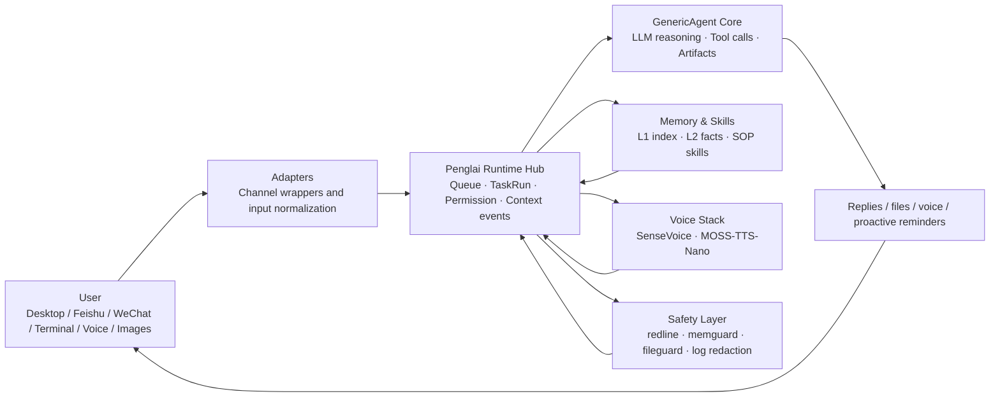

<div align="center">


# Penglai 0.3.0

### A self-hosted AI Runtime Hub for ordinary users

Bring a working agent to your desktop, Feishu, WeChat, terminal, and voice.

[](LICENSE)
[](https://www.python.org/)
[](https://github.com/kevinchennewbee/PenglaiAgent/releases/tag/v0.3.0)
[](#penglai-runtime-hub)
[](https://github.com/lsdefine/GenericAgent)
[](https://kevinchennewbee.github.io/PenglaiAgent/)

[中文](README.md) · **English** · [Website](https://kevinchennewbee.github.io/PenglaiAgent/) · [Release](https://github.com/kevinchennewbee/PenglaiAgent/releases/tag/v0.3.0)

</div>

> **Official channels:** this GitHub repository · [kevinchennewbee.github.io/PenglaiAgent](https://kevinchennewbee.github.io/PenglaiAgent/) · [penglai.pages.dev](https://penglai.pages.dev/) · PyPI [`penglai`](https://pypi.org/project/penglai). Do not enter API keys, bot tokens, or account credentials on unofficial sites or bots.

---

**Penglai** is not another chatbot shell. It is a personal AI Runtime Hub that runs on your own machine: [GenericAgent](https://github.com/lsdefine/GenericAgent) remains the execution core, while Penglai unifies desktop, Feishu, WeChat, terminal, voice, images, files, proactive events, and long-term memory.

v0.3.0 moves Penglai from "an agent connected to chat apps" to a personal AI butler distribution that can be installed, operated, upgraded, and audited. You can use the native Mac / Windows desktop clients or deploy it to your own host with one command. Your memory, logs, config, and channel credentials stay on your machine by default.

Voice also becomes a full listen-and-speak loop. Earlier Penglai focused on local speech-to-text through the FunASR / SenseVoice line: transcription, emotion labels, and acoustic events. v0.3.0 adds MOSS-TTS-Nano so text replies can be synthesized locally as speech. Both sides can run on local CPU, and voice data does not need to leave your machine.

<p align="center">
  
</p>

## Start in 30 Seconds

Desktop clients:

- [macOS Apple Silicon DMG](https://github.com/kevinchennewbee/PenglaiAgent/releases/download/v0.3.0/Penglai_0.3.0_macos_aarch64.dmg)
- [Windows x64 installer](https://github.com/kevinchennewbee/PenglaiAgent/releases/download/v0.3.0/Penglai_0.3.0_windows_x64_setup.exe)

Command-line install:

```bash
curl -fsSL https://raw.githubusercontent.com/kevinchennewbee/PenglaiAgent/main/install.sh | sh
```

Mainland China network:

```bash
curl -fsSL https://gh-proxy.com/https://raw.githubusercontent.com/kevinchennewbee/PenglaiAgent/main/install.sh | sh
```

Daily commands:

```bash
penglai                         # chat in the terminal
penglai setup                   # setup wizard
penglai doctor                  # environment / dependency / config / LLM / service checks
penglai channels                # channel matrix
penglai abilities               # voice / TTS / companion / search / critic overview
penglai enable voice|tts|companion|intel|critic
penglai update                  # check and safely upgrade
penglai privacy-audit --strict  # pre-release privacy audit
```

**Docker has been removed from the support matrix**: starting with 0.3.0, Penglai no longer ships Dockerfile, docker-compose, docker-install, GHCR image, or container deployment support. Use the desktop installers, `install.sh`, PyPI bootstrap, or source install instead.

## Why Penglai Exists

I spent ten years in networking, security, and operations, but I could not write code. Penglai was spoken into existence line by line with AI coding tools.

It exists because AI agents should not belong only to people who can code, use terminals, and edit config files. CLI agents are powerful. Desktop agents are useful. But ordinary users live in chat apps. **If you can send a WeChat message, you should be able to use an agent.**

The name Penglai comes from the legendary immortal island in Chinese mythology. For ancient people, Penglai was magical but hidden behind sea mist. For many people today, AI feels just as distant, hidden behind APIs, terminals, English docs, and configuration files. Penglai tries to be the ferry.

## Penglai Runtime Hub

The core of v0.3.0 is Runtime Hub. It normalizes desktop, Feishu, WeChat, terminal, voice, files, and proactive events into one event, queue, permission, and run-history layer before handing work to GenericAgent.



What users actually feel:

- **Fewer lost messages**: follow-up messages queue while a task is running.
- **More coherent context**: desktop, IM, terminal, and proactive events share the same context path.
- **More reliable file delivery**: images, videos, PDFs, Markdown, and Office docs are sent by real artifact type; sensitive suffixes stay blocked.
- **Safer logs**: API keys, tokens, secrets, and authorization-like values are redacted before logs and history.
- **Clearer diagnostics**: Runtime Hub, Feishu, WeChat, scheduler, and companion services report separately.
- **Auditable releases**: `privacy-audit`, `runtime-audit`, `install-check`, and `doctor` validate different risk layers.

## Why v0.3.0 Matters

| Area | What v0.3.0 adds |
|---|---|
| Native desktop | Mac / Windows installers, graphical setup wizard, multi-session workspace, tray, channel and ability management |
| Runtime Hub | `InboundEvent`, FIFO queue, `TaskRun` audit, run history |
| MOSS-TTS-Nano | Local text-to-speech for desktop playback and IM voice messages; CPU-local inference, audio can stay on-device |
| SenseVoice / FunASR line | Local speech transcription, emotion labels, acoustic events |
| IM channels | Feishu is the most validated; WeChat, DingTalk, QQ, WeCom, Telegram, and Discord are progressively field-tested |
| Proactive companion | Weather, emotion follow-up, anchors, check-ins, quiet hours, frequency gates |
| Safety audit | command red lines, path red lines, memory writes, outbound files, log redaction, pre-release privacy audit |
| Updates | `penglai update` with check, backup, apply, and rollback |

## Stack and Acknowledgements

Penglai does not invent every layer from scratch. It packages strong open-source and ecosystem components into something ordinary users can actually run.

| Layer | Project / technology | Role |
|---|---|---|
| Agent Core | [GenericAgent](https://github.com/lsdefine/GenericAgent) | execution core: context, LLM reasoning, tools, artifacts |
| Runtime | Penglai Runtime Hub | queue, TaskRun, permissions, run history, context events |
| Desktop | Tauri + Web UI | native Mac / Windows clients and setup wizard |
| Speech-to-text | SenseVoice / FunASR line | local transcription, emotion labels, acoustic events |
| Text-to-speech | MOSS-TTS-Nano | local speech synthesis, CPU-capable |
| IM | Feishu / WeChat / more adapters | real chat entries for the agent |
| Safety | redline / memguard / fileguard / log redaction | deterministic safety boundaries |
| Memory | file-based L1 / L2 / SOP / raw sessions | auditable, migratable, cleanable long-term memory |

## Channels and Abilities

| Entry | How it connects | Status |
|---|---|---|
| Desktop | macOS / Windows native clients | released in 0.3.0 |
| Feishu | setup wizard, QR-created app, long connection | most validated |
| WeChat personal account | setup wizard, QR login | routed through Runtime Hub, enable after local binding |
| Terminal TUI | run `penglai` | available |
| DingTalk / QQ / WeCom | `penglai enable <channel>` | wrapped, field validation ongoing |
| Telegram / Discord | paste bot token | wrapped, field validation ongoing |

| Ability | Description | Status |
|---|---|---|
| Speech-to-text | SenseVoice / FunASR-line local transcription and emotion labels | optional |
| Text-to-speech | MOSS-TTS-Nano local TTS, CPU inference | new in 0.3.0 |
| Vision | IM images enter vision tasks | depends on configured vision model |
| Long-term memory | file-based memory with write-time safety scan | default |
| Search | free fallback, optional enhanced providers | default |
| Proactive companion | weather, emotion, reminders, check-ins | opt-in |
| Critic | local tripwire + optional cross-vendor review | optional |
| Skills | local SOP skills with install-time scan | on demand |

## Safety and Privacy

- The public repository does not include personal memory, logs, runtime history, tokens, or private config.
- API keys, chat records, long-term memory, channel credentials, and locally processed voice data stay on your machine by default.
- Logs, context events, and run history are redacted before writing.
- `memory/global_mem.txt`, `memory/global_mem_insight.txt`, `temp/`, and `_internal/` are local runtime/private paths and are ignored by default.
- Safety rails reduce risk; they are not an absolute security guarantee. Run Penglai on a machine you control.
- Please redact sensitive data before reporting vulnerabilities. See [SECURITY.md](SECURITY.md).

## Penglai and GenericAgent

[GenericAgent](https://github.com/lsdefine/GenericAgent) is Penglai's execution core. Penglai does not replace GenericAgent or turn the upstream kernel into a private fork. Penglai adds the layer ordinary users need: setup, desktop, channels, voice, memory hygiene, safety audit, long-running operation, and upgrades.

| Dimension | GenericAgent | Penglai |
|---|---|---|
| Role | agent execution core | personal AI butler distribution |
| Setup | dependency and config knowledge required | one-command install + desktop wizard |
| Entries | terminal / upstream frontends | desktop, Feishu, WeChat, terminal, more IM |
| Runtime | core loop | Runtime Hub: queue, audit, context, permissions |
| Voice / images | bring your own integration | SenseVoice, MOSS-TTS-Nano, image-entry rules |
| Safety | basic | deterministic guards for commands, paths, logs, files, memory writes |
| Operations | mostly manual | doctor / status / logs / update / audit |

## Version

**v0.3.0 · 2026-06-25**

Runtime Hub stable release. Native Mac / Windows desktop clients, Feishu QR app creation, MOSS-TTS-Nano local speech synthesis, `penglai update` backup and rollback, and full Docker removal from the support matrix.

Full timeline: [website changelog](https://kevinchennewbee.github.io/PenglaiAgent/#changelog).

## License, Brand, and Thanks

- Code is released under [MIT](LICENSE).
- Upstream GenericAgent copyright notices are preserved.
- The "Penglai / 蓬莱" name, logo, and visual brand assets are reserved and are not covered by the code license.
- Third-party asset and high-permission tooling boundaries are listed in [THIRD_PARTY_NOTICES.md](THIRD_PARTY_NOTICES.md).

Thanks to [GenericAgent](https://github.com/lsdefine/GenericAgent), MOSS-TTS-Nano, SenseVoice, Tauri, the Feishu / Lark SDK ecosystem, and every open-source project making AI tools more ordinary, usable, and safe.
