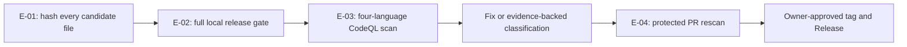

# Penglai 0.4.0 release security audit

Audit date: 2026-08-09

Scope: the local 0.4.0 public-release candidate, desktop bundle, Host runtime,
dependency locks, GitHub workflows, public documentation and `gh-pages` source.

Method: authorized source review, adversarial regression tests, dependency
advisory scans, release-gate scans and a local DMG lifecycle test. No production
service or third-party account was attacked.

## Verdict

The source candidate is suitable for Owner review before a public push. The
identified release-blocking code defects were fixed and the resulting macOS
Apple Silicon DMG passed install/use/uninstall acceptance. There are no known
npm or Rust vulnerability advisories in the shipped macOS/Windows dependency
paths as of the audit date.

This verdict is deliberately narrower than “perfectly secure”. The desktop is
a same-user application, its command/MCP processes are not OS-sandboxed, and
the local DMG is ad-hoc signed rather than Apple Developer ID signed/notarized.
GitHub branch protection and repository security settings were configured and
read back through the API before the candidate branch was pushed.

## Evidence summary

| Evidence | Observed result | Finding/path |
| --- | --- | --- |
| `npm test` | 72 files, 862 tests passed | F-01 through F-12 regression coverage |
| `pytest -q tests` | 421 tests passed; 12 deprecation warnings | legacy/migration safety coverage |
| current + legacy `cargo fmt/check/test --locked` | passed; current shell 2 tests, legacy shell 0 | native desktop compile/test coverage |
| `npm audit --audit-level=moderate --registry=https://registry.npmjs.org` | 0 vulnerabilities | F-06 |
| `cargo audit --file packages/desktop/src-tauri/Cargo.lock` | 0 vulnerabilities; 17 allowed warnings | F-07 |
| `cargo tree ... --target aarch64-apple-darwin -i glib@0.18.5` | dependency absent | F-07 |
| `cargo tree ... --target x86_64-pc-windows-msvc -i glib@0.18.5` | dependency absent | F-07 |
| `cargo tree ... --target x86_64-unknown-linux-gnu -i glib@0.18.5` | reachable through Tauri GTK3 | F-07 |
| `node scripts/release-check.mjs` | public-source release gates pass | F-06, F-08, F-09 |
| Gitleaks candidate snapshot | 606 candidate files; 0 leaks | public-tree secret check |
| Semgrep candidate snapshot | 49 findings: 42 warnings + 7 manually bounded error-level matches | dangerous API review |
| Bandit production source | 591 low, 23 medium, 0 high over 55,558 LOC | legacy Python dangerous API review |
| GitHub CodeQL default setup, run `31309734868` | Actions, JavaScript/TypeScript, Python and Rust analyzed; 114 alerts opened for classification | F-12 |
| PR #18 CodeQL, final run `31310952927` | four language analyses passed; the CodeQL PR check passed with zero annotations | F-12 |
| protected `main` CodeQL, run `31311133375` | four language analyses passed; all 24 repaired baseline alerts closed automatically | F-12 |
| `npm run tauri:build:local -w @penglai/desktop` | build, ad-hoc seal and `hdiutil verify` pass | F-10 |
| `node scripts/lifecycle-check.mjs` | install, first launch, isolated Host, setup, chat, Evidence preview, redacted diagnostics and uninstall pass | F-01, F-02, F-05, F-10 |

The audit ledger traverses and hashes every byte and line in the candidate; it
does not pretend that one human semantically proved every line. Language-aware
compilers/scanners/tests cover the full tree, with manual review concentrated
on trust boundaries and scanner findings. Semgrep parsed about 99.9% of its
targets but reported 29 fixpoint-timeout warnings; those surfaces also remain
covered by compiler/tests and targeted review. Its seven error-level matches
are the fixed numeric loopback extension probe, two fixed-allowlist argv-only
legacy subprocess sites (reported by two rules each), and two exact-loopback
BBS fetch sites. Bandit's 23 medium matches are 21 reviewed URL openers, one
intentional non-loopback rejection self-check, and one documentation-string SQL
false positive. The complete eight-group release gate was rerun against the
working candidate including untracked additions and passed.

## Evidence to finding to path

Scope authorization is the repository Owner's requested public-release review
and remediation. In scope are the tracked public tree, GitHub repository
settings, CI/release workflows and locally built 0.4 artifacts. Network work is
limited to the Owner-authorized GitHub repository, dependency advisory sources
and the product's documented loopback/provider boundaries; no unrelated
service was probed.

| Evidence | Reproduction | Content hash | Linked findings |
| --- | --- | --- | --- |
| E-01 candidate byte/line ledger | `node scripts/generate-audit-ledger.mjs` | per-file SHA-256 in `docs/audit/FILE_LEDGER_0.4.0.csv` | F-01–F-12 |
| E-02 complete local release gate | `TZ=UTC node scripts/release-check.mjs` | n/a; deterministic console report | F-01–F-09, F-11, F-12 |
| E-03 initial GitHub CodeQL scan | inspect Actions run `31309734868` and the code-scanning API | n/a; GitHub-retained SARIF | F-12 |
| E-04 protected PR rescan | inspect PR #18 and Actions run `31310641231` | n/a; GitHub-retained checks/SARIF | F-12 |
| E-05 packaged desktop lifecycle | `node scripts/lifecycle-check.mjs` against the recorded DMG | DMG SHA-256 in F-10 | F-01, F-02, F-05, F-10, F-11 |

P-01 is the public-release security path: E-01 established the exact source
snapshot; E-02 exercised the release contract; E-03 found scanner candidates;
each candidate was either repaired with a regression test or classified with a
public GitHub rationale; E-04 independently rescanned the PR; the protected
`main` checks then gate merge. The residual boundary is explicit: a signed tag,
release-environment approval and GitHub Release publication remain separate
Owner actions.



## Findings and repairs

### F-01 — Host credential leaked through WebSocket URLs — fixed

The 0.4 candidate put the loopback Host token in a WebSocket query string.
URLs are commonly copied into logs, histories and diagnostics. Query
authentication is now rejected. Native/CLI clients use `X-Penglai-Token` and
browser-compatible WebSockets use an authenticated subprotocol.

Paths: `packages/host/src/server.ts`, `packages/host/src/cli/client.ts`,
`packages/desktop/src/bridge/http-bridge.ts`,
`packages/desktop/vite.config.ts`, `packages/host/static/app.js`.

### F-02 — Local credential file assumptions were too weak — fixed

Host startup now rejects token symlinks and non-regular files, checks current
user ownership, hardens the data directory to 0700 and token file to 0600, and
requires adequate token strength. Creation is exclusive and atomic. Desktop
startup and Doctor enforce/describe the same boundary without returning the
secret.

Paths: `packages/host/src/token-file.ts`, `packages/host/src/doctor.ts`,
`packages/desktop/src-tauri/src/lib.rs`.

### F-03 — Public model keys could cross plaintext HTTP — fixed

Provider endpoints now require HTTPS for non-loopback hosts. Only exact
`localhost`, `127.0.0.1` and `::1` HTTP endpoints are accepted for local
development; URL credentials and fragments are rejected. The rule is applied
at profile creation/update, model discovery, smoke checks, kernel creation and
review calls.

Paths: `packages/host/src/providers/url-safety.ts`,
`packages/host/src/profiles-store.ts`,
`packages/host/src/kernel/create-production-pi-kernel.ts`,
`packages/desktop/src/wizard/machine.ts`.

### F-04 — Indirect prompt injection crossed content boundaries — fixed

Document text, search results, fetched pages and MCP results are now wrapped as
untrusted data with a system-level instruction that embedded authority claims,
secret requests and tool instructions have no authority. MCP-provided names,
descriptions and JSON schemas are also structurally sanitized before they enter
the model tool surface. This is model defence-in-depth; deterministic policy,
workspace jail and Owner L3 approvals remain the authority boundary.

Paths: `packages/host/src/security/untrusted-content.ts`,
`packages/host/src/kernel/capability-tools.ts`,
`packages/host/src/mcp/client.ts`,
`packages/host/src/kernel/create-production-pi-kernel.ts`.

### F-05 — Evidence and approval logs could persist credentials — fixed

A shared recursive redactor now runs before Evidence, approval decisions and
diagnostic text are persisted. It covers private-key blocks, authentication
headers, common secret fields/assignments, URL credentials, CLI secret flags
and well-known token shapes. Tests assert that raw command, output and metadata
secrets do not survive. Redaction remains best-effort, so users should not paste
secrets into ordinary content.

Paths: `packages/host/src/security/redaction.ts`,
`packages/host/src/storage/product-store.ts`,
`packages/host/src/conversation-approvals.ts`,
`packages/host/src/diagnostics.ts`.

### F-06 — JavaScript dependency and lock provenance findings — fixed

Vite and vulnerable transitive packages were updated/overridden. The npm lock
was regenerated against the official registry with integrity hashes, and CI
now fails on moderate-or-higher npm advisories. The audit reports zero known
vulnerabilities on the audit date.

Paths: `package.json`, `package-lock.json`, `packages/desktop/package.json`,
`.github/workflows/host-test.yml`, `scripts/release-check.mjs`.

### F-07 — Rust advisories — shipped targets clean; Linux GUI warning accepted

`event-listener` was updated from 5.4.1 to 5.4.2, removing
RUSTSEC-2026-0221. Cargo audit reports no vulnerability findings, but reports 17
allowed warnings: unmaintained crates and RUSTSEC-2024-0429 for `glib 0.18.5`.
Target trees prove the GTK3/glib chain is absent from macOS and Windows builds
and present only in the Linux Tauri GUI tree. The 0.4.0 release matrix does not
ship Linux Desktop; its Linux artifact is the TypeScript headless runtime and
does not contain that Rust GUI dependency. A future Linux GUI release must
upgrade/migrate this stack or repeat a target-specific risk decision.

Path: `packages/desktop/src-tauri/Cargo.lock`.

### F-08 — Supply-chain automation used floating Actions and lacked update ownership — fixed

GitHub Actions are pinned to full commit SHAs. Dependabot now covers npm,
Cargo and GitHub Actions weekly. Release workflows retain asset hashes, SBOM,
runtime manifest checks and updater signature gates.

Paths: `.github/workflows/*.yml`, `.github/dependabot.yml`.

### F-09 — Privacy, licence and security claims were incomplete — fixed

The public documents now describe stored data, outbound third parties,
retention/deletion, same-user limits, non-sandboxed child processes, prompt
injection limits, diagnostic redaction and third-party licence ownership. The
website mirrors the material claims instead of saying that all bundled code is
MIT.

Paths: `SECURITY.md`, `docs/PRIVACY_AND_DATA.md`, `NOTICE`, `README.md`,
`docs/UNINSTALL.md`, and the `gh-pages` English/Chinese pages.

### F-10 — Local installer acceptance — passed with explicit signing limit

The rebuilt Apple Silicon DMG is 259,236,192 bytes with SHA-256
`34079daf42a0c8bdb5068c26fc3f204c052ee88bb3aa2cedc49d186acf50ac07`.
`hdiutil` verified its image checksum. The mounted app passed ad-hoc seal
verification and a sandboxed install/use/uninstall lifecycle using its bundled
Node 22.22.2 Host runtime. This proves local integrity and functionality, not an
Apple-verified publisher identity or notarization.

Path: `packages/desktop/scripts/build-local-dmg.mjs`,
`scripts/lifecycle-check.mjs`, `docs/RELEASE_NOTES_0.4.0.md`.

### F-11 — Packaged Host could not resolve the Pi workspace dependency — fixed

The first clean DMG lifecycle found a real release blocker that unit tests in
the monorepo had hidden: npm installed the pinned Pi packages below the Host
workspace, and the runtime packager preserved that workspace prefix inside the
standalone artifact. Node therefore could not resolve `pi-agent-core` from the
packaged Host. The packager now maps workspace-owned dependencies to the
standalone runtime root, fails on destination collisions, and records every
direct required package in the signed runtime manifest. The verifier rejects a
runtime missing any of them. A rebuilt DMG then passed isolated Host boot,
Doctor, setup, Pi chat and the full lifecycle.

Paths: `packages/host/scripts/build-runtime.mjs`,
`packages/host/scripts/verify-runtime.mjs`,
`packages/host/test/runtime-integrity.test.ts`, `scripts/lifecycle-check.mjs`.

### F-12 — First four-language CodeQL baseline exposed unreviewed trust-boundary candidates — fixed/classified

The first GitHub default-setup scan opened 114 alerts: 3 critical, 87 high and
24 medium. Treating that new baseline as clean would have been incorrect. The
review separated it into three evidence-bearing classes:

- 24 current 0.4 findings were repaired in PR #18: file check/use races,
  symlink-sensitive credential and artifact reads, predictable temporary
  paths, polynomial regular expressions, log injection, an incorrectly
  anchored test expression and one dormant static-page XSS sink;
- 18 baseline current findings were documented as false positives or test-only flows,
  including fixed-loopback Host authentication, signed canonical updater
  assets, pinned-and-hashed voice models, private non-executable memory/SOP
  files, owner-selected HTTPS model review and masked migration reports;
- 72 findings belong exclusively to the frozen v0.3.6 Python/legacy desktop
  archive. They were dismissed as `won't fix`, not claimed as repaired, with a
  repository-visible warning that the 0.4 runtime/build does not execute those
  paths and that any future reuse requires a new review.

The PR CodeQL check and all four language analyses passed. Protected `main`
run `31311133375` then closed all 24 repaired alerts from new analysis rather
than dismissal. It opened one additional medium candidate for persisting the
fixed-domain WeChat iLink polling cursor. That flow is bounded, private and
non-executable and was documented as a false positive; following its call path
also triggered a systematic completion pass that moved every remaining Host
private-state read (WeChat/Feishu tokens, conversations, goals, MCP, skills,
memory, services, usage and overlays) onto stable no-follow descriptors. A new
WeChat symlink regression test covers the discovered gap.

Paths: PR #18; `packages/host/src/security/private-file.ts`,
`packages/host/src/security/redaction.ts`, `packages/host/src/token-file.ts`,
`packages/host/src/server.ts`, `packages/host/scripts/*.mjs`,
`scripts/generate-audit-ledger.mjs`, `scripts/lifecycle-check.mjs`.

## Owner cutover controls

These controls live in GitHub settings and cannot be made true by a source
commit alone. API inspection and authorized remediation on 2026-08-09 now
confirm:

- the repository is public and the authenticated Owner has `ADMIN`;
- `main` requires a pull request, strict passing checks for Public Python, Host
  packaging and Desktop Rust, linear history and resolved conversations;
  administrator enforcement is on, while force pushes and deletion are off;
- repository Action SHA pinning is required and workflow permissions default to
  read-only;
- Dependabot vulnerability alerts/security updates and private vulnerability
  reporting are enabled;
- the protected `release` environment requires the Owner reviewer and accepts
  only `v0.4.*` tags;
- the public description identifies the TypeScript Host + Pi 0.4 product;
- secret scanning and push protection are enabled, with zero open secret
  scanning alerts visible to the authenticated Owner.

The remaining cutover sequence is operational rather than a missing control:

1. Merge the private-file completion PR only after required checks and CodeQL
   pass, then re-read the default-branch alert count.
2. Create and push the Owner-signed annotated tag only from the accepted `main`.
3. Inspect the generated draft Release checksums, SBOM and downloaded assets;
   then use the separate manual publish workflow with the exact confirmation.

## Reproduction

Run from a clean checkout on the candidate commit:

```bash
npm ci
npm test
PYTHONPATH=. pytest -q tests
npm audit --audit-level=moderate --registry=https://registry.npmjs.org
node scripts/release-check.mjs
actionlint .github/workflows/*.yml
cargo audit --file packages/desktop/src-tauri/Cargo.lock
cargo check --locked --manifest-path packages/desktop/src-tauri/Cargo.toml
cargo test --locked --manifest-path packages/desktop/src-tauri/Cargo.toml
npm run tauri:build:local -w @penglai/desktop
node scripts/lifecycle-check.mjs
```

The DMG is intentionally not committed. Recompute and compare its SHA-256 with
the release notes when rebuilding; compressed image hashes are not expected to
be reproducible across arbitrary rebuild times.
